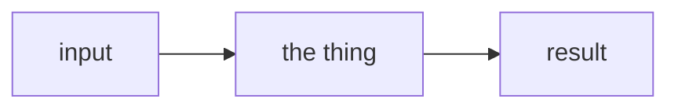

# {{title}}

One or two sentences: what part of the system this is and what it is responsible for. No preamble about the note itself.

## What it exposes

The surface as a table of **what each part answers**, rather than as a copy of its declaration. A reader who wants the exact types opens the file; what they cannot get there is why each member exists and who asks it.

| Member | Answers |
|---|---|
| `something` | the question it is there to answer, and who asks |

## How it works

The mechanism, in the order it happens. This is the bulk of the note, and it is prose and diagrams.

Use a diagram whenever the subject is a flow, a tree, a sequence or a state machine. Mermaid renders in Obsidian and on GitHub; do not draw it in ASCII.

**Explain the code, do not reprint it.** A declaration, a constructor body or a whole function belongs in the file it lives in, where it cannot fall out of date. A snippet earns its place only where the code *is* the insight (an exact formula, a guard whose precise form is the point, a line whose shape a reader would get wrong from a description), and then it is two to four lines, not a block.

Headings name the thing they cover. "The four stages" gives a reader nothing to search for; "the four stages a URL passes through" does.

> [!note] Why it is this way and not the obvious alternative
> The reasoning, next to the mechanism it justifies. One callout per real choice: not a section, and not a list of every option anyone mentioned.

> [!warning] The failure mode
> What breaks, how it presents, and whether anything catches it. Prefer failures that have actually happened.

> [!info] Rejected: the alternative someone would otherwise try
> What it was and the constraint it failed. Worth writing only for an alternative a reasonable person would reach for; "we did not use some other vendor" is not one.

## What is not built yet

What is deliberately absent, and what would ask for it. Keeps the next person from reading an omission as an oversight.

---

Related: [[some-other-note]]
