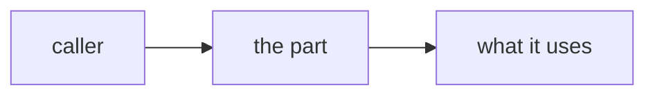
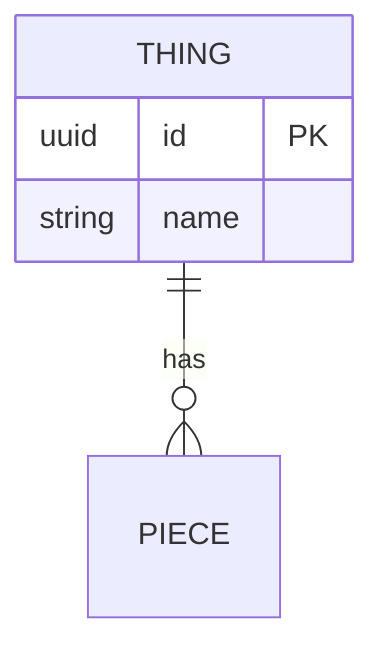
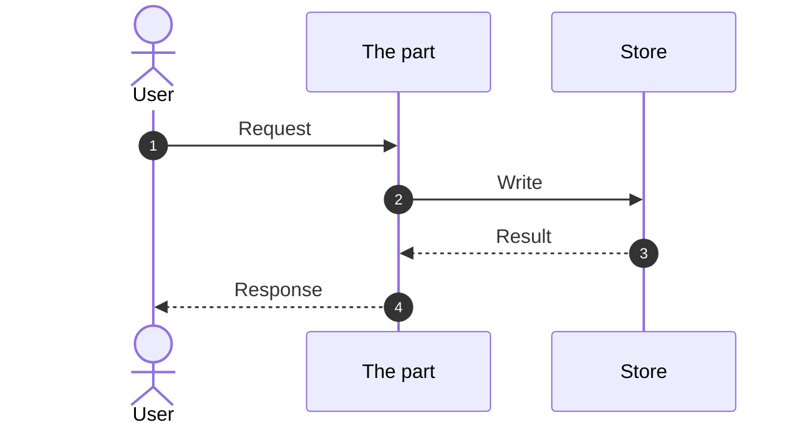
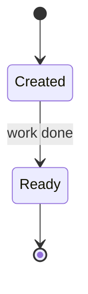
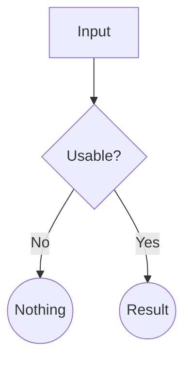

# {{title}}

## 🔭 Overview

What this part is, what it is responsible for, and the main principles its design follows. Two to five sentences a reader can stop after and still know what the part does. No preamble about the note itself.

*The sections below are a menu, not a shape. Keep the ones the subject needs, delete the rest, and add one the menu does not have whenever the subject asks for it: the menu is what has been useful so far, not a limit. Put them in whatever order makes the note easiest to follow, which is usually the thing a reader has to hold first. Every heading carries an emoji that names its subject at a glance; pick one for a section you add. Reasoning, failure modes and rejected alternatives go in callouts beside the mechanism they belong to, never in a section of their own; edge cases go in the prose or in a callout, never in a section.*

## 🏗️ Architecture

When the part is several components and how they interact is what needs explaining. A flowchart of the components and what crosses between them, then prose on what each component is responsible for.

## 💽 Modeling

When the part stores something. An entity diagram of what the part owns, with the full field list on entities the part creates and only the relevant fields on ones that already exist, then one or two paragraphs per entity: fields, types, nullability, what each is for, who validates the shape.

## 📩 Flow

When something moves through the part, or the part is triggered and does work in an order. One sequence diagram per path, numbered, high level: actors and components, no function names. Prose under it walks the numbers and covers what the diagram does not show: what happens when the input is absent, which order was chosen and what the fallback preserves.

## 🟢 States

When an entity has a lifecycle. A state diagram, then what each transition requires and what each state permits.

## ⚖️ Rules

When a value is derived or a decision is made from an input. A flowchart of the decision, top to bottom, then the matching rules the diagram cannot carry and what each terminal outcome means for the caller.

## ♠️ What it exposes

When the part has a surface others call. A table of **what each member answers and who asks**, rather than a copy of its declaration. For HTTP, the endpoint, the payload shape and the response shape, with an example only where the shape is not obvious from the description.

| Member | Answers |
|---|---|
| `something` | the question it is there to answer, and who asks |

## ⚙️ Implementation details

When a concrete choice a reader would otherwise get wrong matters: a configuration key, a storage format, an ordering constraint, an exact formula. Code appears only where the code is the insight, two to four lines, never a block.

## ⏩ What is not built yet

What is deliberately absent, and what would ask for it. Keeps the next person from reading an omission as an oversight.

## ℹ️ Sources

External links only, and only when one shaped the design. Other notes are linked inline where they are relevant, never collected here.

> [!NOTE] Why it is this way and not the obvious alternative
> The reasoning, next to the mechanism it justifies. One callout per real choice, not a section, and not a list of every option anyone mentioned.

> [!WARNING] The failure mode
> What breaks, how it presents, and whether anything catches it. Prefer failures that have actually happened.

> [!TIP] Rejected: the alternative someone would otherwise try
> What it was and the constraint it failed. Worth writing only for an alternative a reasonable person would reach for; "we did not use some other vendor" is not one.

---

Related: [some-other-note](some-other-note.md)
