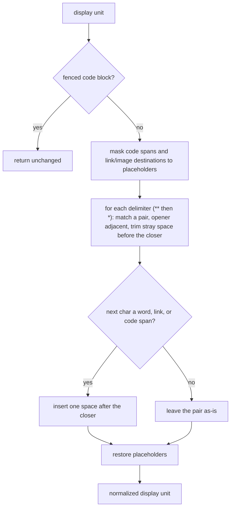

# Feature Design — Markdown-formatted read-along content

**Status**: ✓ current **Spec**: [feature-specs/markdown-read-along-content.md](../feature-specs/markdown-read-along-content.md) **Grounded in**: [experiment 002](../../experiments/002-markdown-paragraphs/README.md) (the spike is reference material — this design is the rewrite) **Decisions**: [ADR-007](../architecture/ADR-007-markdown-extraction-source-of-truth.md), [ADR-004](../architecture/ADR-004-trafilatura-extraction-headless-deferred.md), [DES-001](../design/DES-001-read-along-timing-windows.md)

How a paragraph carries its markdown formatting to the render layer while the spoken audio stays clean and the timing stays exactly aligned.

## Problem context

The backend spine already turns a URL into a private, pollable, player-ready item; this feature changes what a *paragraph* is. Its shape is set by a few constraints:

- **Display and spoken diverge but must stay aligned.** A paragraph now has a display form (markdown, what the reader sees and what is highlighted) and a spoken form (clean prose, what is synthesized). The two must refer to the same logical unit for every paragraph, or highlighting drifts from the audio (ADR-007).
- **The audio must never speak syntax.** Feeding raw markdown to the text-to-speech service makes it vocalize markers audibly; the spoken form must be stripped clean before synthesis (ADR-007).
- **The text-to-speech contract does not change.** The service already returns timing keyed by list position, so the derived spoken list can be synthesized as-is and its timeline joined back by index (ADR-007).
- **Segmentation must follow the article's logical units, not raw lines.** Markdown output soft-wraps within a paragraph and packs a list into one block, so unit boundaries are semantic, not newline-based (ADR-007).
- **Timing invariants are inherited unchanged.** The read-along windows stay contiguous and end at the audio duration (DES-001).
- **Edge cleanup must survive markdown markers.** The existing title-echo / nav-label / cruft cleanup matches on exact text and silently stops firing once a leading `#` or list marker is present, so it must be made marker-aware.

## Design overview

The change is contained to the API's **extraction and content-assembly** layer; the auth guard, the async-and-poll lifecycle, the TTS invocation client, the TTS compute, and audio delivery are all inherited from the backend spine unchanged.

The pipeline gains a single markdown extraction that yields two index-aligned lists, and the item carries the display list across the async gap so it can be joined onto the timeline when synthesis finishes:

- **Extraction** — fetch the URL (unchanged), then extract **markdown**, segment it into display units, normalize each unit's emphasis boundaries so it renders as valid markdown, and derive a spoken unit from each. Produces `(title, display[], spoken[])`, equal length and index-aligned.
- **Display normalization** — repair the imperfect emphasis boundaries the extractor leaves, so the stored display markdown renders cleanly.
- **Spoken strip** — a markdown token walk that renders one display unit to clean prose.
- **Content assembly** — at enqueue, the display list is persisted on the item and the spoken list is sent for synthesis. At poll-time finalize, the position-keyed timeline is joined onto the display list by index to produce the stored read-along paragraphs.

```
  enqueue (URL, voice?)                                   poll (finalize)
        │                                                       │
        ▼                                                       ▼
  ┌─────────────────────────── HTTP API (auth guard) ────────────────────────────┐
  │  extract markdown ─fail─▶ failed         resolve remote call                  │
  │        │ ok                                    │ done                          │
  │        ▼                                       ▼                               │
  │  segment → display[]  ┐                  timeline[i] = {start,end}  (by pos)   │
  │  strip   → spoken[]   ┘ same index        │                                    │
  │        │  (drop empty-spoken from both)   ▼                                    │
  │        ├─ persist display[] on item   join by index:                          │
  │        └─ spawn synth(spoken[]) ─────▶ paragraph[i] = {index,start,end,        │
  │        ▼                                             text = display[i]}        │
  │  return accepted (generating)         store paragraphs → ready                 │
  └───────────────────────────────────────────────────────────────────────────────┘
                         │                                    ▲
                         ▼ spoken[]                           │ index-keyed timeline
                 ┌────────────────────┐                       │
                 │  TTS compute        │  unchanged — synthesizes spoken[], returns
                 │  (separate deploy)  │  {index,start,end,text} per position (DES-001)
                 └─────────────────────┘
```

## Modeling & data flow

**Item** keeps its backend-spine shape and gains one field: the **display list** — the markdown display units, persisted at enqueue and awaiting timing. It is internal (never in the item response); the response's `paragraphs` are populated only once ready. The `paragraphs` field continues to hold the read-along windows, but each window's `text` now carries the **display markdown** rather than the spoken text.

The read-along **Paragraph** in the response keeps its shape — `{index, start, end, text}` — where `text` is the display markdown. The spoken form is an internal synthesis detail and is not exposed.

**Flow, enqueue → ready:**

1. **Enqueue** creates the item `generating` and runs extraction. Extraction fetches the URL (non-HTML clean-fails as before), extracts markdown, segments it into `display[]`, and derives `spoken[]`; a unit whose spoken form is empty is dropped from **both** lists, and marker-aware cleanup drops echoed-title / nav / cruft units from both. If extraction fails, the item is marked `failed` and returned. Otherwise the API persists `display[]` on the item, spawns a synthesis call over `spoken[]`, persists the call handle, and returns the item immediately (`generating`).
2. **Poll** resolves the remote call non-blockingly (unchanged). On *done*, the returned timeline — one `{index, start, end}` per submitted position — is joined onto `display[]` by index: `paragraph[i] = {index: i, start, end, text: display[i]}`. The joined windows are stored and the item transitions to `ready`. *Still running* and *crashed* behave exactly as in the backend spine.
3. **Audio** is unchanged.

The join is a pure index zip: the spoken list submitted for synthesis and the returned timeline are the same length and order as `display[]`, so `display[i]` is the display form of the unit timed at position `i`. The zip is guarded — if the persisted display list and the returned timeline differ in length, finalize fails the item with a clear error rather than mis-mapping formatting to timing.

## Key mechanisms

| Part | Mechanism | Serves |
|------|-----------|--------|
| Single markdown extraction | Extract markdown (with formatting, links, and tables carried), then segment: unit boundary is the blank line (markdown soft-wraps within a paragraph), soft-wraps joined, each list item its own unit — including a nested sub-item — a code block one atomic unit, a blockquote or table block kept as one raw unit so its markers parse rather than leak (ADR-007) | R1, R4, R5 |
| Inline-code-as-fence repair | Before segmentation, collapse an inline `<code>` the extractor mis-renders as a fence glued mid-paragraph (a fence at the end of a prose line, its content, then a lone closing fence on its own line) back into an inline code span. A fenced block can never open mid-line in CommonMark, so a fence preceded by text on its line is unambiguously this artifact; only the balanced shape is repaired and the content is collapsed to one line. Left in place, the lone closing fence is misread as a block opener and every following code block cascades apart (ADR-007) | R1, R5 |
| Derived spoken strip | Walk each display unit's markdown tokens: emphasis → its text, link → anchor text (URL dropped), heading/list markers dropped, code block → a short placeholder (the interim spoken form — the definitive one is a parked follow-up in `BACKLOG.md`), table → header-aware prose. Restore the word boundary dropped at a run-in emphasis (close side only), then a residual pass turns any leftover emphasis marker into a space to absorb technically-invalid markdown the extractor emits (ADR-007) | R2, R4 |
| Display normalization | Before a unit is stored, repair the emphasis boundaries the extractor leaves imperfect: trim a stray space before a closing `**`/`*` and insert the space that would otherwise fuse the closer with the following word, link, or code span, so the display markdown is valid and renders without fused words or stray markers. Only the closing edge is touched (the open edge is left, so intra-word emphasis is not over-split), and only the delimiters the extractor emits for emphasis (`**`, `*`); inline code spans, link/image destinations, and fenced code blocks pass through untouched — their delimiter characters are not emphasis (ADR-007) | R1 |
| Index-keyed alignment | One segmentation makes `display[i]` and `spoken[i]` the same unit; `display[]` is persisted at enqueue and the TTS position-keyed timeline is joined onto it by index at finalize — structural, no reconciliation, no TTS contract change (ADR-007) | R3, R9 |
| Empty-spoken drop | A unit whose spoken form strips to empty is removed from both lists before synthesis, preserving the 1:1 index and never sending an empty string to synthesis | R6 |
| Marker-aware edge cleanup | Normalize a leading heading/list marker before matching the echoed title and nav labels; drop footnote glyphs and punctuation-only units; every drop removes the unit from both lists | R8 |
| Table extraction enabled | Table extraction is turned on so a table block is emitted, kept as one unit, and linearized to header-aware prose in the spoken form (ADR-007) | R4 |
| Timing invariants | The timeline over the derived spoken list keeps the pause-fold windows — contiguous, monotonic, last end == duration (DES-001) | R7 |
| Read-along contract | The response paragraph's `text` carries display markdown; timing windows, duration, and the audio link are unchanged from the backend spine | R1, R3 |

The display normalization flow — a matched delimiter pair makes the second delimiter
unambiguously the closer, so no open/close heuristic is needed; protected regions are masked out
first so their delimiter characters are never touched:



**Inherited validation risk (not a blocking unknown).** The strip is proven for all seven construct classes, but only inline emphasis, links, headings, and (flat) lists were carried end-to-end (audio + timing) on a real article; blockquote, code, and table are strip-level only. Nested (indented) lists follow the same per-item rule — each sub-item is its own unit — but deep nesting structure is flattened rather than preserved in the display, and only flat lists were exercised. Implementation should run a formatting-heavy input covering these where practical, but the end-to-end round-trip for blockquote/code/table and the nested-list fidelity are tracked in `BACKLOG.md`, not gated here.

## Key decisions

### Single markdown extraction with a derived, index-keyed spoken list

- **Choice**: one markdown extraction is the source of truth; the spoken list is derived from it by stripping, and the TTS position-keyed timeline joins back onto both lists by index. Promoted to [ADR-007](../architecture/ADR-007-markdown-extraction-source-of-truth.md).
- **Evidence**: experiment 002.
- **Alternatives considered and not chosen**: dual extraction (plain + markdown) — not chosen, tree-driven segmentation diverges on richer articles and recreates the alignment risk; text-keyed timing — not chosen, it re-derives a text match the TTS does not need.
- **Consequences**: alignment is structural; no TTS contract change; the display/spoken split becomes the content contract downstream surfaces consume.

### `text` carries display markdown; the spoken form stays internal

- **Choice**: the read-along paragraph's `text` field carries the display markdown; the spoken form is not exposed in the item response.
- **Evidence**: experiment 002.
- **Alternatives considered and not chosen**: a separate `markdown` field alongside a spoken `text` — not chosen, it exposes an internal synthesis detail and invites ambiguity over which field to render, with no consumer needing spoken yet; renaming to `display` / `spoken` — not chosen, it churns the established paragraph field name for no present gain (a future caption surface can add the spoken form when it exists).
- **Consequences**: the item response keeps its backend-spine shape; a player renders `text` as markdown; caption export, when built, adds the spoken form then.

### Persist the display list on the item across the async gap

- **Choice**: the display list is persisted on the item at enqueue and joined onto the timeline at finalize; it is an internal field, absent from the response.
- **Evidence**: experiment 002.
- **Alternatives considered and not chosen**: re-extracting at finalize — not chosen, it refetches the URL and risks a different result across the async gap; writing partial paragraph rows (text but no timing) into the response field at enqueue — not chosen, it puts an incomplete shape into a field the response validates as fully-timed windows.
- **Consequences**: one new nullable field on the item and a schema migration; the finalize step is a pure index join with the display already in hand.

### Enable table extraction now

- **Choice**: turn table extraction on so tables are emitted and linearized to header-aware prose in production.
- **Evidence**: experiment 002.
- **Alternatives considered and not chosen**: keeping table extraction off and shipping the table code dormant — not chosen, it would make tables an inert capability until a later toggle, and the whole-feature intent is to carry tables.
- **Consequences**: tables are carried and read as prose; this accepts trafilatura's precision trade-off across all articles and ships tables' audio + timing round-trip still unvalidated end-to-end (tracked in `BACKLOG.md`).

## Decisions surfaced

- **ADR-007** — Markdown as the extraction source of truth (single extraction, derived spoken, index-keyed). *Hard-to-reverse, project-wide: the content contract every downstream surface consumes.* Refines ADR-004 (the fetch + trafilatura foundation is unchanged; its output is now markdown).
- No new DES: the segmentation and strip rules are this feature's extraction mechanism, used in one place, and stay in this design. The timing windows continue to follow DES-001 unchanged.

## System behavior

- **Formatted article, happy path** — Enqueue an article with emphasis, links, headings, and lists → `generating`. Poll after completion → `ready`; each paragraph's `text` is display markdown, the windows are contiguous with last end == duration, and the audio speaks clean prose with no vocalized syntax.
- **Plain-text article (degenerate)** — An article with no formatting → each paragraph's display equals its spoken form; alignment, timing, and behavior are indistinguishable from a backend-spine item.
- **Link** — A paragraph with `[anchor](url)` → `text` retains the markdown link; the spoken (and thus the audio) says only the anchor text, never the URL.
- **Run-in emphasis** — `**phrase**word` in the source → the display markdown is repaired to `**phrase** word` (valid, renders without fused words or stray markers) and the spoken form reads `phrase word` (the dropped word boundary restored), with no leftover `**`. A stray inner space (`**text: **more`) is likewise repaired to `**text:** more`.
- **Empty-spoken unit** — A unit that strips to empty (e.g. an image-only unit) → dropped from both lists; remaining indices stay contiguous and nothing empty is synthesized.
- **Echoed title / nav as a heading** — The extracted markdown repeats the title as `# Title` or a `Table of Contents` label → marker-aware cleanup drops it, just as the plain-text path dropped the bare title.
- **List** — A three-item list → three paragraphs; each spoken form drops its bullet/number marker. A nested sub-item is likewise its own paragraph (deep nesting is flattened, not preserved).
- **Table** — A table block → one paragraph whose `text` is the table markdown and whose spoken form reads `Col: value, Col: value.` rather than pipe characters.
- **Code block** — A fenced code block → one paragraph whose `text` is the code markdown and whose spoken form is a short placeholder rather than the code read aloud (the interim form; the definitive spoken treatment of code is a parked follow-up).
- **Inline code the extractor mis-renders as a fence** — An inline `<code>` reference in a sentence (e.g. `a `` `ClassName` `` base class`) that the extractor emits as a fence glued mid-paragraph → collapsed back to an inline code span before segmentation, so the paragraph stays one unit and the fenced code blocks that follow it stay atomic instead of cascading apart.
- **Timing** — Inspected in order, each window's start equals the previous end and the last end equals the reported duration.
- **Alignment mismatch on finalize** — If the returned timeline and the persisted display list ever differ in length, finalize fails the item with a clear error rather than mis-mapping formatting onto the wrong window.
- **No TTS change** — The request to the TTS service and the shape it returns are identical to a non-markdown item; the capability adds nothing to that contract.
