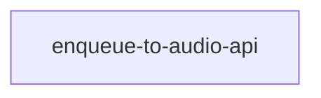

# Roadmap

Per-milestone build order for the product half. Each milestone in `PRODUCT.md` that is being built
gets a section here. Order and the dependency graph are decided in `/roadmap`; features then flow
through `/spec → /design → /implement → /reconcile`.

## Milestone 1 — Enqueue-to-audio API (the backend spine)

Source: [`PRODUCT.md` Milestone 1](../../PRODUCT.md). The milestone is a single coherent feature —
the API that turns a public article URL into a private, player-ready read-along audio item — built in
place under the spike-at-root / graduate-in-place convention and documented after the fact.

### Features

| Feature | Depends on | Parallel-safe with | Source evidence | Status |
|---------|-----------|--------------------|-----------------|--------|
| [`enqueue-to-audio-api`](../feature-specs/enqueue-to-audio-api.md) | — | — | [exp 001](../../experiments/001-player-ready-item/README.md) | ✓ Reconciled |

Status values: `✗ Defined` → `⧗ Spec` → `✓ Spec` → `⧗ Design` → `✓ Design` → `⧗ Implemented` → `✓ Implemented` → `✓ Reconciled`.

### Dependency graph

### Build order

1. `enqueue-to-audio-api` — the whole milestone; no dependencies. It is the spine every future
   surface (read-along player, queue list, settings) and the public-funnel slices consume.

---

*Future milestones append their own sections here as they are promoted from `PRODUCT.md` and become
worth building. The next candidates — the read-along player and the surfaces that consume this API —
are still in the experiment backlog (`BACKLOG.md`), not yet promoted.*
