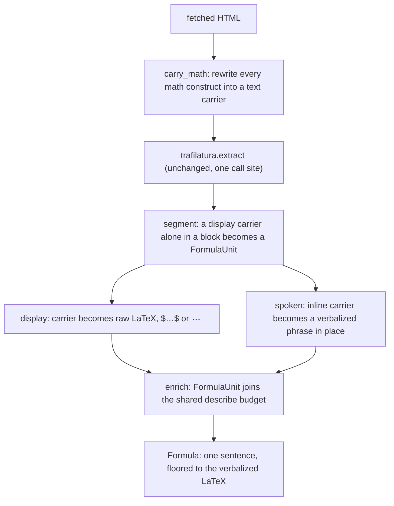

# LaTeX formulas not read

## What

Formulas vanish from output and aren't read by the TTS — need either LaTeX→plain-text rendering before TTS, or explicit spoken descriptions.

## Design

### What happens today, measured

Four real math-bearing articles pushed through the live pipeline. The record says formulas "vanish from output"; that is true of three families and false of two, and the two it is false about are the more dangerous ones because they reach a listener as fluent-looking garbage.

| Family | Probe article | In the HTML | Reaches `units_from_markdown` | Listener hears |
|---|---|---|---|---|
| MathML + TeX annotation, inline | arXiv HTML (LaTeXML) | `<math alttext="d_{k}">` plus `<annotation encoding="application/x-tex">` | nothing, a hole mid-sentence | "While for small values of ⟨gap⟩ the two mechanisms perform similarly" |
| MathML + TeX annotation, display | Wikipedia | same, `display="block"` | nothing | "sometimes called the Pythagorean equation:" then silence |
| `$$…$$` inside a bare `<div>` | lilianweng | `<div>$$L_\text{AE}…$$</div>` | nothing, `favor_precision` drops the div | "as simple as MSE loss:" then silence |
| Unrendered `$…$` in a text node | lilianweng | literal `$\mathbf{x}$` | literal LaTeX in `display` **and** `spoken` | "dollar backslash mathbf x dollar" |
| Unrendered `\(…\)` in a text node | colah | `\(x_t\)` | `_to_spoken` eats `\(` as a CommonMark escape, leaving `(x_t)` | "(x underscore t)" |

The disappearance is upstream of segmentation, at trafilatura. `_to_spoken('The value is $x^2 + y^2$ overall.')` returns its input unchanged, so nothing in the segmentation layer drops math.

The recovery fact the whole design rests on: in the vanishing families **the LaTeX is still in the HTML**, in `alttext` and in `<annotation encoding="application/x-tex">`. `extract_article` already returns `html` alongside the units, and `images.py` already probes back into that tree, so the seam exists.

### Position decides the voicing, and budget only reinforces it

Recovery is identical for inline and display math: the LaTeX comes out of the same two attributes either way. What differs is where the result has to land.

A display formula owns a block, so a `Formula: <one sentence>` description can occupy it the way `Code: <one sentence>` occupies a code block. An inline formula sits inside somebody else's clause ("for small values of `$d_k$` the two mechanisms perform similarly"), and a description cannot be spliced into the middle of a sentence without wrecking it. Inline math therefore needs a grammar-fitting phrase produced by rules, and that is a consequence of position alone.

Budget is the second reason and it is worth stating as second: one arXiv paper carries 137 inline formulas against `describe_max_per_item`. That argument would collapse the moment describing got cheap. The position argument would not.

### Five stages



### Stage 1: recovery, at the one extraction seam

New module `api/app/service/formulas.py`.

```python
def carry_math(html: str) -> str:
    """Rewrite every math construct into an inline text carrier holding its LaTeX, so
    trafilatura transports it as ordinary prose instead of discarding it."""

def declares_math_renderer(tree: HtmlElement) -> bool:
    """True when the page loads MathJax or KaTeX, or carries their configuration."""

def verbalize(tex: str) -> str:
    """Render a LaTeX fragment as a speakable phrase that fits inside a sentence."""
```

`carry_math` is called inside `_extract_units_from_html`, on the line before `trafilatura.extract`. That is the single segmentation call site both the plain fetch and the firecrawl fallback route through, so invariant 1 holds by construction and firecrawl's `rawHtml` gets the same recovery for free. Invariant 5 is untouched: no new service, no new process.

It rewrites, never re-extracts. The original `page.html` is what `extract_article` returns and what `images.py` probes, so image selection keeps seeing the tree it sees today.

**Three sources, in precedence order.**

1. `<math>` elements. Take the TeX from `<annotation encoding="application/x-tex">`, else from the `alttext` attribute. `display="block"` makes it a display carrier. Covers arXiv/LaTeXML, Wikipedia, and server-prerendered KaTeX.
2. `<script type="math/tex">` and `<script type="math/tex; mode=display">`, MathJax v2's pre-typeset form.
3. Raw delimiters in text nodes (`$…$`, `$$…$$`, `\(…\)`, `\[…\]`), gated on `declares_math_renderer`.

**Replace the outermost math wrapper, never the `<math>` node itself.** This is the difference between the design working and silently recovering nothing, and it was measured: replacing the `<math>` node on Wikipedia recovers 0 formulas, because MediaWiki puts the MathML in a visually-hidden `mwe-math-mathml-a11y` wrapper that trafilatura discards along with any carrier placed inside it. Walking up to the outermost wrapper whose class matches a known math container (`mwe-math-element`, `katex`, `MathJax`, `ltx_Math`) and replacing that recovers 96 of 99. Prerendered KaTeX needs the same move for a different reason: `.katex` holds a MathML twin beside a `.katex-html` glyph-soup twin, and replacing only the former leaves the soup to be extracted as duplicate garbage.

MediaWiki's `alttext` wraps its TeX in `{\displaystyle …}`, which is unwrapped on the way into the carrier.

**The gate exists so currency survives.** Scanning text nodes for `$…$` unconditionally would eat "between $5 and $10 million". `declares_math_renderer` looks for a MathJax or KaTeX script or configuration on the document; the two leak-family probes both carry one (lilianweng 3 occurrences, colah 8), and the MathML families do not need it. A second shape guard applies per candidate span even when the gate passes: the body must carry a LaTeX signal (a backslash command, `^`, `_`, or `{`) and must not span a blank line.

Residual, accepted and stated rather than chased: a page that renders math into bare `$…$` and declares no renderer keeps leaking, because nothing distinguishes it from currency.

**The carrier.**

```python
INLINE_OPEN, DISPLAY_OPEN, CLOSE = "⟦i:", "⟦d:", "⟧"
_CARRIER = re.compile(r"⟦(?P<mode>[id]):(?P<tex>[^⟧]*)⟧")
```

U+27E6 and U+27E7 were chosen by measurement, not taste. A private-use codepoint (U+E000) and a C0 control (U+0001) are both **stripped by trafilatura**, so neither can cross the seam at all. An ASCII sentinel survives but can occur in prose. A mode tag inside one delimiter pair keeps inline and display distinguishable without the doubled-delimiter ambiguity that `$` against `$$` carries.

A display carrier is emitted as its own `<p>` so it becomes its own markdown block, and therefore its own unit.

Measured end to end on the real pages: lilianweng recovers 24 display formulas where the `$$L_\text{AE}…$$` block used to vanish, arXiv recovers 137 inline carriers and the broken sentence becomes "While for small values of ⟦i:d_{k}⟧ the two mechanisms perform similarly", Wikipedia recovers `⟦d:a^{2}+b^{2}=c^{2}.⟧` exactly where the dangling colon was.

### Stage 2: a fourth unit type

In `app/schemas/items.py`:

```python
UNIT_TYPES: tuple[str, ...] = ("paragraph", "code", "image", "formula")
UnitType = Literal["paragraph", "code", "image", "formula"]

class FormulaUnit(_UnitBase):
    type: Literal["formula"]
    display: str   # raw LaTeX, $$…$$ delimited
    spoken: str
    latex: str     # the bare TeX, no delimiters: what the describer and the verbalizer read

Unit = Annotated[
    Union[ParagraphUnit, CodeUnit, ImageUnit, FormulaUnit], Field(discriminator="type")
]

class FormulaResponse(_UnitResponseBase):
    type: Literal["formula"]

UnitResponse = Annotated[
    Union[ParagraphResponse, CodeResponse, ImageResponse, FormulaResponse],
    Field(discriminator="type"),
]
```

`latex` rides on the persisted unit and is projected out of the wire shape, the way `spoken` is. It exists so the describer reads the TeX without re-deriving it from `display`, which is the re-derivation `_code_content` performs for code and which a unit can simply carry instead. `FormulaResponse` carries `display`, which already holds the same LaTeX in delimited form.

In `extract.py`, `_split_units` gains `"formula"` as a provisional type for a block that is exactly one display carrier, and `units_from_markdown` constructs `FormulaUnit` for it.

### Stage 3: display carries raw LaTeX

A step beside `_normalize_display` rewrites surviving carriers into LaTeX delimiters: `⟦i:d_{k}⟧` becomes `$d_{k}$`, and a display carrier becomes `$$…$$`.

> [!note] Raw LaTeX in `display` is a forward commitment, made ahead of its client
> `web/` does not exist yet, so this is a decision about a renderer nobody has written rather than an observed behaviour. Choosing raw LaTeX puts a math renderer (KaTeX) in the `web/` plan as an obligation: a client that does not render it shows a reader the markup verbatim. The alternative considered was flattening to a unicode approximation at extraction time, which needs no renderer and cannot be un-flattened later; raw LaTeX keeps the article's own form and pushes the rendering decision to the surface that can actually make it.

### Stage 4: spoken form

In `_to_spoken`, inline carriers are replaced by `verbalize(tex)` **before** the markdown-it walk. Order matters: a TeX body carries `_`, `^`, `\` and `{`, which the walk would otherwise mangle, and mangling it is precisely what goes wrong with `\(…\)` today.

`verbalize` is a rules table, because there is no library to lean on: `latex2speech`, `mathspeak`, `speech-rule-engine` and `mathml2speech` are all absent from PyPI, and `pylatexenc`, the nearest thing that exists, produces unicode rather than speech (`\frac{1}{n}\sum_{i=1}^n (\mathbf{x}^{(i)})^2` becomes `1/n∑_i=1^n (𝐱^(i))^2`, which Kokoro cannot read). The table covers greek letters, sub- and superscripts (`^2` as "squared", `^n` as "to the n", `_i` as "sub i"), `\frac{a}{b}` as "a over b", `\sqrt`, `\sum` and `\int` with their bounds, the common relations and operators, and the font commands (`\mathbf`, `\mathrm`, `\text`) stripped to their inner text. An unknown `\command` drops its backslash and speaks its name, and braces are dropped, so the function degrades to a bare symbol reading rather than failing.

Its output goes through `sanitize_spoken`, the tail both existing spoken producers already share.

A `FormulaUnit`'s spoken form at this stage is the fixed interim placeholder `"Formula."`, the exact analogue of `"Code sample."`, replaced during enrichment.

**The `\(…\)` mangling disappears by construction.** Because the gate and carrier convert `\(x_t\)` into `⟦i:x_t⟧` while it is still HTML, markdown-it never sees `\(` on a math-bearing page and the silent `(x_t)` reading cannot happen. On a page that declares no renderer, `\(` still reaches `_to_spoken` and is still read as an escaped paren, which is accepted: there the construct is far likelier to be a literal escaped parenthesis than math.

### Stage 5: enrichment, and the floor ladder

In `describe.py`:

```python
_FORMULA_FLOOR = "Formula with no description."

def build_formula_prompt(title: str | None, intro: str | None, latex: str) -> str: ...
```

`enrich_with_descriptions` gains a third branch in the job walk:

```python
elif isinstance(unit, FormulaUnit):
    jobs.append((i, "formula"))
```

Everything downstream generalizes already: the single `max_describes` budget counted in document order, the `asyncio.Semaphore`, `asyncio.gather(return_exceptions=True)` so one failure never discards the rest, the `Formula: ` prefix on success, and `on_describe("formula")` so the cost ledger meters it by kind.

The prompt follows the code prompt's discipline: one sentence naming what the formula is and what it is for, the introducing paragraph as the authority, no opener, and no reading the symbols aloud, since the floor below already does that.

**The floor ladder, explicitly, because silence is the symptom this quest exists to kill.**

| Outcome | Spoken form | Degradation |
|---|---|---|
| Described | `Formula: <one sentence>` | none |
| Past the cap | `verbalize(unit.latex)` | `{"type": "formula", "reason": "describe cap reached"}` |
| Describe failed | `verbalize(unit.latex)` | `{"type": "formula", "reason": "describe failed"}` |
| Verbalizer returns nothing usable | `_FORMULA_FLOOR` | as above |

A formula unit is never dropped and never carries an empty spoken form, so its read-along window always exists and invariants 2 and 3 hold.

A formula-only outage does **not** raise. Code raises when every code unit within the cap fails, because a code unit's floor is an honest admission that says nothing; a formula's floor is the verbalized LaTeX, a real spoken form carrying the actual content. Formula therefore follows the image rule rather than the code rule: it degrades, it never fails the item. This is the one place the formula path deliberately parts from the code path it otherwise mirrors.

### What this obliges elsewhere

- `docs/technical-design/item-contract.md`: a `formula` element section.
- `docs/technical-design/article-extraction.md`: the recovery stage, its gate, and the carrier choice.
- `docs/product-design/what-gets-read-aloud.md`: a bullet under "Non-prose constructs read as something sensible".
- **A fixture per family**, per CLAUDE.md's rule that an extraction rule with no fixture is a rule nobody can re-check: MathML display (Wikipedia), MathML inline (arXiv/LaTeXML), `$$`-in-a-div (lilianweng), `$…$` leak, `\(…\)` leak, and prerendered KaTeX.
- **No DDL.** `Item.units` is a `JSON` column, so a fourth union member needs no schema change, and existing rows are forward-compatible because they contain no formula units. CLAUDE.md's recipe says a change to the item JSON needs a migration; that rule is aimed at shape changes needing backfill, and this one has none. The build quest should put a no-op revision to the user rather than deciding it alone.

### Hazards the build has to check

1. **Image containment probe.** `images.py` anchors the longest units back into the original tree by text containment, and a math-bearing unit now carries `$d_{k}$` where the tree holds a `<math>` subtree, so those anchors can miss. The deepest-element-holding-80%-of-anchors rule tolerates individual misses and math units are rarely the longest, but this must be measured on the arXiv fixture rather than assumed. Stripping carriers from the probe text is the fix if it bites.
2. **A leaked carrier is inaudible in a diff.** A carrier that survives into `spoken` reads as "left white square bracket i colon". `sanitize_spoken` should strip any surviving carrier, the same belt-and-suspenders role it already plays for leaked emphasis markers.
3. **Verbalizer quality carries arXiv, not the describer.** 137 formulas against `describe_max_per_item` means most of that article floors to `verbalize`. That is the designed behaviour, and it means the rules table is load-bearing on exactly the article class that has the most math.
4. **Listen to it.** Per CLAUDE.md, a strip regression is invisible in a diff and inaudible in a test summary. One recovered display formula and one inline formula have to be played before this is called done.

### Out of scope

Formulas rendered to images with no MathML twin and no usable alt (some Substack and Medium posts) stay unrecoverable, since no LaTeX exists in the page to recover. The image path already gives them a described `ImageUnit`, which is the right fallback and needs no change here.

## Answer

The shape is settled in `## Design` above, down to the module, the types and the signatures. Nothing was built.

**What the probing established.** The record's premise is half right. Formulas vanish in three families (MathML inline, MathML display, and `$$…$$` inside a bare `<div>`) and in two others they do the opposite, reaching `spoken` as literal LaTeX that Kokoro reads as syntax. The vanishing happens at trafilatura, upstream of segmentation: `_to_spoken` passes `$x^2 + y^2$` through unchanged. The arXiv case is the worst of the five because it removes an inline formula from the middle of a sentence and leaves a grammatical-looking wreck ("While for small values of ⟨gap⟩ the two mechanisms perform similarly") that no test can see.

**What was decided.** Inline math is verbalized in place by rules, because a `Formula: <sentence>` cannot be spliced into someone else's clause; the describe budget is the second reason and not the first. Display math becomes a `FormulaUnit` described as `Formula: <one sentence>` on `describe.py`'s existing budget, floor and degradation machinery, floored to the verbalized LaTeX rather than to silence. `display` carries raw LaTeX, which is a forward commitment that puts KaTeX in the `web/` plan.

**How far it reaches.** Four real articles fetched and pushed through the live pipeline on this machine: arXiv HTML (LaTeXML), Wikipedia (MediaWiki), lilianweng (Hugo with client-side MathJax), colah (MathJax with `\(…\)`). The recovery mechanism was prototyped and measured end to end on three of them: 137 inline carriers recovered on arXiv, 24 display formulas on lilianweng, 96 of 99 on Wikipedia. Two carrier choices were settled by measurement rather than taste: a private-use codepoint and a C0 control are both stripped by trafilatura and cannot cross the seam, and replacing the `<math>` node rather than its outermost wrapper recovers nothing at all on Wikipedia, because MediaWiki hides the MathML in an a11y wrapper that trafilatura discards.

**What would make it stop being true.** A trafilatura upgrade that starts carrying MathML into its markdown output removes the need for the recovery pre-pass entirely, though not for the verbalizer. A Python LaTeX-to-speech library appearing on PyPI would replace the hand-rolled rules table, which is the weakest part of the shape and the part carrying the most math-heavy articles. And if `web/` is built without a math renderer, the raw-LaTeX display decision becomes wrong and the flattening has to move back to extraction time.

**What was deliberately not touched.** The `\(…\)` mangling in `_to_spoken` is fixed by construction here rather than by a new guard, and only on pages that declare a math renderer. Formulas rendered to images with no MathML twin stay with the image path. The footnote-glyph strip, the XML-tagged word dropping and the blockquote and code-block classification belong to sibling quests and were left alone.

---

Related: [[quest-log/README|the quest log]] · [[article-extraction]] · [[what-gets-read-aloud]]
