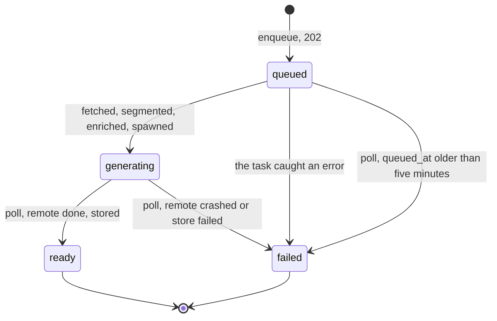

# The queued item lifecycle

## What

Enqueue returns `202` with an item that is `queued`. A background task fetches, segments, and later enriches, then spawns synthesis and moves the item to `generating`. Poll resolves the Modal call from there exactly as it does today.

A container that dies mid-task leaves an item that poll fails at five minutes rather than one that sits in progress forever.

Nothing enriches yet at this point in [[richer-extraction]], so the task does fetch and segment and stops. That is deliberate: it makes the lifecycle change verifiable on its own, and [[firecrawl-fallback-fetch]] and the description quests plug steps into a task that already exists rather than building the path twice.

This reopens a decision [[item-lifecycle]] argued against, so it owes that note real answers rather than deletion.

## Design

### The machine

`queued` and `generating` stay separate because the two phases have different physics, not because a client wants a progress bar. Enrichment runs **in the API process** and dies with the container. Synthesis runs **on Modal** and survives a redeploy, which is why lazy resolution on poll works today and would keep working across two restarts.

Collapsing them into one status would mean a client cannot tell a strandable phase from an unstrandable one, and the staleness rule would have to infer the phase from whether `modal_call_id` happens to be set.

### Three columns and one new status value

**`queued_at`** is set at enqueue, in the same write that sets `queued`, and **rewritten on every retry**. Staleness is `now - queued_at`. It cannot be `created_at`, which never moves: a retried item would be stale the instant it was retried, and poll would fail it immediately, turning retry into a no-op that reports failure.

> [!note] Why the clock starts at enqueue, not when the task begins
> A clock set when the task begins strands rows. A container that dies between the enqueue commit and the task's first write leaves a row at `queued` with `queued_at` null; the ceiling has nothing to measure, and the retry route (which requires `failed`) can never reach it either — the same class of unreachable row the release-1 migration had to `DELETE` five of. Setting the clock in the enqueue write means a queued row has one by construction, and retry rewrites it, so the "cannot be `created_at`" argument above still holds.

**`enriched_at`** is set only once *every* unit has resolved. This is the completion flag and what "has enrichment output" means. The presence of units is not the test, because units are written incrementally.

**`retry_count`** bounds re-spend and belongs to [[retry-a-failed-item]], but lands in this migration so there is one revision rather than two.

`queued` joins the `ItemStatus` enum. Note the casing drift [[typed-unit-contract]] normalizes: that quest must run first or this column gains a third participant in the drift.

### Units are written as they resolve

Persisted incrementally rather than held in memory and committed once at the end. A container that dies at unit 49 of 50 keeps 49 units' worth of work, and retry re-describes only what is missing. Given what enrichment costs, 30 firecrawl credits for an X URL and a fraction of a cent per describe call, discarding a nearly complete enrichment because the container was recycled is the more expensive mistake.

The price is that a half-populated unit list exists on the row, which is why the next rule is load-bearing.

### The partial list is never observable

`GET /items/{id}` returns `units: null` while `queued`. Partial state exists on the row and never on the wire.

> [!warning] "The complete list from `generating` onward" is wrong, and [[typed-unit-contract]] settled it during the build
> A wire element requires `start` and `end`, and timing does not exist until synthesis finishes. So units cannot be on the wire at `generating` in the shape the contract specifies: the two rules contradict each other.
>
> The resolution already shipped: **`units` is held back until it is timed**, so the list appears at `ready` rather than at `generating`. Inherit that rather than re-opening it. Nothing is lost, because a client polling a `generating` item has no timeline to render against anyway.

> [!important] This keeps invariant 2 intact rather than weakening it
> The invariant is a statement about construction and observation: `units[i].display` and `units[i].spoken` are the same unit, and a unit dropped from one is dropped from both. Neither claim is about the interior of a write no client can see. Had the partial list been exposed, `spoken` would have become nullable-during-`queued` and the invariant would have needed real surgery.

Completion order is irrelevant. Units flush to their index slots as they resolve, in any order, and the persisted list is ordered by unit index rather than by write timestamp.

### A late task must not resurrect a failed item

The one genuinely subtle case. Poll trips the five-minute ceiling and marks an item `failed`; the container was slow rather than dead, and the task finishes a minute later. It must **not** write `generating` over that `failed`, because a client has already observed the failure and may have surfaced it.

So every write the task makes is conditional on the item still being `queued`. A task that finds any other status abandons its work and commits nothing further. Nothing is actually lost: the units it already wrote are still on the row, so a retry resumes from them.

### What poll does now

Poll gains exactly one job: if the item is `queued` and `queued_at` is older than `NAGARA_QUEUED_CEILING_SECONDS` (default 300), mark it `failed` with `enrichment: no result after 300s`. The Modal resolution path is untouched.

Poll is no longer the only thing that advances state, and no path leaves an item stuck:

- `queued`, task alive: the task advances it.
- `queued`, task dead: poll fails it at the ceiling.
- `generating`: poll resolves the Modal call, exactly as today.
- `generating` with no `modal_call_id`: unreachable, since the handle and the status transition are written together.

An item nobody polls still sits where it was left, which is the existing lazy philosophy and acceptable for the same reason.

### The ceiling holds, and this was recomputed rather than assumed

The corpus stress case carries **76 fenced code blocks, not 484**. The 484 was raw `<code>` tag count, mostly inline spans, and inline code does not segment into a describable unit. With the selected images that is roughly 91 describable units worst case.

At a conservative 3.4s per call, serialized enrichment of that case is 309 seconds and barely blows the ceiling. At the describe cap of 10 it is about 34 seconds. The ceiling survives at any concurrency at or above 2, which is why [[async-api-migration]] blocks this quest.

### Invariant 5 gains one clause

Current text says no broker, no worker, no background sweeper. A `BackgroundTasks` handler is none of the three: it adds no queue, no second process, no deployable, and nothing to operate, which is what the invariant actually protects.

What it does add is work that outlives the response inside the API process, and the wording does not currently admit such work exists. Rewrite it to say deferred work runs in the API process itself and is therefore **mortal**, which the `queued_at` ceiling and the retry route exist to recover from. Update `invariants.md` and the `CLAUDE.md` summary together.

### The three callouts in `item-lifecycle` need answers, not deletion

**"Why generation starts inside the enqueue request"** already anticipated this: *if a non-eager path is ever added, the `queued` state returns then, not now.* That condition is met, and the callout becomes the record of why it returned.

**"Rejected: a deferred queue with a queued pre-state"** argued the state bought nothing because Modal already runs work asynchronously on spawn. That reasoning was sound and is now out of date, because enrichment happens *before* spawn, so there is real work with nowhere to live. Rewrite it to say what changed rather than pretending the original call was wrong.

**"Rejected: a background sweeper"** stands unchanged. Nothing here sweeps.

### How it is verified

Seam 1, the HTTP surface. `TestClient` runs a background task to completion before handing control back, so the enrichment path runs inline in the test: `POST` returns `queued`, the task runs, and a following `GET` observes `generating`.

Cover every edge of the machine, the ceiling, `units: null` while `queued`, and the conditional-write rule by driving a task that finishes after the item was already failed.

---

Related: [[quest-log/README|the quest log]] · [[richer-extraction]] · [[item-lifecycle]] · [[invariants]] · [[retry-a-failed-item]] · [[async-api-migration]]
