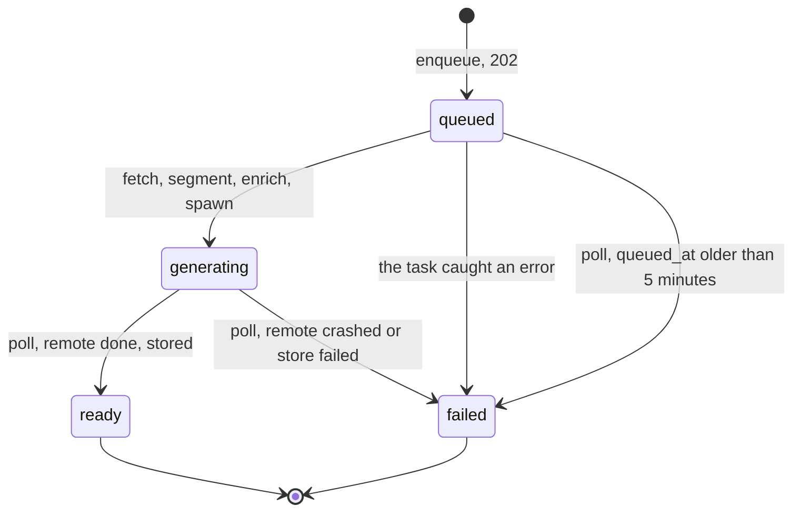

# Richer extraction

## Destination

nagara's extraction pipeline fetches through firecrawl when a plain fetch cannot reach the article, carries the article's own images on nagara's storage, and speaks a generated description of every image and code block. Every display unit is a typed object with its own spoken form and its own timing window.

Reaching the end means all three are built, deployed, and dogfooded, and the decisions below live in `docs/technical-design/` as durable notes.

This raid is post-reconciliation. [[richer-extraction-groundwork]] is the journey behind it, and its twenty-one design quests are where the reasoning for every decision below was settled. What follows is the buildable plan they collapse into.

> [!warning] This raid carries its design, against the quest log's usual rule
> [[quest-log/README|The quest log]] says an adventure points at its quests and never restates them, because a decision lives in exactly one place. That rule assumes the quests are in the vault. The journey's twenty-one were worked in gitignored `.scratch/richer-extraction/`, which is disposable by design and will not survive. Its solved index names their origin; the decisions themselves have to live here or nowhere, until [[richer-extraction-notes]] turns them into durable notes and this record is struck.

## Bearings

**The ground.** The `api/` extraction seam (`app/service/extract.py`), the item lifecycle, the item JSON contract, and the storage seam. Nothing in `tts/`. `web/` does not exist and stays out.

**Read first.** [[article-extraction]], [[item-contract]], [[item-lifecycle]], [[persistence-and-storage]], [[invariants]]. `CLAUDE.md` lists what a new route, a new extraction rule, a contract change, and a new cross-environment capability each oblige you to write.

**Standing preferences.**

Two verification habits carry into every slice. A green pipeline is not evidence the item is the article, and a strip regression is only ever caught by listening to the audio. The second one has a debt attached: see [Further notes](#further-notes).

Three branches exist and two of them are inherited from [[richer-extraction-groundwork]], which means this raid is what strikes them. `idea/firecrawl-markdown-fidelity` holds the corpus cache, the cost model, the bake-off, and the image and boundary prototypes. `idea/describer-prompt-design` holds the prompt variants and the sixteen listen clips. `idea/firecrawl-as-the-extractor` is a **separate experiment and not prior art here**; do not read it as one.

The premise the journey started from was overturned by its own evidence. Firecrawl was going to replace trafilatura outright. It cannot: firecrawl fetches and converts, it does not find the article, and its markdown carries page chrome into every document. Firecrawl is a **fallback fetch** and trafilatura keeps the extraction, which is why there is still exactly one segmentation.

## Problem

A listener gets a worse article than the reader does, and on some articles gets a broken one.

**Code is announced and never described.** Every fenced block strips to the literal string `"Code sample."`. A listener learns a code block exists and nothing else. On a tutorial that is most of the content.

**Images do not exist at all.** An image-only unit strips to empty text and is dropped from both lists, so a listener never learns the image was there and a reader never sees it. Trafilatura's image loss makes this worse than a gap: on a New Yorker piece about photographs it dropped all four contact sheets and kept the author's avatar.

**On one corpus article, two thirds of the prose is spoken as "Code sample."** Trafilatura emits an unbalanced fence count on `realpython.com/python-first-steps/`, the block splitter trusts its toggle, and roughly 3,687 words of article prose end up inside three fake code blocks. The item reaches `ready`, the unit count looks healthy at 359, and the failure is audible in ten seconds and invisible everywhere else.

**Guarded pages cannot be enqueued.** An X post or a Cloudflare-challenged page returns a JS shell that extracts to nothing usable.

**An error page can reach `ready`.** The plain fetch sends trafilatura's default user agent, which `mitchellh.com` answers with HTTP 403, and nothing reads `response.status`. That 403 body extracts to eight words, passes every guard, and synthesizes.

**Words glue together.** Trafilatura discards the whitespace following an inline element, so a listener hears "a realpart and animaginarypart".

## Solution

Four changes, shipped in three releases.

**A typed unit.** A display unit becomes an object carrying its rendered markdown, a type a client can discriminate on, and the spoken text used to generate its audio. Three types: `paragraph`, `code`, `image`. The spoken form is persisted and filtered out of the response, so invariant 1's oldest clause survives.

**A fallback fetch.** A plain fetch runs first, now with a browser user agent and a status check. When it fails, returns non-2xx, or yields fewer than 250 spoken words, firecrawl scrapes the same URL and trafilatura extracts from its `rawHtml`. More spoken words wins between the two extractions. There is one `trafilatura.extract` call site and one segmentation either way.

**Self-hosted images.** The article's own images are found by DOM containment over the page trafilatura already read, downloaded, decoded, re-encoded to WebP, keyed by content hash, and served from `GET /items/{id}/images/{hash}` behind the same key as everything else.

**A describer.** A cheap vision model writes one sentence per image and per code block. nagara prepends `Image: ` or `Code: `; the model outputs only the content, as structured JSON, sanitized before it reaches synthesis. Authorial text always wins: a figure caption or a good alt is spoken verbatim and the describer is never called.

## User stories

**As a listener**

1. As a listener, I want to hear what a code block is for and what kind of code it is, so that a tutorial is worth listening to rather than a sequence of "Code sample."
2. As a listener, I want to hear one sentence describing each figure in the article, so that I can picture what the author put in front of a reader.
3. As a listener, I want the article's own figure caption read verbatim when the author wrote one, so that I get the author's words rather than a machine's paraphrase.
4. As a listener, I want the author's alt text read verbatim when it is a real sentence, so that a good description is not thrown away and regenerated worse.
5. As a listener, I want to hear the full prose of a code-heavy article, so that an unbalanced fence does not silently swallow two thirds of what I came for.
6. As a listener, I want to never hear a backtick, an asterisk, or a hash spoken aloud, so that a leaked markdown marker does not interrupt a sentence.
7. As a listener, I want a description to begin with the thing itself, so that I do not hear "This block demonstrates" seventy times in one article.
8. As a listener, I want to be told an image could not be described rather than hearing nothing, so that I know something was there.
9. As a listener, I want words at an inline-code or link boundary to stay separate, so that I do not hear "a realpart and animaginarypart".
10. As a listener, I want related-article thumbnails and author avatars left out, so that I do not hear a dozen unrelated headlines read aloud mid-article.
11. As a listener, I want to enqueue an X post or a Cloudflare-challenged page, so that the queue is not limited to pages that answer a plain fetch.
12. As a listener, I want an image unit to hold its own timing window, so that read-along highlights the figure at the moment it is described.

**As a reader using a client**

13. As a reader, I want the article's images to appear in the read-along view, so that a figure-led piece reads the way it was published.
14. As a reader, I want each unit to carry a `type`, so that a client can render code as code and an image as an image without sniffing the markdown.
15. As a reader, I want the image link on a unit to keep working, so that a persisted item does not go visually blank an hour after it was generated.
16. As a reader, I want the unit list to be absent until it is complete, so that I never render half an article.

**As an operator**

17. As an operator, I want a `ready` item to carry a record of every unit it dropped or floored, so that I can tell a clean item from a quietly degraded one.
18. As an operator, I want the failure phase named in the error string, so that I can tell a transport problem from an interpretation problem without reading the code.
19. As an operator, I want a per-item ceiling on describer calls, so that one seventy-block tutorial cannot silently cost seventy calls.
20. As an operator, I want a per-item ceiling on retries, so that a failing item is not an unbounded spend surface.
21. As an operator, I want each metered call recorded with both its raw measure and its dollar cost at the time, so that I can total spend today and re-price it against tomorrow's rates.
22. As an operator, I want an item that never finishes enrichment to fail on its own, so that nothing sits in progress forever after a redeploy killed its task.
23. As an operator, I want a non-2xx plain fetch to escalate rather than synthesize, so that an error page never reaches `ready`.
24. As an operator, I want the firecrawl fallback to run only when the plain fetch failed, so that most articles never spend a credit and an X-shaped URL costs thirty only when it has to.
25. As an operator, I want a retry after a synthesis crash to cost nothing, so that a problem on someone else's GPU is not billed to me twice.

**As an API client**

26. As an API client, I want `POST /items/{id}/retry` to re-drive a failed item, so that a transient failure does not mean re-enqueueing and losing the id.
27. As an API client, I want retry to reject anything that is not failed, so that double-submitting is safe without me tracking in-flight state.
28. As an API client, I want the image route behind the same key as audio and poll, so that there is one auth story and no public asset path.
29. As an API client, I want the wire rename done once, completely, while there is one client, so that I am not carrying `paragraphs[].text` next to `units[].display` forever.
30. As an API client, I want `spoken` kept off the wire, so that the response stays the size of what a renderer needs.

**As a developer on this codebase**

31. As a developer, I want the suite to exercise the production code path with the network intercepted at the transport layer, so that a green test is evidence about nagara's client and not about a hand-written fake.
32. As a developer, I want CI to run with no credentials and fail loudly on a missing cassette, so that a test can never silently reach the network.
33. As a developer, I want every extraction rule to own a fixture and a case, so that a rule nobody can re-check does not enter `extract.py`.
34. As a developer, I want secrets scrubbed from cassettes in one central place, so that there is no per-test opt-in to forget.

**As the owner of the existing queue**

35. As the owner of 108 live items, I want every one transformed in place, so that nothing I already generated stops working when the contract renames.
36. As the owner of the existing queue, I want the five permanently stranded rows deleted, so that the queue stops carrying items that can never advance.

## Implementation decisions

### Vocabulary

The rename is total and lands in release 1.

| Today | Becomes | Where |
|---|---|---|
| `Paragraph` (pydantic) | `Unit`, a discriminated union of `ParagraphUnit` / `CodeUnit` / `ImageUnit` | `schemas/items.py` |
| `paragraphs[]` | `units[]` | the wire |
| `.text` | `.display` | the wire and the model |
| `display` and `paragraphs` columns | one `units` column | `models/item.py` |
| `paragraphs_from_markdown` | `units_from_markdown` | `service/extract.py` |

The type values ship as a constant map, `UNIT_TYPES = {"paragraph", "code", "image"}`, with the pydantic discriminator a `Literal` derived from it. No `StrEnum`, per the project's no-enum rule. `ItemStatus` is an existing `StrEnum` and stays one; it gains `queued`.

New terms this adventure introduces: **escalation** is the plain fetch handing off to firecrawl; **enrichment** is image acquisition plus describer calls; a **degradation** is a per-unit enrichment failure on an item that still reaches `ready`, as opposed to a **hard failure**, which fails the item.

### Release 1: the typed unit contract and its migration

Ships alone. Every unit is a `paragraph`, nothing user-visible changes, and the one irreversible step is isolated. Needs no new environment variables, which is the second reason it goes first.

**Two shapes, because `spoken` is internal.**

| Persisted variant | Fields |
|---|---|
| `ParagraphUnit` | `type="paragraph"`, `display`, `spoken` |
| `CodeUnit` | `type="code"`, `display`, `spoken` |
| `ImageUnit` | `type="image"`, `display`, `spoken`, `image` |

The wire element is `{index, type, display, start, end}`, plus `image` on an image unit. `spoken` is required on every persisted variant and projected out at the response boundary.

`ImageUnit.image` is the content hash. The route path is reconstructed at read time from the item id and the hash. No origin URL is ever retained. Nothing else earns a field: no `language` (absent from the corpus, inferred by the describer, and it rides in the display markdown untouched if it ever appears), no separate `alt` (it rides in the display markdown), no `caption` (consumed into `spoken` verbatim).

**Where the type is decided.** `_split_units` tags provisionally as it already branches, fence to `code` and everything else to `paragraph`. Release 2's fenced-prose guard flips `code` to `paragraph` on re-classified blocks. Release 3 injects `image` units during enrichment. The discriminator is settled before a unit reaches the persisted list.

**Tables, blockquotes, lists and headings all fold to `paragraph`.** The type's job is to tell the pipeline which units enrich, not to re-encode what the markdown already says. Spoken derivation keeps sniffing the display markdown shape, so a paragraph whose display starts with `|` still routes through `_table_to_spoken`.

**The migration**, one revision with `down_revision = 43f4ed0fcb35`, doing all of it so there is no intermediate state:

1. `DELETE` rows with status `generating` and no `paragraphs`, the five permanently stranded.
2. `UPDATE items SET status = lower(status)`, normalizing the `READY`/`ready` casing drift found live in both databases.
3. Add `units` (JSON, nullable).
4. Backfill per row: `units[i] = {index, type: "paragraph", display: display[i] or paragraphs[i].text, spoken: paragraphs[i].text, start, end}`. `index`, `start` and `end` come across verbatim.
5. Drop `display` and `paragraphs`.

Every old unit becomes `paragraph`, including the 99 that hold a fence. Inferring `code` from the fence was considered and rejected: the transform stays uniform, and because `display` is preserved inside the unit, re-tagging later is a pure function of the stored data.

`downgrade()` rebuilds `display` and `paragraphs` from `units` and cannot restore the five deleted rows.

**Invariant 1 keeps its first clause and its second one changes.** New text: *One extraction is the source of truth. The spoken form never reaches a client and the display form is never synthesized: both come from one markdown segmentation and ride on the same typed unit.* The clause about the spoken form is load-bearing, because it is the reason for the response filter.

**Invariant 2 tightens.** There is one unit list where there were two parallel lists. A dropped unit leaves the one list and its timeline window goes with it, and a length mismatch at finalize still fails the item.

### Release 2: the fallback fetch, and the lifecycle that carries it

**Ticket 10 named the three releases and did not place the lifecycle work. This spec places it here**, for two reasons. Ticket 09's state machine already runs firecrawl inside the background task, so putting the fetch in the request at release 2 and moving it at release 3 builds the fetch path twice. And ticket 14's async migration is a prerequisite for release 3's fan-out regardless, so doing it once here avoids a second rewrite of every endpoint.

Release 2 has no enrichment, so `enriched_at` is set as soon as segmentation completes and no unit ever degrades.

**Two free fixes to the plain fetch, first.** Send a browser user agent, and read `response.status`. Together they account for most of what the fallback was written to chase: `mitchellh.com` answers trafilatura's default agent with 403, that 403 body passes every existing guard, and the item synthesizes an error page.

**The escalation trigger.** Escalate when any of these holds:

1. `response.status` is not 2xx.
2. Any of four `ExtractionError` raise sites fires: fetch failed, could not decode, no article text, no paragraphs.
3. The extraction yields fewer than 250 spoken words.

The content-type gate does not escalate. A PDF is a clean failure and firecrawl will not make it HTML, so that branch keeps raising. No condition here ever fails an item on its own; each one buys a second opinion.

The 250-word floor comes from a corpus with a canyon in it: the broken X extraction is 37 spoken words and the smallest legitimate article is 1,002. The gap is 27x, which is why the trigger is stable and an item does not flap between escalating and not.

**What firecrawl is called with:** `formats=["rawHtml", "markdown"]`, `proxy="auto"`, and `maxAge` omitted.

`rawHtml` feeds trafilatura exactly as a plain fetch's HTML does, so invariant 1 holds by construction. Trafilatura's prose output is byte-identical from `rawHtml` and from firecrawl's cleaned `html`, and `rawHtml` is chosen for the images the cleaning throws away. `markdown` rides along at the same credit and is evidence, not pipeline input. `proxy="auto"` bills 1 credit when basic suffices and 5 when it escalates to stealth; hardcoding either is worse in one direction or the other.

`maxAge` is omitted deliberately, taking firecrawl's 2-day default. A cached hit bills full price, so suppressing the cache saves nothing, and firecrawl's own docs say `maxAge: 0` is more likely to fail. Firecrawl runs only on pages a plain fetch could not reach, and on those a cached success beats a forced fresh attempt.

**Choosing between the two extractions: more spoken words wins.** Correct on every corpus entry, including the two that pull opposite ways (Wired, where the plain fetch gets 3,912 words and firecrawl gets 517; Stack Overflow, where the plain fetch gets a 403 and firecrawl gets 639).

Where there is no baseline because the plain fetch produced nothing, accept whatever firecrawl returns and never fail the item for being small. Firecrawl's output is non-deterministic, measured at a 5x spread on one URL minutes apart, and that is accepted rather than solved on the one path with no safety net. Sampling twice for a synthetic baseline would double the cost exactly where calls are most expensive.

**The state machine.**



`queued` and `generating` stay separate because the two phases have different physics. Enrichment runs in the API process and dies with the container; synthesis runs on Modal and survives a redeploy. A client that cannot tell them apart cannot tell a strandable phase from an unstrandable one.

**Three new columns and one new status value.** `queued_at` is set when the background task begins and rewritten on every retry, and staleness is measured from it rather than from `created_at`, which never moves and would make a retried item stale the instant it was retried. `enriched_at` is set only once every unit has resolved, and is what "has enrichment output" means. `retry_count` bounds re-spend.

**Enrichment writes as it goes.** Units are persisted as they resolve rather than held in memory. A container that dies at unit 49 of 50 keeps 49 units' worth of work, and retry re-describes only what is missing. The half-populated list is never observable: `GET /items/{id}` returns `units: null` while `queued` and the complete list from `generating` onward. This is what keeps invariant 2 a statement about construction and observation rather than about the interior of a write nobody can see.

**A late task must not resurrect a failed item.** Poll trips the ceiling and marks an item `failed`; the container was slow rather than dead, and the task finishes a minute later. Every write the task makes is conditional on the item still being `queued`, and a task that finds any other status commits nothing further. Nothing is lost, because the units already written are still on the row.

**Retry.** `POST /items/{id}/retry`, returning 202 and an `ItemResponse`. Only a `failed` item with `retry_count < NAGARA_RETRY_MAX` is retryable; everything else returns 409. A stranded item needs no special case, because the ceiling converts it to `failed` first. Retry resumes from the phase that failed, keyed on `enriched_at`:

| Row state | What retry does | Cost |
|---|---|---|
| `enriched_at` set | spawn synthesis, straight to `generating` | zero credits, zero describe calls |
| `enriched_at` null, some units | `queued`, re-enrich only units still missing spoken text | one firecrawl call, partial describe calls |
| `enriched_at` null, no units | `queued`, full enrichment | full cost |

Retry does not re-fetch when enrichment already completed, so it cannot repair an item whose stored extraction was wrong. That is deliberate and belongs to [[trustworthy-extraction]]. It is also now load-bearing for a second reason: re-fetching through firecrawl demonstrably does not reproduce what was extracted the first time.

**Poll gains exactly one job:** if the item is `queued` and `queued_at` is more than five minutes old, mark it `failed` with `enrichment: no result after 300s`. The Modal resolution path is untouched. No path leaves an item stuck.

**The API migrates to async**, `async def` endpoints with `create_async_engine` and `AsyncSession`. Three load-bearing third-party calls are sync and blocking and get bridged through `run_in_threadpool`: trafilatura (fetch and the CPU-bound extract), boto3 (`BucketAudioStorage.store`), and the Modal client (`spawn_synthesis`, `poll_synthesis`). Async endpoints over a sync session would relocate the impedance mismatch from the enrichment handler onto every endpoint, which is what going async was meant to avoid.

**Invariant 5 gains a clause.** A `BackgroundTasks` handler is not a broker, a worker process, or a sweeper: it adds no queue, no second process, no deployable, and nothing to operate. What the current wording does not admit is that work now outlives the response inside the API process and is therefore **mortal**, which the `queued_at` ceiling and the retry route exist to recover from.

**The error prefix vocabulary settles at six**, with `fetch:` split out of `extraction:` rather than added beside it:

| Prefix | Phase | Hard when |
|---|---|---|
| `fetch:` | getting the document: plain fetch, content-type gate, decode, firecrawl fallback | non-HTML content type; connection or status error on either path; firecrawl unreachable |
| `extraction:` | trafilatura turning fetched HTML into units | no article text or no units surviving both paths |
| `enrichment:` | per-unit enrichment gone systemic | every enrichable unit failed; the five-minute ceiling |
| `spawn:` | spawning synthesis | unchanged |
| `store:` | storing audio and timing | unchanged |
| `tts:` | remote synthesis | unchanged |

The prefix names the pipeline phase rather than the background-task block, so firecrawl-unreachable is `fetch:`. One wrinkle is accepted: a firecrawl call that *hangs* is caught by the ceiling and reports `enrichment:`, because the ceiling cannot tell which sub-phase it is stuck in.

`ExtractionError` stays and is scoped to acquisition. There is no `EnrichmentError`: the gather runs with `return_exceptions=True`, so a per-unit failure is a value in a result list and a systemic failure is a condition the task checks. An exception nobody raises is furniture.

**Two extraction rules land here**, both of which owe a function in `extract.py`, a case in `test_extract.py`, a fixture, and a callout in [[article-extraction]].

*Fence handling, two independent causes.* Tighten `_FENCE` from `^\s*(```|~~~)` to `^[ ]{0,3}(```|~~~)`, because CommonMark allows at most three leading spaces and `\s*` matches indented literals and traceback carets that desync the toggle. Refuse to open a fence that has no closer anywhere after it, emitting the opener line as prose. That recovers 1,464 of the swallowed words. The remaining 2,223 are prose trafilatura genuinely wrapped in *closed* fences, which no parser recovers, so a guard detects a fenced block whose interior is mostly sentence-shaped prose (prose-prefixed lines, no `>>>`, `$`, `#` or `//`) and re-classifies it as a paragraph unit, stripping the fences. The detector must leave real REPL transcripts as code; its exact threshold is a build decision against fixtures.

Delegating segmentation to `markdown_it` was rejected: it roughly doubles unit counts on every article and still sees fenced prose as a code block. The blank-line recovery anchor was rejected because 6 of 72 real code blocks on that article contain internal blank lines.

*Boundary repair.* Extend `_normalize_display` to inline code spans and link destinations, alongside the emphasis pair it already handles. Trafilatura discards the whitespace following an inline element in every output format, upstream of any renderer, so `include_formatting=False` cannot help and there is nothing to escape to. The existing repairs already catch 25 of 29 losses across the corpus; the four reaching a listener are all code-span or link boundaries. Verified at 40 units changed and zero regressions.

> [!warning] The obvious regex is wrong and this already cost one rewrite
> Anchoring on a backtick pair and testing the character after it makes the closing backtick of a non-matching span become the opener of the next match, so the gap between two spans is treated as a span and the space lands inside it. Capture the following character in a lookahead, exactly as `_EMPHASIS` already does.

The two residual fusions are inside a table cell, where trafilatura drops the inline markup along with the space and no delimiter survives to key on. That stays unfixed and is recorded in [Further notes](#further-notes).

**A `CostEntry` ledger lands here**, one row per metered event scoped to its `item_id`: `type` (a constant map, `firecrawl | describer | tts`), `quantity` and `unit` (the raw measure, in credits, calls, or seconds), `dollars` (snapshotted at call time from configuration), and a nullable JSON `detail`. Both the raw measure and the dollar figure are kept: the raw measure never goes stale and lets you re-price, and the snapshot gives instant totals without a price-table join. A ledger beats two aggregate columns on the item because cost is its own domain and per-event rows are what let you tune the cap later.

### Release 3: images and descriptions

**Image selection is DOM containment over the article's own HTML**, which is why it behaves identically on the plain-fetch and fallback paths. Trafilatura already found the prose; its longest units are used as probes back into the original tree. For each probe, find the deepest element whose text content holds it. Then score every ancestor of every anchor by how many anchors it contains, and take the deepest element holding at least 80% of them. Scoring rather than taking a strict lowest common ancestor is what makes it survive one bad match, which would otherwise collapse the answer to `<body>`.

Add `og:image`, which recovers the lede that containment systematically misses because the hero sits above the article body element.

> [!warning] Two implementation facts that each cost a rewrite in the prototype
> lxml element proxies are recreated per access, so `id()` is not a stable identity and a membership set built from it silently produces nonsense; use paths from `getroottree().getpath()`. And the probe must skip `<script>`, because both Condé Nast sites carry a JSON-LD copy of the article body that drags the container to the document root.

Measured on the corpus: New Yorker selects all four contact sheets plus the lede with zero false positives, Wired selects the four commissioned artworks plus the lede and excludes all twelve related-article thumbnails, Real Python selects three with one false positive (a brand logo). Firecrawl's markdown is not the source and was tested directly: it carries 454 images on ACX, 442 of them commenter avatars, and none of Wired's artwork.

When no container is found, fall back to `og:image` alone. Anchoring succeeded on 6 of 6 corpus articles, so this path is untested; its worst case is thin rather than wrong.

**Acquisition.** A ~10 second per-image fetch timeout, streaming and aborting past ~10 MB. Validate the real format by decoding with Pillow, never by trusting `Content-Type`, which is wrong or missing on most image CDNs. Accept JPEG, PNG, GIF and WebP. Follow redirects. `data:` URIs decode in place under the same rules.

**Selection finishes after download.** Keep an image when `min(width, height) >= 200`, measured on the decoded file rather than on HTML attributes, which most of the corpus omits: all four New Yorker contact sheets carry neither `width` nor `height`. The corpus separates on a canyon, from 40px tweet avatars to a 305px `og:image`.

**Re-encode to WebP before storing**, so the content hash is over the WebP bytes. This dedupes across source-format variants of the same image and shrinks storage. Animated GIFs collapse to a static first frame, which the describer uses anyway.

**SVG rasterises on the way in**, to PNG at a fixed render resolution, before entering the WebP pipeline. The 200px filter does not apply to it, because an SVG has no intrinsic pixel size and the post-rasterisation resolution is chosen rather than measured. Diagrams in technical articles are disproportionately SVG, which is nagara's core corpus. If rasterisation fails, the spoken form degrades to alt text, or to silence if there is none.

> [!warning] Verify the rasteriser deploys before building the path
> cairosvg needs cairo and resvg needs a binary, and neither may install cleanly on the Railway image. If it does not deploy, the decision degrades to storing the SVG as-is for display and describing from alt text only, rather than re-opening the question. The render resolution is also unnamed: 768px width read the corpus mermaid diagram's `<text>` labels correctly in the prototype, and the number wants eyes on a real diagram.

**Storage: a shared base class, two interfaces.** The base holds the local-directory and bucket-client machinery; `AudioStorage` and `ImageStorage` inherit it. Images differ from audio on every axis (many per item, fetched rather than handed in, keyed for cross-article dedup, served by a URL embedded in persisted markdown), so they earn their own contract, and factoring the backend into the base avoids copy-pasting the bucket client. One factory, one `s3_configured` switch, no branch. Three of four S3 fields still counts as not configured and images fall back to local storage exactly as audio does.

**Serving: `GET /items/{id}/images/{hash}`**, minting at request time, `FileResponse` locally and `RedirectResponse` to a fresh presigned URL in the bucket, mirroring `GET /items/{id}/audio`. A presigned URL written into the row would be dead inside `s3_url_ttl`, and the display list is persisted. The route requires the key, so invariant 4 holds uniformly.

**An image that fails acquisition drops the unit from both lists.** A 404, a timeout, a body over the ceiling, or a file that will not decode means no describable content, so no spoken form, so the existing drop path. The reader loses the image and the audio never mentions it. No origin URL leaks into persisted markdown. The drop is recorded as a degradation and the item still reaches `ready`.

**What a listener hears for an image**, a five-step precedence with `Image: ` prepended for cases 1 through 4:

| # | Condition | Spoken form |
|---|---|---|
| 1 | caption present | the caption, verbatim |
| 2 | no caption, good alt | the alt, verbatim |
| 3 | no caption, no good alt | one generated sentence of what the image shows |
| 4 | generation failed, alt non-empty | any alt, verbatim |
| 5 | generation failed, alt empty | `Image with no description.` |

The spine is that meaning comes only from the author. The describer makes the image visible and never says what it means, so there is no second sentence about the image's role in the article.

Case 1 is newly load-bearing and is real work. The corpus carries authorial figure captions and they are not `<figcaption>`: the New Yorker wraps them in `<span class="...caption__text">` and ACX uses `<figcaption class="image-caption">`. The credit line beside the caption is a separate span and is excluded. The selector strategy, per-CMS rules against a heuristic over class names, is not designed; see [Further notes](#further-notes).

Case 2 is conservative. Alt is spoken verbatim only when it is a grammatical sentence, is not the article title (reuse the existing `_is_cruft` check), and clears a small CMS-boilerplate denylist: `subscribe`, `appears in`, `courtesy`, `photograph by`, `click`, and filename patterns. No clean heuristic separates good alt from bad, which is measured rather than assumed: "Image of tank rolling over a world map" and "This article appears in the October 2023 issue. Subscribe to WIRED." are both grammatical sentences. The denylist is the line, and it keeps the tank.

Cases 4 and 5 deliberately invert case 2's anti-noise rule. Bad alt is never spoken in the normal path, and is spoken only when the describer is unreachable, because a flawed description ranks above a missing image.

**What a listener hears for a code block:** one generated sentence saying what the block is *for* and what *kind* it is, with `Code: ` prepended. Never a readback of the code, one-liners included, and never a claim about what it *does*, which is the invention surface a listener cannot check against code they cannot see. The closest thing to authorial text is the introducing prose, the unit immediately before, which is treated as authoritative.

A code unit is never dropped, because there is no acquisition-failure path: it is already extracted text. On describer failure or cap exhaustion it falls to `Code with no description.`

The redundancy with the introducing prose is accepted. In every one of the five baked-off genuine blocks the introducing unit already named the block, and the describer restated it. What the describer adds above restatement is the kind and the structure, and that is the value above the floor. Dropping is worse, because it removes the code from the reader's view.

No language-tag branching. No fence in the corpus carries a tag, in either extraction path, so the language is always inferred and folded into the kind-name.

**The describer is `gemini-3.5-flash-lite`, called directly on Google's paid API**, with `gemini-3.1-flash-lite` as the documented fallback. The bake-off ran every candidate through OpenRouter to compare them with one key; production drops the gateway, which is marginally cheaper and does not change the model's behaviour. Gemini's per-image token count is near-constant (1.03x spread against Haiku's 3.17x) and Haiku costs 5.1x more per image. Flash-Lite's RPM is not binding at nagara's scale, so there is no rate-pacing machinery.

**Structured output plus sanitize, both.** `response_mime_type="application/json"` with `response_schema={"type":"object","properties":{"spoken":{"type":"string"}},"required":["spoken"]}`, and the parsed value then runs through the same belt-and-suspenders tail `_to_spoken` applies to article text.

Both guards, because the marker leak is **stochastic**: it hit once in the bake-off and did not reproduce across 48 free-text re-runs. "It did not happen this time" is exactly the judgement you cannot rely on in a pipeline where a leaked backtick is only ever caught by playing the audio. Structured output makes the heading-and-preamble class impossible; sanitize catches a marker inside the string value, which a JSON schema cannot forbid.

**The schema is not duplicated in the prompt.** Gemini's own docs warn that duplicating the schema, or JSON examples, lowers output quality. The prompt describes the task and the config carries the shape.

**No opener, by construction and by instruction.** The sentence begins with the visible thing for an image or the kind-noun for code, and the prompt forbids "This", "These", "The following", and any preamble. Images noun-open naturally. Code needed a second pass: forbidding "This block" and "This example" left a residual "This is a...", because the model substitutes the demonstrative it was told to drop. Forbid "This" outright and require the sentence to begin with the kind.

**The invention guard is a sharpened positive instruction, no few-shot.** For images: show only, and do not name people, organizations, brands, places, or regions unless the name appears as written text in the image. For code: kind and what-for, the introducing prose as authority, never mechanics, return values, or framework names unless the introducing prose states them.

**Context is minimal and asymmetric.** Code gets the article title, the introducing paragraph, and the content; the paragraph *after* is dropped, because it is the elaboration the listener is about to hear anyway and including it nudges toward behaviour description. Images get the article title and the alt, labelled as often wrong, empty, or SEO filler.

The describer never sees SVG, because release 3 rasterises on the way in.

**Concurrency: `asyncio.gather(..., return_exceptions=True)`**, so every unit resolves independently and no single failure aborts the gather. A fifty-unit article where unit 17's image 404s must not discard the other 49 descriptions, and independent resolution is the only model compatible with incremental writes and resume-from-`enriched_at`.

Two semaphores with different derivations, both settings. Describe concurrency defaults to 10 and is low-stakes, since async coroutines yield on I/O and RPM is not binding. Image fetch is the bound with teeth: a dict of per-host semaphores at 2 plus a global at 10, so one article's 27 same-host images never open 27 connections to a server nagara has no relationship with.

Each describe call retries transient errors in place with `stamina` (a new `api` dependency), roughly three attempts with exponential backoff and jitter, classifying through stamina's `on` hook. 429, 408, 5xx and connection or timeout errors retry; 400, 401, 403 and 404 fail the unit immediately, because they mean the call is wrong rather than unlucky.

Units are flushed to their index slots as they complete, in any order. The persisted list is ordered by unit index rather than by write timestamp, so completion order is irrelevant and survival on a container death is maximized.

**The five-minute ceiling survives**, and this was recomputed rather than assumed. The corpus stress case carries 76 fenced code blocks, not the 484 originally counted, which was raw `<code>` tags and mostly inline spans. With roughly 10 to 15 selected images that is about 91 describable units. Serialized at the bake-off's conservative 3.4s per call that is 309 seconds and barely blows the ceiling; at the describe cap of 10 it is about 34 seconds. The ceiling holds at any concurrency at or above 2.

**Systemic failure is hard, per-unit failure is degraded.** `enriched_at` is set only when every unit has resolved. Firecrawl unreachable, or every enrichable unit failing, fails the item, because a zero-spoken item marked complete is a silent total failure and "every unit failed" is an outage rather than an article state.

**The `degradations` column** is a JSON list of typed objects, never on the wire, accumulated in memory during the gather and flushed with the same write that flushes units:

```json
{"type": "image", "url": "<origin url>", "reason": "404"}
```

`type` takes its values from the unit discriminator, so in practice only `image` and `code` ever appear: a paragraph cannot enrich, so it cannot degrade. `reason` is a short value (`404`, `timeout`, `undecodable`, `svg rasterise failed`, `describe failed`), and the drop-versus-fallback outcome rides on it: acquisition reasons can only mean the unit was dropped, and `describe failed` can only mean the spoken form fell back. `url` is the image's origin, the locator worth re-fetching, since a dropped unit has no surviving index.

This exists because `error` is failed-only and that rule stays. A `ready` item that dropped six of twelve images exposes nothing to the client and a full record to the operator. Scope is runtime degradations only: the table-cell whitespace loss and the fenced-prose re-classification are data-quality defects rather than runtime failure decisions.

**A per-item describer cap, `NAGARA_DESCRIBE_MAX_PER_ITEM`, default 25.** One combined budget for images and code, counting units that reach the generator after the caption and alt precedence skips. Past the cap, units fall to their non-describer spoken form in document order: images degrade through the precedence to alt and then to the floor, code degrades to `Code with no description.` The cap never fails an item and never goes silent. 25 sits just above the measured collapse point where a code-heavy article's describer spend falls back to the TTS baseline, while still absorbing a genuinely pathological 50-image gallery.

**No describer cache.** Per-row resume already handles the common retry case. What is lost is cross-article dedup of the same snippet, which is second-order on cost, and amortization of a total-loss retry, which is an enforcement problem rather than a caching one.

### Configuration

Every one of these is a `NAGARA_`-prefixed `Settings` field read from the environment, per invariant 6. None is an environment-name branch.

| Setting | Default | Release |
|---|---|---|
| `NAGARA_FIRECRAWL_API_KEY` | `""` | 2 |
| `NAGARA_QUEUED_CEILING_SECONDS` | `300` | 2 |
| `NAGARA_RETRY_MAX` | `3` | 2 |
| price configuration (firecrawl $/credit by plan, Gemini per-call) | list rates | 2 |
| `NAGARA_GEMINI_API_KEY` | `""` | 3 |
| `NAGARA_DESCRIBE_CONCURRENCY` | `10` | 3 |
| `NAGARA_DESCRIBE_MAX_PER_ITEM` | `25` | 3 |
| `NAGARA_IMAGE_FETCH_PER_HOST` | `2` | 3 |
| `NAGARA_IMAGE_FETCH_CONCURRENCY` | `10` | 3 |

The firecrawl SDK reads a bare `FIRECRAWL_API_KEY` from the environment when no `api_key` argument is passed. Pass it explicitly from `Settings` anyway: ambient lookup would put the one credential outside the object every other credential goes through, and the ambient name does not match the `NAGARA_` prefix regardless.

> [!warning] `railway.toml` carries no environment variables at all
> Every secret is a Railway dashboard variable. The firecrawl key, the Gemini credentials, and every setting above must be set in the dashboard **before** the merge that needs them. Push first and `preDeployCommand` runs the migration, the new code boots, and every enqueue fails on a missing key. Release 1 needs no new variables, which is a third reason it ships first.

`api/.env.example` does not exist and is owed by this build, covering every setting rather than only the new ones.

### Documentation obligations

Per `CLAUDE.md`, and none of these is optional.

| Change | Owes |
|---|---|
| the typed unit and the `units[]` wire shape | [[item-contract]], replacing the "why the field is still called `text`" callout |
| invariants 1, 2 and 5 | [[invariants]] **and** the `CLAUDE.md` summary, updated together so the two cannot disagree |
| spoken persisting on the unit and filtering at the boundary | [[article-extraction]], the spoken-derivation section and the invariant-1 callout |
| the retry route, `queued` in the status vocabulary, the image route | [[item-contract]] |
| the state machine, the ceiling, the six error prefixes, the hard-versus-degraded line | [[item-lifecycle]], including real answers for its three existing callouts rather than deletion |
| the `degradations` column, the shared storage base, the content-hash key, the read-time mint | [[persistence-and-storage]] |
| the fence rules and the boundary repair | [[article-extraction]], one callout each, plus a fixture and a case |
| what a listener hears for an image and for code | `docs/product-design/` |

Two quests are consumed by this adventure and get resolved when it closes: [[reach-guarded-pages]], answered outright by the fallback fetch, and [[image-extraction-and-alt-text]], which becomes the image half. Its framing changes: the spoken form is caption, then good alt, then a generated sentence, then a fallback, rather than "speak the alt text". [[trustworthy-extraction]] sits adjacent and is **not** consumed, though the fence work and the escalation trigger both fed it real evidence.

Three of [[item-lifecycle]]'s callouts need answers. "Why generation starts inside the enqueue request" already anticipated this and becomes the record of why `queued` returned. "Rejected: a deferred queue with a queued pre-state" was sound and is now out of date, because enrichment happens before spawn, so it gets rewritten to say what changed rather than pretending the original call was wrong. "Rejected: a background sweeper" stands unchanged, because nothing here sweeps.

## Testing decisions

A good test here asserts on what a caller observes: a route's status and JSON, or a pure function's return value. It never asserts on how the pipeline reached that answer, and it never asserts on a number that a non-deterministic upstream controls.

### Two seams, both existing

**Seam 1 is the app's HTTP surface**, driven with `TestClient` over `POST /items`, `GET /items/{id}`, `POST /items/{id}/retry`, `GET /items/{id}/audio` and `GET /items/{id}/images/{hash}`.

What changes is where the network stops. Today the suite patches module attributes (`@patch("app.endpoints.items.extract_article")`, `@patch("app.endpoints.items.spawn_synthesis")`), which replaces the function wholesale. Under this build the network is intercepted at the **transport** layer by vcrpy behind pytest-recording, so the real pipeline runs end to end: plain fetch, user-agent and status check, escalation, trafilatura, segmentation, image selection, download and WebP re-encode, describer, spawn.

That matters specifically for release 2's two free fixes. A module-boundary mock structurally cannot verify that the browser user agent is sent or that `response.status` is read, because it replaces the function that would do either. A cassette records the request headers and the response status, so both run against the real `trafilatura.fetch_response`.

**Modal is the one carve-out.** `spawn_synthesis` and `poll_synthesis` stay module-patched as they are today, because the Modal client is not plain HTTP that vcrpy replays cleanly.

Seam 1 covers: the four-state machine and every edge, the five-minute ceiling, retry's three resume paths and its 409 gates, the `units[]` projection with `spoken` absent, `units: null` while `queued`, degradations accumulating on a `ready` item, the describer cap degrading in document order, the image route's auth and its 404s, and the error prefix on each failure path.

**Seam 2 is the pure functions in `service/extract.py`**, `units_from_markdown(markdown, title)` and the image selector, driven by committed fixtures with no network at all. This is the existing seam that all 403 lines of `test_extract.py` already sit at, and `CLAUDE.md` mandates it: an extraction rule owes a function, a case, and a fixture, because a rule with no fixture is a rule nobody can re-check.

Seam 2 covers: the tightened `_FENCE`, the unclosed-opener refusal, the fenced-prose re-classification and its threshold, the code-span and link boundary repair, provisional type tagging and the `code` to `paragraph` flip, DOM containment, and the `og:image` addition.

The fence fixture is load-bearing and cannot be synthesized down: the bug is only visible with the real ~300 KB document, which is cached at `prototype_cache/t17_realpython.html` on `idea/firecrawl-markdown-fidelity`.

**`AudioStorage`'s existing seam absorbs `ImageStorage`.** `test_storage.py` already drives the local-versus-bucket choice through configuration, and the shared base plus the second interface is more of the same.

No third seam. A describer seam was considered and rejected: the wire shape is the half that can drift, the cassette already exercises it, and the sanitize tail is reachable from seam 1.

### Cassette mechanics

Four one-line configurations, each non-obvious enough to name.

**`filter_headers=["authorization", "x-api-key"]` in one session-scoped `vcr_config` fixture.** vcrpy records credentials into the committed YAML unless told not to, and scrubbing is opt-in. Centralizing it means there is no per-test opt-in to forget and the only way to leak is to edit that one fixture, which is a visible diff. Recording is never the default (pytest-recording runs at `none`), so CI is structurally incapable of being the leak event. This repository has already had to clean a leaked key out of its history once.

**`match_on` must include `body`.** vcrpy matches on method, scheme, host, port, path and query by default. Both firecrawl (`POST /v2/scrape`) and the describer are one endpoint called with a different body per item, so URL-and-method matching collapses every article and every image onto one cassette entry and replays the first recorded response for all of them. This is the gotcha most likely to be forgotten, because it is invisible until two tests silently share an entry.

**`--block-network` in the CI pytest invocation.** A bare `pytest` is replay-only at record mode `none`, needs no keys, and never touches the network; `--block-network` turns a missing cassette into a red test rather than a hidden network call, catching the case a mark-only guard misses.

**Re-recording is a local developer action.** `pytest --record-mode=rewrite path::name` rewrites one cassette from scratch; `--record-mode=once` records only what is missing. Both need keys. CI never records.

### What a cassette may and may not assert on

Replay is deterministic, because a cassette returns its recorded bytes verbatim. The measured 5x firecrawl spread bites on **re-record**, never on replay. So the discipline is about which assertions survive a re-recording:

- **A firecrawl cassette asserts on the code path and the response schema, never on unit counts.** Counts come from the recorded corpus baseline.
- **A describer cassette asserts on the HTTP and JSON shape**, never on the exact generated sentence, which varies by temperature and cannot be judged from a test either way.
- **The no-baseline path replays one representative sample and asserts nothing about its size**, matching the runtime decision to accept whatever comes back.
- **Most escalation tests need no firecrawl fixture at all**, because the trigger is protocol facts: a recorded non-2xx drives the escalation, and "more spoken words wins" is a pure function of two extractions.

`pycurl` must stay out of the dependency tree. `trafilatura.fetch_response` routes through urllib3, which vcrpy records; installing pycurl silently reroutes it through a C extension vcrpy cannot see, and cassettes would break without failing informatively.

**Images are not cassetted at scale.** A fetched image is base64 in the YAML, large and not diffable. Feed the describer a committed fixture image and cassette only the model's text response; treat the image-fetch GET as a thin client with at most one representative cassette.

### The migration is verified by hand, and this is a decision

`alembic upgrade head` is verified by a **manual dry-run against a copy of the production database before merging**. Not a test.

> [!warning] A permanent migration test was offered and declined, and the consequence is on record
> `tests/conftest.py` builds the schema with `init_db()`, so the migration path is never executed by CI. The gap stays open for this migration **and every future one**, the dry-run depends on someone remembering to do it, and it verifies this revision only. If anyone reverses this later, the four cohorts such a test would need to seed are the 96 length-aligned ready rows, the 3 pre-`display` rows, the 5 stranded `generating` rows, and the 4 failed rows, plus the `READY`/`ready` casing drift.

### What a test cannot catch here

Two things, and both need a human.

**Listening.** A strip regression is invisible in a diff and inaudible in a test summary. The describer-prompt layer has been heard (16 clips through the production Modal path) and the rest has not. Every slice that changes what a listener hears owes a listen pass through the real TTS, not a text assertion.

**Extraction succeeding on the wrong thing.** A 200-status error page extracts cleanly and reaches `ready`. Release 2's status check closes the 403 case specifically and no shape-based plausibility test separates the corpus, which is measured rather than assumed: median unit length does not separate (a degraded Wired extraction sits at 12, between a legitimate 11 and a legitimate 16), and neither does link density. Only total word count separates, and only because the corpus contains no genuinely short article.

### New dependencies

`api` runtime: `firecrawl-py`, `google-genai`, `httpx`, `stamina`, `Pillow`, and a rasteriser (`cairosvg` or `resvg`, subject to the Railway verification above). `api` dev: `vcrpy`, `pytest-recording`.

## Trials

**None left.** Every trial graduated into a build quest on 2026-08-02, so this list is empty by design and the work is in the quest log. What follows is the release grouping, which the `blocked_by` graph does not carry.

### The release grouping, and why it is not in the graph

`blocked_by` encodes only what genuinely gates a quest, so the in-reach view stays honest. Release boundaries are a **shipping** constraint and mostly live here instead.

One exception. Release 1 must ship alone, because it carries the one irreversible step in the adventure and isolating it is the whole point of the sequence. So every release-2 quest names [[typed-unit-contract]] as a blocker even where it is not a logical dependency. The release-2 to release-3 boundary is **not** encoded, because nothing separating them is irreversible.

| Release | Quests | Ships with |
|---|---|---|
| 1, the contract | [[typed-unit-contract]] | no new environment variables |
| 2, the fallback fetch | [[plain-fetch-hardening]], [[async-api-migration]], [[fence-segmentation-repair]], [[queued-item-lifecycle]], [[retry-a-failed-item]], [[firecrawl-fallback-fetch]], [[cost-ledger]] | the firecrawl key and the queue settings |
| 3, images and descriptions | [[image-storage-and-serving]], [[article-image-units]], [[describe-code-blocks]], [[describe-article-images]], [[article-figure-captions]] | the Gemini key and the enrichment settings |
| closing out | [[richer-extraction-listen-pass]], [[richer-extraction-notes]] | nothing |

[[inline-formatting-loses-preceding-space]] belongs to release 2 by subject and carries no blockers, because it predates this adventure, touches no contract, and has been takeable since 2026-07-17.

Three quests are absorbed into others rather than standing alone. The **data migration** rides with [[typed-unit-contract]], because shipping the typed model without its column is a broken deploy and a schema change is a migration. The **image route** rides with [[image-storage-and-serving]], and **SVG rasterisation** rides with [[article-image-units]]; neither is demoable by itself.

**Invariant text rides with the quest that changes it**, because `CLAUDE.md` says the summary and the explanation get fixed together or they drift. Invariants 1 and 2 ship with [[typed-unit-contract]] and invariant 5 with [[queued-item-lifecycle]]. Every other note waits for [[richer-extraction-notes]], per the quest log's rule that the durable note is written once, at the end, out of every quest at once.

## Solved

One line per landed slice, oldest first. The reasoning is on the quest; these lines carry only enough to decide whether to open it. The twenty-one design quests behind all of them are [[richer-extraction-groundwork]]'s.

- [[typed-unit-contract]] — the discriminated `Unit`, one `units` column, `spoken` filtered at the wire. Fixes the shape everything else rides on. Left behind: migration `3719bc66858f`, the only irreversible step in the adventure, and a warning that `Enum(native_enum=False)` stores by name.
- [[async-api-migration]] — the whole API on async SQLAlchemy, sync libraries bridged with `run_in_threadpool`. Fixes the concurrency floor enrichment needs.
- [[plain-fetch-hardening]] — a browser user agent and a status check, so a 403 stops reaching `ready`. Fixes the fetch half of the escalation trigger. Left behind: the first two cassettes, in `api/tests/cassettes/test_fetch_contract/`.
- [[fence-segmentation-repair]] — an unbalanced fence no longer swallows the article. Fixes segmentation. Left behind: measured recovery of 6,543 → 10,086 spoken words on one corpus entry.
- [[inline-formatting-loses-preceding-space]] — the code-span and link boundaries a listener actually hears. Fixes the spoken form at inline boundaries.
- [[queued-item-lifecycle]] — `queued` plus a background task and the five-minute ceiling. Fixes the lifecycle every later slice plugs into. Left behind: migration `b8f2a1c4d7e3`, the conditional-write rule that stops a late task resurrecting a failed item, and invariant 5's mortality clause.
- [[image-storage-and-serving]] — the content-hash store on both backends and the route that serves it. Fixes the storage seam [[article-image-units]] fills. Left behind: a warning that the route checks item existence, not association.
- [[retry-a-failed-item]] — `POST /items/{id}/retry`, resuming from the phase that failed. Fixes recovery, which is what makes the ceiling survivable rather than terminal. Left behind: an atomic claim, because check-then-write let two concurrent retries both spawn.
- [[firecrawl-fallback-fetch]] — escalate to firecrawl when a plain fetch returns too little, more-spoken-words-wins. Fixes reaching a guarded page. Left behind: one cassette costing 1 credit, and a note that the SDK sends `maxAge` whether or not it is passed.
- [[reach-guarded-pages]] — a rendering proxy as a fallback rather than as the fetch, and pre-rendered HTML rejected as an enqueue input. Fixes the question the slice above answers by building. Adopted into this raid rather than left loose: it predates the effort by two weeks, but the effort is what answered it and what strikes it.
- [[article-image-units]] — DOM containment finds article images, they download onto nagara's storage as WebP, and each becomes an image unit interleaved at its document-order position. Fixes images existing at all. Left behind: migration `a4e7f2b91c56` (the `degradations` column), cairosvg unverified on Railway (SVG degrades to a drop if it fails), and a 768px rasterisation width that wants eyes on a real diagram.

## Out of scope

**Rendering typed units in a player.** `web/` does not exist on `main` and the read-along player is a concluded spike on `idea/read-along-player`. This adventure decides what the contract exposes, not what a client draws with it.

**Quota and API-key enforcement.** [[api-hardening]] owns it. This adventure sharpens the requirement (the firecrawl-credit ceiling is the real exposure, not describer dollars) and builds only the two local bounds: the per-item describer cap and the per-item retry-count cap.

**A cost-reading surface.** The ledger records spend; an endpoint or UI that consumes it is a new route.

**A caption-export surface.** `spoken` is persisted and stays off the wire, so [[caption-export]] does not get the field for free and needs its own route or an opt-in flag. That is a sharp enough question to be a quest and is not one yet.

**Repairing the 24 production items whose audio reads code aloud.** 99 units, 2.8% of all 3,553 in production, have raw code as their spoken text, because `_to_spoken`'s `"Code sample."` rule is newer than every item live. All 96 ready rows are transformed identically and this is accepted as a known defect, fixable only by re-enqueueing by hand.

**A force-restart path** that re-fetches an item whose stored extraction was wrong. That belongs to [[trustworthy-extraction]].

**Re-extracting old items to recover richer display.** A fresh extraction segments differently, so aligning it against an old timeline is exactly the text-matching invariant 2 forbids.

## Further notes

### The listening debt is only partly paid

Quests 03, 16, 05 and 04 each decided what a listener hears **by reading alone**. Quest 21 is the only one that put output through the production Modal TTS path and heard it, and it discharged the debt for the describer-prompt layer only. [[richer-extraction-listen-pass]] exists to pay the rest, and the project's standing rule is unmet everywhere else until it runs.

### Quest 12's cost figures were corrected after the fact

It resolved before quests 20, 05 and 14, and three of its inputs were superseded within the hour. Corrected headline: a typical article is ~$0.009, about 89% of it TTS. Every describer figure in it is a **ceiling** rather than an estimate, because roughly three of realpython's "code" units were prose, a good caption or alt now skips the describer entirely, and production calls Gemini directly rather than through OpenRouter.

The largest unmodelled item points the other way. **TTS is modelled flat at $0.008 per article**, which hides the ~3,687 words the fence fix recovers on realpython: roughly $0.012 more, putting its real total near $0.045. Re-derive TTS per word before trusting any code-heavy row.

### One number disagrees with itself

Quest 08's heading says the describer cap defaults to 50 and its body says 25 twice, then refers to "bounded at 50 describer calls" once. **This spec takes 25**, which is what the body's reasoning derives and what the adventure's index recorded. It is a setting, so the cost of being wrong is one environment variable.

### Three cross-quest contradictions were consolidated by hand

All the same species: a quest asserting what a sibling had decided while that sibling was still running. Already fixed in the source files, and the pattern is worth knowing because it will recur if work fans out again.

- **05 against 07** on whether an image ever drops from both lists. 07 owns acquisition failure and drops the unit; 05 owns description failure and never goes silent. They do not overlap.
- **07 predicted 05's answer** before it existed.
- **14 claimed 12 priced on direct-Gemini rates** when it priced on OpenRouter rates.

If work fans out again, keep the instruction added mid-run: do not state what a sibling decided unless it is already resolved and you have read its answer.

### Seven fog patches survive, and none blocks the build

Two are sharp enough to be quests, though both are arguably past this adventure's destination and may belong to a fresh one: **caption-export needing its own surface**, and **whether a table deserves its own unit variant**. The other five are genuinely still fog:

- **Whether the X-destination multiplier is a first-class signal** for [[api-hardening]] (cap X enqueues, warn on credit burn).
- **A corpus entry that would actually test the 250-word floor.** The smallest legitimate article is 1,002 words and the broken extraction is 37, so the number is safe on what exists and untested on a genuine 300-word post. Adding one is a task rather than a decision.
- **Whether claiming to be a browser is a decision anyone else gets a say in.** Rate limits and `robots.txt` are unaffected and nothing here is cloaking, but whether nagara identifies itself honestly has not been put to anyone. Too small to be a quest while volume is one user.
- **Whether a high rate of fenced-prose re-classification should escalate at the document level.** Only one corpus article fences prose at all, so incidence is unknowable until a second code-heavy article exists.
- **Caption extraction's selector strategy**, per-CMS rules against a heuristic over class names, and whether it lives in the containment pass or its own step. [[article-figure-captions]] has to choose one.

### The table-cell fusion stays broken

Inside a table cell trafilatura drops the inline markup along with the following space, so `<strong>real</strong> part` becomes `realpart` with no delimiter left to key on. A listener hears "a realpart and animaginarypart". Every other instance of this defect is fixable at the markdown layer; this one is not, because the information is gone before extraction hands it over. It sits with the open question about table units.

### Two rollout hazards

`preDeployCommand` runs while the old release is still serving traffic, so an item genuinely mid-synthesis at that moment matches release 1's stranded-row `DELETE` and is destroyed. With one replica, `sleepApplication = true` and one user this is small, but it is real: **run the migration when nothing is in flight.**

And read [[deployment-and-ci]] before touching deploy configuration. Two dashboard-only Railway settings are load-bearing and are not in `railway.toml`.

### Three design decisions have never touched real data

Each is a first-build verification rather than an open question.

- **No corpus unit was round-tripped through the typed contract.** The first build must verify a real article's units serialize, persist, project with `spoken` filtered, and re-join timing end to end.
- **No corpus image was round-tripped through the storage design.** Verify fetch, decode, re-encode, hash, store and serve on a real image, and that a second enqueue of the same article hits the stored object rather than re-fetching.
- **The `og:image`-only fallback path is untested**, because containment succeeded on 6 of 6 corpus articles.

### The vault moved and `CLAUDE.md` has not caught up

Commit `0a57c99` migrated `docs/lab/` to `docs/quest-log/` and merged ideas and work into one quest list. `CLAUDE.md` still describes `docs/lab/ideas/`, `docs/lab/experiments/` and `docs/lab/work/`, and still points at `docs/lab/README.md`. [[richer-extraction-notes]] touches `CLAUDE.md` anyway; fix the paths in the same pass.

---

Related: [[quest-log/README|the quest log]] · [[article-extraction]] · [[item-contract]] · [[item-lifecycle]] · [[persistence-and-storage]] · [[invariants]] · [[reach-guarded-pages]] · [[image-extraction-and-alt-text]] · [[trustworthy-extraction]] · [[api-hardening]] · [[caption-export]]
