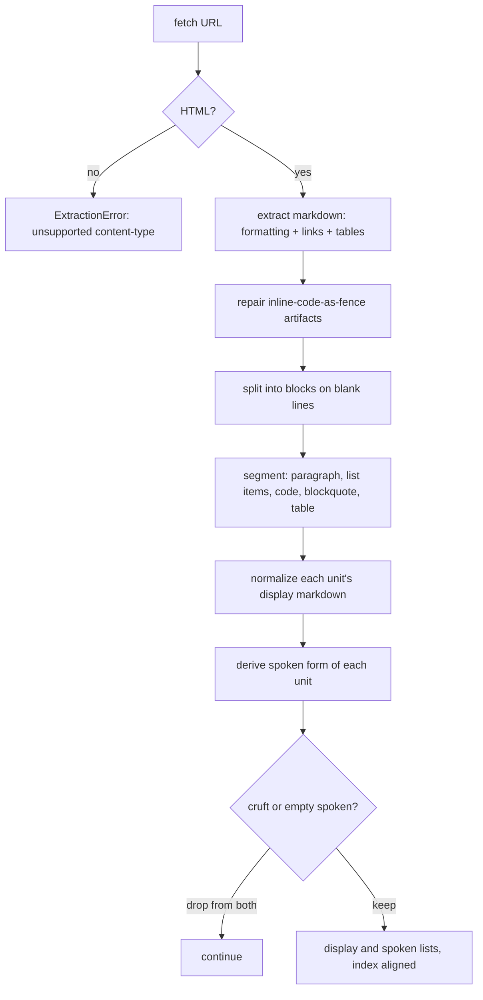
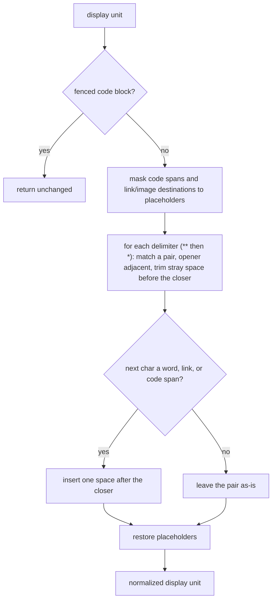

# Article extraction

Turns a public article URL into the `(title, display[], spoken[])` triple every other part of the pipeline builds on: `display[i]` is the markdown a client renders, `spoken[i]` is the same logical unit stripped to clean prose for synthesis, and the two are the same length and index-aligned by construction. Implemented in `api/app/service/extract.py`.

## What it exposes

`extract_article(url)` returns a `(title, display, spoken)` triple:

| Returns | Answers |
|---|---|
| `title` | the article's title, or `None` if extraction found one but no title |
| `display[]` | the markdown units a client renders |
| `spoken[]` | the same units stripped to clean prose for synthesis, same length and index as `display[]` |

Non-HTML, an empty fetch, or an article that extracts to nothing all raise `ExtractionError` instead of returning a degenerate result; [[item-lifecycle]] turns that into a `failed` item at enqueue.

## Fetching, and the content-type gate

`trafilatura.fetch_response` does the fetch and hands back both the decoded HTML and the response headers in one call. The content-type header is checked before anything else: anything that is not HTML (a PDF is the running example) clean-fails immediately with an error naming the unsupported type, rather than being force-parsed into garbage.

> [!note] Why no headless browser
> A plain HTTP fetch plus trafilatura handled every HTML fixture tried in [[player-ready-item]]: a clean static blog, a magazine longread, a newsletter, and a JS-heavy Substack post that was expected to need one. The Substack post server-renders its content, so the plain fetch returned the full article anyway. The HTML↔headless boundary sits considerably further out than assumed; a headless browser is reached for only if a specific site actually fails, never preemptively.

> [!info] Rejected: a readability-style extractor
> trafilatura produced trustworthy boundaries and titles on the real fixtures, and its one fetch already supplies the content-type the non-HTML clean-fail needs.

## How a URL becomes display and spoken units

`extract_article` runs one `trafilatura.extract(output_format="markdown", include_formatting=True, include_links=True, include_tables=True, favor_precision=True)` call: a single markdown document is the source of truth for everything downstream.

> [!note] Why one extraction, and not one pass per purpose
> Two extraction passes (a plain one for audio, a markdown one for display) would diverge whenever an article has richer structure: the underlying extractor segments from the document tree, and toggles like table and link inclusion are tree-shape decisions, not rendering decorations. Two independent passes on the same article can produce different unit counts and boundaries, which manufactures exactly the display/spoken alignment problem a single extraction avoids. Because both lists come from one segmentation, `display[i]` and `spoken[i]` are the same logical unit by construction: alignment is structural, never reconciled.

> [!info] Rejected: dual extraction (a plain pass for audio, a markdown pass for display)
> Dead on the evidence above before it was spiked: `include_tables`/`include_links` are tree-shape decisions, so two passes provably diverge on any article with a table.

> [!info] Rejected: single markdown extraction with text-keyed timing
> The TTS service already returns its timeline keyed by list **position** (see [[tts-service]]), not by matching text back. Text-keyed timing would re-derive a join the service does not need.

### Inline-code-as-fence repair

Before segmentation, `_repair_inline_fences` collapses an artifact trafilatura sometimes emits: an inline `<code>` reference whose text contains a newline renders as a fence glued mid-paragraph (an opening fence at the end of a prose line, the content, then a lone closing fence on its own line) instead of a genuine inline code span. A fenced block can never open mid-line in CommonMark (only whitespace may precede an opening fence), so a fence preceded by text on its line is unambiguously this artifact. Left unrepaired, the lone closing fence is later misread as a block-opening fence and every genuine code block after it in the article cascades apart. The regex requires the closing fence to own its own line and stops the match at a blank line, so an unbalanced glued opener can never reach across a paragraph break to swallow a real block's opening fence.

### Segmentation: blank line is the unit boundary

`_split_units` groups the repaired markdown into blocks on blank-line boundaries first (`_blocks`), keeping a fenced code block's own internal blank lines from splitting it apart. Within a non-fenced block: a table block (every non-blank line matches a table row) or a blockquote block (every line starts with `>`) is kept as one raw unit, so the parser sees its markers structurally instead of them leaking into spoken text; a block containing a list marker is split into per-item units (`_split_list_items`): a non-marker line folds into the current item as a soft-wrap continuation, so a nested (indented) sub-item, which starts with its own marker, becomes its own unit rather than being preserved as nested structure; anything else has its soft-wraps joined into one paragraph unit.

> [!note] Markdown mode hard-wraps a paragraph across single newlines
> A blank line, not `\n`, is the real unit boundary: a single newline inside a markdown paragraph is a soft line break the renderer is free to reflow, and joining on it would fragment one logical paragraph into several units.

### Fence handling: a tightened toggle, an unclosed-opener refusal, and a prose guard

`_blocks` keeps a fenced code block whole by toggling fence state on each fence line, and `_split_units` tags such a block `code`. Three corrections let that toggle survive the shapes trafilatura emits on a code-heavy article, where an unbalanced fence count once swallowed two thirds of the prose as “Code sample.”

The fence is recognized CommonMark-tight — `^[ ]{0,3}(\`\`\`|~~~)`, at most three leading spaces — so an indented traceback caret (`    ~~~^~~`) or an indented literal no longer matches as a fence and desync the toggle. And `_blocks` refuses to open a fence that has no closer anywhere after it, dropping the stray opener: a genuinely unclosed fence runs to EOF, and opening it would hide its prose behind the code placeholder.

> [!note] Why the toggle refuses an unclosed opener
> CommonMark lets an unclosed fence run to EOF as a code block; the splitter refuses it instead and drops the opener so its contents segment as prose. That is a deliberate recovery for audio: the one corpus article with an unclosed fence fences genuine article prose, and opening it silently replaced roughly 1,400 words with “Code sample.” Refusing the opener touches only a genuinely unclosed fence — every balanced fence still pairs — so it cannot drop real code.

The remaining swallow is prose trafilatura wrapped in *closed* fences, which no parser recovers, CommonMark-faithful or otherwise: the fences balance, the toggle stays aligned, and the block is a code block to every parser. `_split_units` runs a guard over a fenced block's interior: a block whose lines carry no REPL, shell, or comment marker (`>>>`, `$`, `#`, `//`) and are mostly sentence-shaped is re-classified as a paragraph with its fences stripped, so the listener hears the actual text.

> [!note] Why a content guard looks at content at all
> The structural fixes cannot reach closed fenced-prose: the fences balance and the block parses as code under every rule set, so the only signal left is the interior itself. The guard leaves genuine transcripts as code on the marker gate and leaves a plain code block as code on its line shape (short, symbol-heavy); its threshold is a build decision against fixtures. Whether a pattern of fenced-prose across an article should escalate to the fallback fetch is left open until a second code-heavy article exists, since only one corpus article fences prose at all.

### Display normalization

`_normalize_display` repairs a spacing defect trafilatura's emphasis emission leaves behind: a closing `**`/`*` that abuts the following token, either directly (`**bold**word`) or with a stray inner space (`**text: **more`), which either fuses two words together or, when it invalidates the emphasis under CommonMark's flanking rule, leaves the literal markers in the rendered text. Inline code spans and link/image destinations are masked out first so their own delimiter-like characters are never touched, then each matched emphasis pair has any stray space before its closer trimmed and a boundary space inserted only if what follows would otherwise render fused against it (a word, a link/image opening bracket, or a masked span about to be restored).

Only the closing edge is touched: the open edge keeps whatever spacing it had, because repairing it too would over-split genuine intra-word emphasis (`super**b**` would become "super b"). An unspaced single-`*` run (`2*3*4`) is left exactly as trafilatura emits it, for the same reason: forcing a word-boundary opener to reject it would also stop the repair from firing on real intra-word emphasis.

### Deriving the spoken form

`_to_spoken` walks each unit's markdown-it-py token tree: a fenced code block becomes the fixed placeholder `"Code sample."`; a table block is routed to `_table_to_spoken`, which linearizes it into header-aware prose (`"Feature: Extraction, Status: done."`) rather than speaking pipe characters; everything else walks `text` and `code_inline` tokens, dropping heading and list markers and link destinations along the way, and restores the word boundary trafilatura drops at a run-in emphasis close (`**phrase**word` → "phrase word"), **close-side only**, for the same over-splitting reason display normalization is close-side only.

A belt-and-suspenders residual pass then turns any *leftover* emphasis marker into a space: trafilatura emits some run-in bold that is CommonMark-invalid (a closing `**` preceded by punctuation and followed immediately by a letter, e.g. `review.**Agents`), which fails markdown-it's flanking rule and is left as literal text rather than parsed as emphasis. The residual pass absorbs it into clean prose regardless.

> [!note] Why table extraction is on, and what it costs
> `include_tables=True` is a precision trade-off accepted so a table can be carried and linearized at all: some table-shaped non-content may occasionally be pulled in across all articles as a result. The trade-off is accepted; its audio + timing round-trip is not yet validated end-to-end (see [[markdown-formatted-paragraphs]]'s open unknowns).

## Dropping a unit, and marker-aware cleanup

A unit is dropped from **both** `display` and `spoken`, never from one alone, under any of: its spoken form strips to empty (an image-only unit, say; synthesizing an empty string would crash or yield a zero-duration window); it echoes the article's title or a known navigation label (`"table of contents"`, `"contents"`); or it carries no alphanumeric character at all (a lone `-`, a bare rule). The title/nav match strips a leading heading or list marker before comparing, so `"# My Title"` is still recognized as an echo of the title `"My Title"`: an exact-string match that did not account for the marker would silently stop firing the moment an echoed title started carrying a `#`.

> [!note] Why the display list is persisted rather than re-extracted
> The display list is written onto the item at enqueue and joined onto the timing at finalize (see [[item-contract]]) rather than re-fetched and re-extracted when synthesis completes. Re-extracting risks a different result across the async gap: the same URL a minute later is not guaranteed to produce the same paragraphs.

## What is not built yet

- **Prose-boilerplate stripping.** Footer donation asides and sponsor mentions arrive as full sentences and are not stripped: a generic filter risks over-trimming real content. See [[prose-boilerplate-stripping]].
- **Quote voice switching**, **image extraction and alt text**, and the still-open blockquote/table end-to-end audio round-trip are all tracked as their own ideas rather than gaps in this note; see [[quote-voice-switching]], [[image-extraction-and-alt-text]], [[markdown-formatted-paragraphs]].
- **Inline formatting losing its preceding space**: a known bug, not yet fixed; see [[inline-formatting-loses-preceding-space]].
- **Reaching pages a plain fetch can't reach** (JS-rendered, or guarded behind a 403): see [[reach-guarded-pages]].

---

Related: [[item-lifecycle]] · [[read-along-timing]] · [[item-contract]] · [[tts-service]] · [[invariants]] · [[markdown-formatted-paragraphs]] · [[audio-read-later-queue]] · [[what-gets-read-aloud]] · [[fence-segmentation-repair]] · [[describe-code-blocks]]
