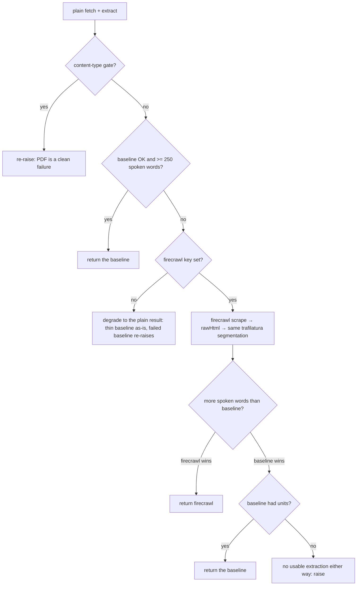
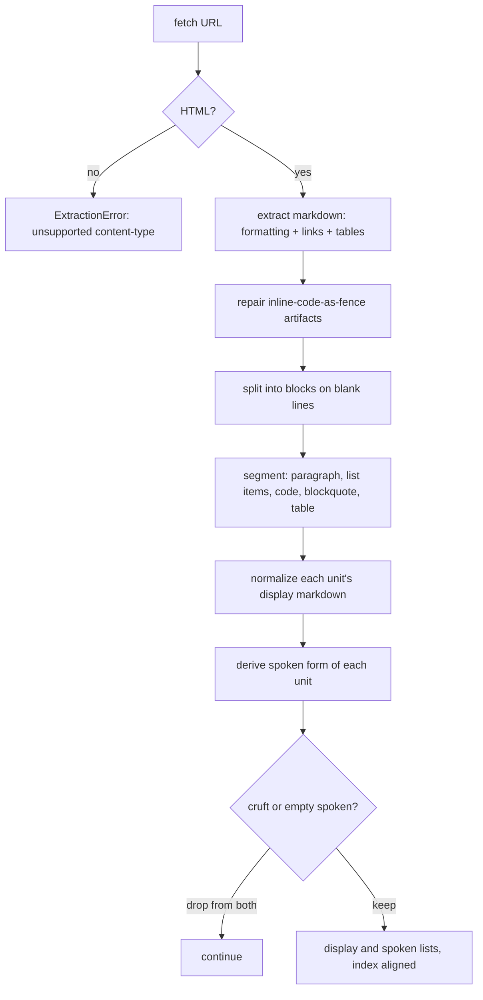
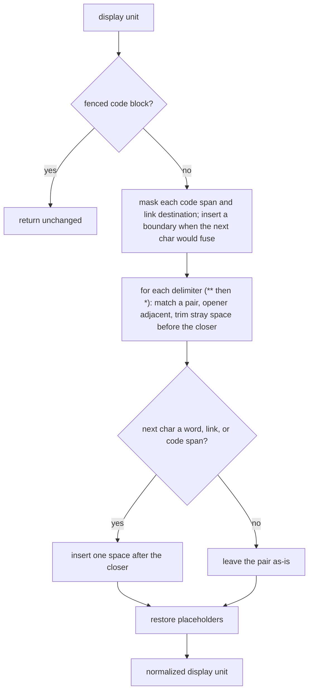
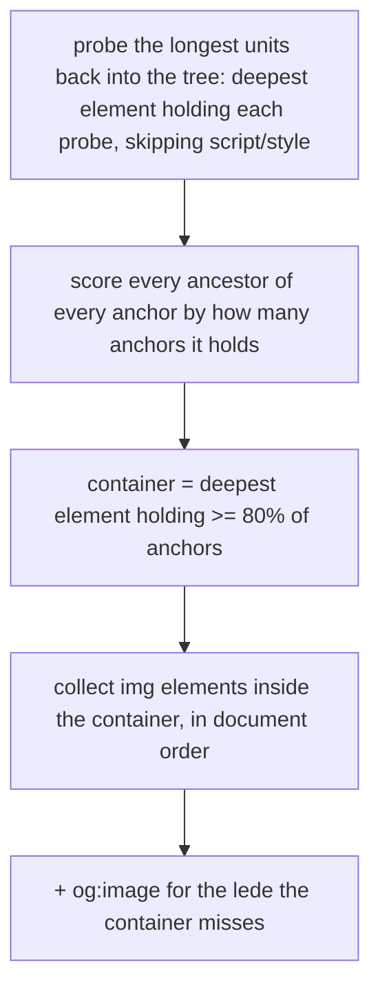

# Article extraction

Turns a public article URL into a title and a list of typed units every other part of the pipeline builds on: each unit carries the markdown a client renders (`display`), its `type`, and the same logical unit stripped to clean prose for synthesis (`spoken`), so the display and spoken forms ride on one unit rather than two parallel lists (see [[item-contract]]). Segmentation lives in `api/app/service/extract.py`; the fetch escalation in `fallback.py`; image selection and acquisition in `images.py`. What each described unit says comes from [[the-describer]].

## What it exposes

`extract_article(url)` returns a `(title, units, html)` triple:

| Returns | Answers |
|---|---|
| `title` | the article's title, or `None` if extraction found one but no title |
| `units` | the typed units, each carrying its `display` markdown, its `type`, and its `spoken` form (see [[item-contract]]) |
| `html` | the fetched source HTML, which image acquisition reads to find the article's own images |

Non-HTML, an empty fetch, or an article that extracts to nothing all raise `ExtractionError` instead of returning a degenerate result; [[item-lifecycle]] turns that into a `failed` item when the queued task runs.

## Fetching, and escalating to a fallback fetch

`trafilatura.fetch_response` does the plain fetch and hands back both the decoded HTML and the response headers in one call. It goes out under a browser user agent, so a host that answers the library's default agent with a 403 returns the article instead. Three checks run before any extraction, in order: a non-2xx `response.status` clean-fails with `fetch: HTTP {status}`, because a 403 error page arrives with a body that would otherwise pass the emptiness check and extract cleanly; an empty body fails next; and the content-type header gates anything that is not HTML, naming the unsupported type rather than force-parsing garbage.

> [!note] The browser user agent is a free fix, so only the agent string moves
> Re-fetching the whole corpus both ways, the browser agent changes exactly one entry, a host that 403s the default agent, and leaves every other extraction byte-identical. So the fetch config carries trafilatura's own defaults verbatim (a bare `ConfigParser` KeyErrors on the first fetch, which reads `MAX_FILE_SIZE`, cookies, and the timeout and redirect limits unconditionally) and overrides the user agent alone.

> [!note] Why no headless browser
> A plain HTTP fetch plus trafilatura handled every HTML fixture tried when the pipeline was first de-risked: a clean static blog, a magazine longread, a newsletter, and a JS-heavy Substack post that was expected to need one. The Substack post server-renders its content, so the plain fetch returned the full article anyway. The HTML↔headless boundary sits considerably further out than assumed; the fallback fetch below is reached for only when a page actually fails, never preemptively.

> [!info] Rejected: a readability-style extractor
> trafilatura produced trustworthy boundaries and titles on the real fixtures, and its one fetch already supplies the content-type the non-HTML clean-fail needs.

### The escalation: a fallback fetch, not a second extractor

`extract_with_fallback` wraps the plain fetch. It runs the plain path first, and escalates to a **firecrawl** fetch when the plain path raised any error except the content-type gate (a non-2xx status, an undecodable body, no article text, or no surviving units), or when it succeeded but yielded fewer than **250 spoken words**. The content-type gate is the one failure that never escalates: firecrawl will not turn a PDF into HTML, so that error re-raises unchanged.

firecrawl is a fetch, not the extractor. Its `rawHtml` feeds the **same** single `trafilatura.extract` call site the plain fetch uses (`_extract_units_from_html`), so there is still exactly one segmentation and invariant 1 holds by construction. Between the two extractions, **more spoken words wins**. Where the plain fetch produced a usable baseline, that baseline is kept whenever firecrawl does not beat it; where the plain fetch produced nothing, whatever firecrawl returns is accepted, floor and all.

> [!note] The 250-word floor buys a second opinion, it never fails an item
> No escalation trigger fails an item on its own. The floor sits inside a corpus canyon: the broken X extraction is 37 spoken words and the smallest legitimate article is 1,002, a 27x gap, so an item cannot flap between escalating and not. On the no-baseline path the floor does not apply at all, because there is nothing to compare against and refusing a small result would only discard the one extraction there is.

> [!note] What firecrawl is called with, and why rawHtml
> The scrape asks for `rawHtml` and `markdown` at `proxy="auto"`. `rawHtml` is chosen over firecrawl's cleaned HTML because the two produce byte-identical prose through trafilatura, and `rawHtml` keeps the images the cleaning throws away (9 against 5 on one corpus article), which the image selection then mines. `markdown` rides along at the same credit as evidence and is never read. `proxy="auto"` bills 1 credit when a basic proxy suffices and 5 on a stealth escalation.

> [!warning] firecrawl's output is non-deterministic, and a longer-wins rule could in principle prefer garbage
> The same URL scraped minutes apart returned a 5x spread in size. `rawHtml` is post-JavaScript, so it can carry hydrated page chrome a plain fetch never had, and more-words-wins could pick that up. It does not happen on this corpus: firecrawl's output deflates rather than inflates against a good plain fetch. The spread bites re-recording a test cassette, never a replay, which returns recorded bytes verbatim.

> [!info] Rejected: firecrawl as the extractor, replacing trafilatura
> firecrawl's own markdown carries page chrome into every document (navigation, "save this story", sponsor blocks) and collapses a table-laid-out article to a couple of units, and `only_main_content` is already on and changes nothing. The objection that a fallback would create two segmentation paths only ever applied while firecrawl did the segmenting; feeding its `rawHtml` through the one trafilatura call removes it.

## How a URL becomes display and spoken units

`extract_article` runs one `trafilatura.extract(output_format="markdown", include_formatting=True, include_links=True, include_tables=True, favor_precision=True)` call: a single markdown document is the source of truth for everything downstream.

> [!note] Why one extraction, and not one pass per purpose
> Two extraction passes (a plain one for audio, a markdown one for display) would diverge whenever an article has richer structure: the underlying extractor segments from the document tree, and toggles like table and link inclusion are tree-shape decisions, not rendering decorations. Two independent passes on the same article can produce different unit counts and boundaries, which manufactures exactly the display/spoken alignment problem a single extraction avoids. Because both lists come from one segmentation, `display[i]` and `spoken[i]` are the same logical unit by construction: alignment is structural, never reconciled.

> [!info] Rejected: dual extraction (a plain pass for audio, a markdown pass for display)
> Dead on the evidence above before it was spiked: `include_tables`/`include_links` are tree-shape decisions, so two passes provably diverge on any article with a table.

> [!info] Rejected: single markdown extraction with text-keyed timing
> The TTS service already returns its timeline keyed by list **position** (see [[tts-service]]), not by matching text back. Text-keyed timing would re-derive a join the service does not need.

### Inline-code-as-fence repair

Before segmentation, `_repair_inline_fences` collapses an artifact trafilatura sometimes emits: an inline `<code>` reference whose text contains a newline renders as a fence glued mid-paragraph (an opening fence at the end of a prose line, the content, then a lone closing fence on its own line) instead of a genuine inline code span. A fenced block can never open mid-line in CommonMark (only whitespace may precede an opening fence), so a fence preceded by text on its line is unambiguously this artifact. Left unrepaired, the lone closing fence is later misread as a block-opening fence and every genuine code block after it in the article cascades apart. The regex requires the closing fence to own its own line and stops the match at a blank line, so an unbalanced glued opener can never reach across a paragraph break to swallow a real block's opening fence.

### Segmentation: blank line is the unit boundary

`_split_units` groups the repaired markdown into blocks on blank-line boundaries first (`_blocks`), keeping a fenced code block's own internal blank lines from splitting it apart. Within a non-fenced block: a table block (every non-blank line matches a table row) or a blockquote block (every line starts with `>`) is kept as one raw unit, so the parser sees its markers structurally instead of them leaking into spoken text; a block containing a list marker is split into per-item units (`_split_list_items`): a non-marker line folds into the current item as a soft-wrap continuation, so a nested (indented) sub-item, which starts with its own marker, becomes its own unit rather than being preserved as nested structure; anything else has its soft-wraps joined into one paragraph unit.

> [!note] Markdown mode hard-wraps a paragraph across single newlines
> A blank line, not `\n`, is the real unit boundary: a single newline inside a markdown paragraph is a soft line break the renderer is free to reflow, and joining on it would fragment one logical paragraph into several units.

### Fence handling: a tightened toggle, an unclosed-opener refusal, and a prose guard

`_blocks` keeps a fenced code block whole by toggling fence state on each fence line, and `_split_units` tags such a block `code`. Three corrections let that toggle survive the shapes trafilatura emits on a code-heavy article, where an unbalanced fence count once swallowed two thirds of the prose as “Code sample.”

The fence is recognized CommonMark-tight — `^[ ]{0,3}(\`\`\`|~~~)`, at most three leading spaces — so an indented traceback caret (`    ~~~^~~`) or an indented literal no longer matches as a fence and desync the toggle. And `_blocks` refuses to open a fence that has no closer anywhere after it, dropping the stray opener: a genuinely unclosed fence runs to EOF, and opening it would hide its prose behind the code placeholder.

> [!note] Why the toggle refuses an unclosed opener
> CommonMark lets an unclosed fence run to EOF as a code block; the splitter refuses it instead and drops the opener so its contents segment as prose. That is a deliberate recovery for audio: the one corpus article with an unclosed fence fences genuine article prose, and opening it silently replaced roughly 1,400 words with “Code sample.” Refusing the opener touches only a genuinely unclosed fence — every balanced fence still pairs — so it cannot drop real code.

The remaining swallow is prose trafilatura wrapped in *closed* fences, which no parser recovers, CommonMark-faithful or otherwise: the fences balance, the toggle stays aligned, and the block is a code block to every parser. `_split_units` runs a guard over a fenced block's interior: a block whose lines carry no REPL, shell, or comment marker (`>>>`, `$`, `#`, `//`) and are mostly sentence-shaped is re-classified as a paragraph with its fences stripped, so the listener hears the actual text.

> [!note] Why a content guard looks at content at all
> The structural fixes cannot reach closed fenced-prose: the fences balance and the block parses as code under every rule set, so the only signal left is the interior itself. The guard leaves genuine transcripts as code on the marker gate and leaves a plain code block as code on its line shape (short, symbol-heavy); its threshold is a build decision against fixtures. Whether a pattern of fenced-prose across an article should escalate to the fallback fetch is left open until a second code-heavy article exists, since only one corpus article fences prose at all.

### Display normalization

`_normalize_display` repairs a spacing defect trafilatura leaves at every inline boundary: a closing delimiter that abuts the following token and fuses two words, or, when it invalidates emphasis under CommonMark's flanking rule, leaks the literal markers. The defect is not emphasis-specific — trafilatura discards the whitespace following any inline element — so the same run-in appears after an inline code span (`None`and) and after a link destination (`[a](u)or`). Inline code spans and link/image destinations are masked out first so the emphasis pass cannot reach their own delimiter-like characters, and each one gains a boundary space at mask time when what follows would otherwise render fused against it (a word, a link/image opening bracket, or an opening paren). Each emphasis pair then has any stray space before its closer trimmed and the same boundary test applied (a word, a bracket, or a masked span about to be restored).

Only the closing edge is touched: the open edge keeps whatever spacing it had, because repairing it too would over-split genuine intra-word emphasis (`super**b**` would become "super b"). An unspaced single-`*` run (`2*3*4`) is left exactly as trafilatura emits it, for the same reason: forcing a word-boundary opener to reject it would also stop the repair from firing on real intra-word emphasis.

> [!note] The cause is trafilatura's DOM handling, not the renderer
> trafilatura discards the whitespace following an inline element in every output format: the source HTML has the space and lxml sees it as a tail, but it is gone before the output format is chosen, so `include_formatting=False` cannot help and there is nothing to escape to. Measured over the article corpus, 29 boundaries were lost; the emphasis repair already caught 25, and the four that reached a listener were every one a code-span or link boundary — which is why the repair was extended there. Two residual fusions live inside table cells, where trafilatura drops the markup along with the space and no delimiter survives to key on: those are not fixable at the markdown layer.

> [!warning] The obvious regex fuses the gap between two spans
> Anchoring on a delimiter pair and testing the next character makes a non-matching span's closer become the next match's opener, so the gap between two code spans is treated as a span and the boundary lands inside it. The following character is captured in a lookahead instead, so every span is consumed in document order — the same trick the emphasis patterns already use.

### Deriving the spoken form

`_to_spoken` walks each unit's markdown-it-py token tree: a fenced code block becomes the fixed placeholder `"Code sample."`; a table block is routed to `_table_to_spoken`, which linearizes it into header-aware prose (`"Feature: Extraction, Status: done."`) rather than speaking pipe characters; everything else walks `text` and `code_inline` tokens, dropping heading and list markers and link destinations along the way, and restores the word boundary trafilatura drops at a run-in emphasis close (`**phrase**word` → "phrase word"), **close-side only**, for the same over-splitting reason display normalization is close-side only.

A belt-and-suspenders residual pass then turns any *leftover* emphasis marker into a space: trafilatura emits some run-in bold that is CommonMark-invalid (a closing `**` preceded by punctuation and followed immediately by a letter, e.g. `review.**Agents`), which fails markdown-it's flanking rule and is left as literal text rather than parsed as emphasis. The residual pass absorbs it into clean prose regardless. That residual pass lives in `sanitize_spoken`, a named function both spoken producers share: trafilatura's parsed prose here, and the describer's model output (see [[the-describer]]), which a JSON schema cannot forbid a marker from carrying inside its string value.

The `"Code sample."` placeholder is the **interim** spoken form of a code block, not its final one. During enrichment [[the-describer]] overwrites a code unit's spoken form with `Code: <one sentence>` and a describable image's with `Image: <one sentence>`; a code block only keeps the floor `"Code with no description."` when the describer fails or the per-item budget is spent.

> [!note] Why table extraction is on, and what it costs
> `include_tables=True` is a precision trade-off accepted so a table can be carried and linearized at all: some table-shaped non-content may occasionally be pulled in across all articles as a result. The trade-off is accepted; its audio + timing round-trip is not yet validated end-to-end for blockquotes and tables.

### Reading an XML-like tagged word the author wrote

An author writing about software writes `&lt;software&gt;`, `&lt;your-api-key&gt;` or `&lt;T&gt;` in the source, and trafilatura hands it on as a literal `<software>` in the markdown. CommonMark calls that an inline HTML tag, so the display form and the spoken form each need a decision about it, and one regex serves both. `_TAG_SHAPE` is drawn on markdown-it's own boundary: `<T>`, ` ` and `<not a tag>` are tags to the parser, while `3 < 4`, `<3` and the autolinks `<a@b.com>` and `<https://x.test>` are not, and the regex matches exactly the first group.

`_normalize_display` backslash-escapes the tag's `<`, so a client renders the author's word. The escape runs inside the existing mask and after the emphasis pass, which gives it three properties for free: an inline code span and a link destination are stashed as placeholders and never touched, a fenced code block never reaches it, and the emphasis repair sees exactly the text it would see without it. A lookbehind on the backslash keeps normalization idempotent.

`sanitize_spoken` reduces the tag to the words inside it, `<software>` to "software" and `
` to "div". It accepts the escaped form as well, because `_table_to_spoken` reads a cell off the raw inline source, where the backslash is still sitting in front of the tag. Putting the rule in the shared tail is what makes one implementation cover both the token walk and the table linearizer.

The `<` also joins the set of following characters that count as fused for the inline-boundary repair, alongside a word character, a link's `[` and an opening paren, in both `_fuses` and the emphasis pass. trafilatura drops the space after every inline closer, so `**bold**<software>` arrives with nothing between the two, and both forms need the boundary restored.

> [!note] The words inside a surviving tag are the article's own
> trafilatura strips every real element, comment, custom tag and inline SVG before it emits markdown: ` ` becomes a paragraph break, `` and `<my-widget>` vanish, `<b>` becomes `**`. Nothing that was markup in the HTML reaches the markdown as a tag. So a tag still present in the extracted text is prose the author escaped, and dropping it silently loses a word the article meant to say. A whitelist of real HTML element names would be actively wrong here, since an author writing about `
` intends the listener to hear "div".

> [!note] Display escapes ahead of the client that will render it
> Left raw, `<software>` is renderer-dependent: a renderer with raw HTML enabled emits it as an unknown element and a browser shows nothing for it, while one with raw HTML disabled escapes it into the word. The backslash makes both settings agree on the word. `web/` does not exist yet, so this is the CommonMark-correct choice made ahead of the client rather than a behaviour observed in one, and it is checked against markdown-it under both settings rather than against a player.

> [!warning] A unit that is only a tag disappears from both lists
> `<software>` alone on a line is an HTML *block*, not an inline tag, so a token walk that reads only inline tokens emits nothing for the whole paragraph. The empty-spoken rule then drops the unit from `display` as well, and an entire paragraph is gone from the page and the audio at once, with nothing failed and nothing logged. Escaping the tag is what stops the block from forming.

> [!note] The synthesizer was never the one dropping the word
> Kokoro reads `<software>` as "software" whether or not the brackets are stripped: passing the raw text through produces near-identical phonemes and duration. The whole loss happened in the token walk before synthesis, so the strip is about being deterministic at the boundary rather than about compensating for the voice.

## Dropping a unit, and marker-aware cleanup

A unit is dropped from **both** `display` and `spoken`, never from one alone, under any of: its spoken form strips to empty (an image-only unit, say; synthesizing an empty string would crash or yield a zero-duration window); it echoes the article's title or a known navigation label (`"table of contents"`, `"contents"`); or it carries no alphanumeric character at all (a lone `-`, a bare rule). The title/nav match strips a leading heading or list marker before comparing, so `"# My Title"` is still recognized as an echo of the title `"My Title"`: an exact-string match that did not account for the marker would silently stop firing the moment an echoed title started carrying a `#`.

> [!note] Why the display list is persisted rather than re-extracted
> The display list is written onto the item at the `generating` transition, once enrichment completes, and joined onto the timing at finalize (see [[item-contract]]) rather than re-fetched and re-extracted when synthesis completes. Re-extracting risks a different result across the async gap: the same URL a minute later is not guaranteed to produce the same paragraphs.

## Article images: selection, acquisition, and captions

`enrich_with_images` adds an article's own figures to the unit list, each an `ImageUnit` with its own spoken form and therefore its own timing window. It runs on whichever HTML won the extraction, so it behaves identically on the plain-fetch and firecrawl paths. An image-only unit strips to empty text and would otherwise be dropped by the cruft trim; giving it a spoken form is what lets it survive as a unit at all.

### Selecting the article's own images

The source is **DOM containment** over the article's own HTML, run in three steps.

trafilatura already found the prose, so its longest units are probes back into the original tree. For each probe, the **deepest** element whose text content holds it is the anchor. Scoring every ancestor by how many anchors it contains, then taking the deepest element holding at least 80% of them, survives one bad match: a strict lowest common ancestor would collapse to `<body>` the moment a single anchor landed in a footer. `og:image` is added on top because containment systematically misses the hero, which sits above the article body element.

> [!warning] Two identity traps that each cost a rewrite in the prototype
> lxml element proxies are recreated on every access, so `id()` is not a stable identity and a membership set built from it silently produces nonsense; element paths from `getroottree().getpath()` are used instead. And the probe must skip `<script>`: both Condé Nast corpus sites carry a JSON-LD copy of the article body, so an unfiltered probe anchors inside it and drags the container to the document root.

### Acquisition: download, validate, rasterise, store

A selected candidate is downloaded under a per-host semaphore (default 2) beneath a global one (default 10), with a 10-second timeout and a 10 MB streamed size cap. The per-host bound is the one with teeth: one article's many same-host images must never open that many connections to a server nagara has no relationship with.

Validation runs on the **decoded bytes**, never on HTTP or HTML metadata. The bytes are sniffed for an `<svg` root; a raster image is opened with Pillow and **kept when `min(width, height) >= 200`**, measured on the decoded file. What survives is re-encoded to WebP keyed by its content hash (see [[persistence-and-storage]] for the storage seam this shares) and the hash becomes the unit's image reference, so no origin URL leaks into persisted markdown.

> [!note] Why validate by decoding, not by trusting the attributes or the Content-Type
> Most of the corpus omits `width`/`height` entirely (all four New Yorker contact sheets carry neither), and a Content-Type header can lie, so the only trustworthy size and format come from decoding the file itself. The 200 px floor sits on a corpus canyon: avatars and tracking pixels cluster around 40 px and every legitimate figure is 305 px or larger. Two square brand logos survive it, accepted rather than chased, because a square-ratio rule has no legitimate square image in the corpus to test against and a false positive costs only one cheap describe call.

An SVG has no pixel size to measure, so it is rasterised to PNG at a fixed 768 px width on the way in and then flows through the same pipeline as any raster image, describable and displayable. The 200 px filter does not apply to it: the figure already passed containment, and after rasterisation the resolution is chosen rather than measured.

> [!warning] The SVG rasteriser needs a system library Railway's image does not carry by default
> `cairosvg` needs the `cairo` system library, absent from Railway's build image. It is installed by a dashboard-only service variable, `RAILPACK_DEPLOY_APT_PACKAGES=libcairo2`, load-bearing and not in `railway.toml` (the same class as the Root Directory / Watch Paths settings in [[deployment-and-ci]]). Without it, the import guard catches the `OSError` a missing system library raises (not `ImportError`) and every SVG degrades to a dropped unit rather than crashing the process.

### Figure captions: the author's own words about the image

When an author wrote a caption, it is the article's own prose about the image and outranks anything generated, so it is spoken verbatim and the describer is never reached (see the precedence in [[the-describer]]). `_find_caption` reads it off the caption-text **leaf**, anchored on the image's enclosing `<figure>`.

> [!note] Per-CMS leaf selectors, not a class-name heuristic
> A corpus caption is rarely a `<figcaption>`: the New Yorker wraps it in a `caption__text` span, ACX in `image-caption`. A heuristic over any class containing "caption" swallows the sibling `CaptionCredit` span and the `CaptionWrapper` that concatenates caption and credit, exactly the "Photograph by … / Courtesy ©" pollution to avoid. Matching the caption-text leaf excludes the credit by construction, and adding a publisher is one tuple entry. Anchoring on the enclosing `<figure>` stops a caption leaking from a neighbouring image.

### An image that will not acquire is dropped from both lists

An image that 404s, times out, exceeds the size cap, will not decode, or fails SVG rasterisation is dropped from `display` and `spoken` alike (invariant 2), and the drop is recorded as a `degradation`: a typed object `{"type": "image", "url": <origin>, "reason": <short>}` that never rides on the wire. This is acquisition failure only, kept distinct from a **describe** failure, which never goes silent (see [[the-describer]]). The two divide by layer: an image that never arrived has no unit to speak for, so it drops; an image that arrived but could not be described keeps a spoken fallback.

> [!note] Why a degradation column, when the item is still `ready`
> `error` stays failed-only, and that rule is worth keeping. A `ready` item that silently dropped six of twelve images exposes nothing to the client and a full record to the operator: technically `ready` and quietly worse. The degradation list is what makes that visible without failing the item. Its scope is runtime degradations only, not data-quality defects like the table-cell whitespace loss below.

Surviving image units are interleaved into the text unit list at their document-order positions, with an `og:image` lede placed before every text unit.

## What is not built yet

- **Prose-boilerplate stripping.** Footer donation asides and sponsor mentions arrive as full sentences and are not stripped: a generic filter risks over-trimming real content.
- **Quote voice switching**, and the blockquote and linearized-table end-to-end audio round-trip: a listener hears both in the one narrator voice, and that path is not yet validated end to end.
- **Inline formatting inside table cells.** trafilatura drops the markup along with the following space inside a table cell (`<strong>real</strong> part` becomes `realpart`), so no delimiter survives to key on: a data-quality defect not fixable at the markdown layer, and not a runtime degradation.
- **Comparison operators read as silence.** A bare `<` or `>` in prose (`3 < 4 and 5 > 2`) is left in both forms exactly as the author wrote it, and Kokoro voices neither character, so a listener hears "three, four". Speaking an operator as a word is a reading rule of its own and no construct in the corpus needs it yet.
- **Code trafilatura flattens into prose.** Where the extractor renders a code sample as ordinary prose rather than a fenced block, nothing downstream recovers it as code: it segments, describes, and reads as the prose it now looks like.
- **Escalating on a pattern of fenced-prose.** Whether a run of closed fenced-prose blocks across one article should itself trigger the fallback fetch is left open until a second code-heavy article exists to measure against; only one corpus article fences prose at all.

---

Related: [[the-describer]] · [[item-lifecycle]] · [[read-along-timing]] · [[item-contract]] · [[tts-service]] · [[persistence-and-storage]] · [[invariants]] · [[what-gets-read-aloud]]
