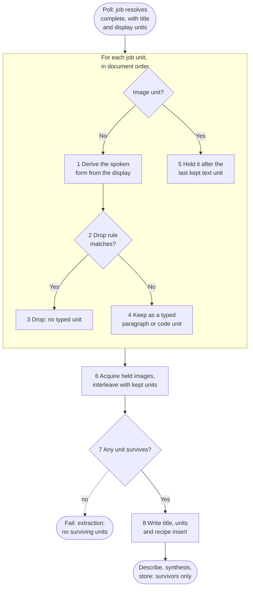
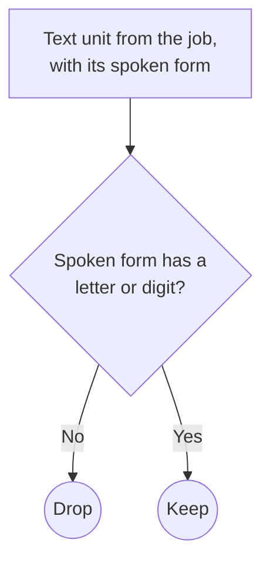

# Article extraction

## 🔭 Overview

The API fetches an article's HTML, hands it to the [extraction-service](extraction-service.md), and turns what comes back into the list of typed units that every later pipeline step reads. The service runs the domain's [recipe](recipes.md) and returns a title and markdown units: paragraphs, code blocks and declared images. When the job resolves, the API derives each text unit's spoken form from its display markdown, drops a unit whose spoken form has nothing to say, and acquires each declared image. The result is one list in which every unit carries its `display`, its `type` and its `spoken` form (see [item-contract](item-contract.md)); what a described unit says comes from [the-describer](the-describer.md).

## 🌐 Fetching the page

The fetch is a firecrawl scrape. Its raw HTML goes to the extraction service unsegmented. The domain of the final URL, after redirects, picks the recipe. A scrape that cannot reach firecrawl, or returns no HTML, fails the item with a `fetch:` reason. The API writes what each scrape bills to the cost ledger in its own commit (see [persistence-and-storage](persistence-and-storage.md)), so a failed item still records the credit it spent.

The fetch sits behind a `Fetcher` interface with one implementation, so a second fetch strategy is another implementation rather than a branch inside the step.

> [!NOTE] What firecrawl is called with, and why rawHtml
> The scrape asks for `rawHtml` and `markdown` at `proxy="auto"`. The API asks for `rawHtml` rather than firecrawl's cleaned HTML because the cleaning throws away images (9 against 5 on one corpus article), and the recipe declares the article's images from the page's own markup. `markdown` costs no extra credit, so the API requests it as evidence; nothing reads it. `proxy="auto"` bills 1 credit when a basic proxy suffices and 5 on a stealth escalation.

> [!WARNING] firecrawl's output is non-deterministic
> The same URL scraped minutes apart returned a 5x spread in size, and `rawHtml` is post-JavaScript, so it can carry hydrated page chrome a plain fetch never had. The recipe's container and ignores are what keep that chrome out of the units. The spread affects re-recording a test cassette, never a replay, which returns recorded bytes verbatim.

## 📩 How a completed job becomes typed units

```mermaid
flowchart TD
    start(["Poll: job resolves<br/>complete, with title<br/>and display units"]) --> loop
    subgraph loop ["For each job unit,<br/>in document order"]
        direction TB
        kind{"Image unit?"}
        kind -->|No| spoken["1 Derive the spoken<br/>form from the display"]
        spoken --> test{"2 Drop rule<br/>matches?"}
        test -->|Yes| drop["3 Drop: no typed unit"]
        test -->|No| keep["4 Keep as a typed<br/>paragraph or code unit"]
        kind -->|Yes| stash["5 Hold it after the<br/>last kept text unit"]
    end
    loop --> acquire["6 Acquire held images,<br/>interleave with kept units"]
    acquire --> any{"7 Any unit survives?"}
    any -. no .-> fail(["Fail: extraction:<br/>no surviving units"])
    any -->|Yes| write["8 Write title, units<br/>and recipe insert"]
    write --> next(["Describe, synthesis,<br/>store: survivors only"])
```

The extraction step runs this once, on the poll that resolves a `complete` job. Steps 1 and 2 are in a required order, because the drop rule reads the spoken form. The loop must also run in document order, because step 5 anchors an image to the last text unit kept so far. When that unit is dropped, the image anchors to the kept unit before it. An image that comes before every text unit goes first in the list. Step 6 acquires the held images and drops any that will not acquire (see below). Step 7 fails the item when nothing survives, before anything is written. Step 8 writes the survivors with the title and, when the job authored or revised the recipe, the insert of its next version (see [recipes](recipes.md)).

From step 8 on, describe, synthesis and store work on the survivors only and never drop a unit, so the length guard at store compares one list against its own timeline (invariant 2).

> [!NOTE] Why the display list is persisted rather than re-extracted
> The display list is written onto the item when the job resolves and joined onto the timing at finalize (see [item-contract](item-contract.md)) rather than re-fetched and re-extracted when synthesis completes. Re-extracting risks a different result across the async gap: the same URL a minute later is not guaranteed to produce the same page.

## 🗣️ Deriving the spoken form

The spoken form is derived from the unit's display markdown by walking its CommonMark token tree, so the display and spoken forms come from one extraction (invariant 1). A fenced code block becomes the fixed placeholder `"Code sample."`. A table is spoken as its body rows only, each row as its own line of header-aware prose (`"Feature: Extraction, Status: done."`) and never as pipe characters. The header row gets no line of its own. A row gets a full stop only when it does not already end in `.`, `!` or `?`. A cell goes through the same inline walk as a paragraph, so a code span keeps its text, and then through `sanitize_spoken`, described below. A heading, a quote and the title unit are read as their words, without their markers. Every block inside a unit becomes its own line, so a unit carrying several paragraphs or list items never runs the last word of one into the first word of the next. A list item gets no full stop. An ordered item keeps its `1.` at the start of its line, and the spoken form does not announce nesting depth. A code block or an image nested inside a list unit is silent in the spoken form. It stays inside the list's own display and is never described or acquired on its own (see [markdown-units](markdown-units.md)). A list item that holds only a code block, an image or a nested list gets no line. The derivation strips a task-list checkbox and reads struck-through text as its words, with no sign of the strike. Emphasis markers and link destinations are dropped throughout.

A shared tail, `sanitize_spoken`, then turns any leftover emphasis or code marker that touches text into a space, so the newlines between a unit's lines survive the pass. It drops the space a marker left before punctuation and collapses whitespace. It reduces an opening or closing tag around a word to the word inside (`<software>` to "software", `
` to "div"). A lone `<` or `>` is not a tag, so this step leaves it for the operator rule that follows. A last pass turns a comparison-operator sequence into the word it stands for, longest match first: `<=` "less than or equal to", `>=` "greater than or equal to", `->` "to", `=>` "to", `<-` "from", `<<` "much less than", `>>` "much greater than", `<3` "heart", then the bare `<` "less than" and `>` "greater than". `<3` becomes "heart" only when no digit follows, so `<30` reads "less than 30". The pass puts a space on each side of every word it inserts, so `a<b` reads "a less than b". The describer's model output runs through the same tail (see [the-describer](the-describer.md)), since a JSON schema cannot forbid a marker inside its string value.

The `"Code sample."` placeholder is the **interim** spoken form of a code block. During enrichment the describer overwrites a code unit's spoken form with `Code: <one sentence>` and a describable image's with `Image: <one sentence>`; a code block keeps the floor `"Code with no description."` only when the describer fails or the per-item budget is spent.

> [!NOTE] The words inside a surviving tag are the article's own
> An author writing about software writes `<software>`, `<your-api-key>` or `<T>` as text, and a tag still present in a unit's markdown is prose the author escaped. Dropping it silently loses a word the article meant to say, and a whitelist of real HTML element names would be actively wrong here, since an author writing about `
` intends the listener to hear "div".

## 🗑️ Dropping a unit with nothing to say

```mermaid
flowchart TD
    A["Text unit from the job,<br/>with its spoken form"] --> C{"Spoken form has a<br/>letter or digit?"}
    C -->|No| D((Drop))
    C -->|Yes| K((Keep))
```

The rule runs on every paragraph and code unit of a completed job and reads only the spoken form: a letter inside a link URL or a code block's language tag never keeps a unit. "Letter or digit" follows Unicode, so non-Latin text is kept. An empty spoken form fails the same test. A dropped unit never becomes a typed unit, so its display, its spoken form and its timing window leave together (invariant 2), and it leaves no trace: no degradation, no log.

What the rule catches is a section-break ornament (`❦`, `* * *`, `§`) or bare punctuation that a recipe emitted as its own paragraph. A code unit always passes, because its spoken form is the `"Code sample."` placeholder.

> [!NOTE] Why a drop leaves no trace
> The rule drops only units whose spoken form carries no letter or digit, so what disappears is never a word the author wrote. A degradation records content the item lost, and an ornament carries no content.

> [!WARNING] A unit with nothing to pronounce crashes synthesis
> The synthesizer produces no audio for a paragraph made only of a symbol, and the TTS service fails the whole call on it. A sockpuppet.org recipe that kept its `❦` section breaks as paragraphs failed its items with a `tts:` error while every extraction step reported success. The drop is what keeps such a unit from reaching synthesis.

> [!TIP] Rejected: echoed-title and navigation-label matching on job units
> The recipe already names the title element and carries the ignore list the author agent wrote, so an echoed title or a "Contents" label is the recipe's to exclude. Matching them again in the API would add a heuristic that repeats a decision the recipe already makes.

## 🖼️ Article images: acquisition and spoken form

The recipe declares which images belong to the article: each image unit carries its `src` and `alt`, and the API acquires exactly the images the recipe declares, with no selection of its own. Each acquired image gets a spoken form and goes after the text unit it followed in the page. Each image is an `ImageUnit` with its own spoken form and therefore its own timing window.

### ⬇️ Acquisition: download, validate, rasterise, store

A declared image is downloaded under a per-host semaphore (default 2) beneath a global one (default 10), with a 10-second timeout and a 10 MB streamed size cap. The per-host bound is the one that matters: one article's many same-host images must never open that many connections to a server nagara has no relationship with.

Validation runs on the **decoded bytes**, never on HTTP or HTML metadata. The bytes are sniffed for an `<svg` root; a raster image is opened with Pillow and **kept when `min(width, height) >= 200`**, measured on the decoded file. What survives is re-encoded to WebP keyed by its content hash (see [persistence-and-storage](persistence-and-storage.md) for the storage seam this shares) and the hash becomes the unit's image reference, so no origin URL leaks into persisted markdown.

> [!NOTE] Why validate by decoding, not by trusting the attributes or the Content-Type
> Most of the corpus omits `width`/`height` entirely (all four New Yorker contact sheets carry neither), and a Content-Type header can lie, so the only trustworthy size and format come from decoding the file itself. The 200 px floor sits in a gap in the corpus: avatars and tracking pixels cluster around 40 px and every legitimate figure is 305 px or larger. Two square brand logos survive it, accepted rather than chased, because a square-ratio rule has no legitimate square image in the corpus to test against and a false positive costs only one cheap describe call.

An SVG has no pixel size to measure, so it is rasterised to PNG at a fixed 768 px width on the way in and then flows through the same pipeline as any raster image, describable and displayable. The 200 px filter does not apply to it, because the rasteriser sets its resolution.

> [!WARNING] The SVG rasteriser needs a system library Railway's image does not carry by default
> `cairosvg` needs the `cairo` system library, absent from Railway's build image. It is installed by a dashboard-only service variable, `RAILPACK_DEPLOY_APT_PACKAGES=libcairo2`, required and not in `railway.toml` (the same class as the Root Directory / Watch Paths settings in [deployment-and-ci](deployment-and-ci.md)). Without it, the import guard catches the `OSError` a missing system library raises (not `ImportError`) and every SVG degrades to a dropped unit rather than crashing the process.

### 💬 An image's spoken form

An acquired image speaks its alt verbatim as `Image: <alt>`, or the floor `"Image with no description."` when the alt is empty. The good-alt filter decides whether the describer replaces that form with a generated sentence (see the precedence in [the-describer](the-describer.md)). One of its checks is the cruft test: an alt that repeats the article title, or carries no letter or digit, is not a good alt.

### ❌ An image that will not acquire is dropped from both lists

An image that 404s, times out, exceeds the size cap, will not decode, or fails SVG rasterisation is dropped from `display` and `spoken` alike (invariant 2), and the drop is recorded as a `degradation`: a typed object `{"type": "image", "url": <origin>, "reason": <short>}` that never rides on the wire. This is acquisition failure only, kept distinct from a **describe** failure, which never goes silent (see [the-describer](the-describer.md)). The two divide by layer: an image that never arrived has no unit to speak for, so it drops; an image that arrived but could not be described keeps a spoken fallback.

> [!NOTE] Why a degradation column, when the item is still `ready`
> `error` stays failed-only, and that rule is worth keeping. A `ready` item that silently dropped six of twelve images exposes nothing to the client and a full record to the operator: technically `ready` and quietly worse. The degradation list is what makes that visible without failing the item. Its scope is runtime degradations only.

## ⏩ What is not built yet

- **Prose-boilerplate stripping.** Footer donation asides and sponsor mentions arrive as full sentences and reach the audio unless the recipe ignores them. The API does not filter them, because a generic filter risks trimming real content.
- **Quote voice switching.** A listener hears a quote in the one narrator voice, and nobody has yet validated the blockquote audio round-trip end to end.

---

Related: [recipes](recipes.md) · [markdown-units](markdown-units.md) · [extraction-service](extraction-service.md) · [the-describer](the-describer.md) · [item-lifecycle](item-lifecycle.md) · [read-along-timing](read-along-timing.md) · [item-contract](item-contract.md) · [tts-service](tts-service.md) · [persistence-and-storage](persistence-and-storage.md) · [invariants](invariants.md) · [what-gets-read-aloud](../product-design/what-gets-read-aloud.md)
