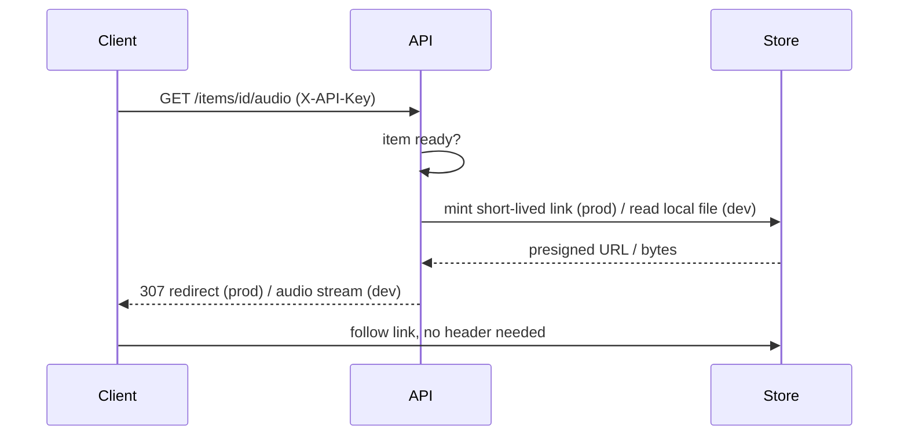

# Authentication

## 🔭 Overview

Items are private: an article someone enqueues is theirs, not public. A single API key acts as the user's identity, and it guards every route that touches an item.

## ⚙️ Implementation details

The guard is a single dependency, `require_key`, wired once at the router level (`APIRouter(prefix="/items", dependencies=[Depends(require_key)])`) so every route on the `/items` router requires it uniformly rather than each handler checking it individually:

```python
if key != settings.api_key:
    raise HTTPException(401, "invalid or missing X-API-Key")
```

Possessing the key **is** being the user: there is no separate identity, session, or login. The key is presented on an `X-API-Key` header and checked against the single configured value on every item route: creation, polling, and audio alike. `/health` is the one public route, and it carries no item data, a deliberate, narrow exception for platform health checks (see [deployment-and-ci](deployment-and-ci.md)).

> [!NOTE] Why one key rather than sessions or OAuth, for now
> The first consumer is an agent (Tachikoma), not a browser: it wants to present one credential on each call, not run an interactive login. There is no audience yet to onboard with real accounts; multi-user identity comes later, once the open question of whether anyone besides the owner wants this has an audience to answer it, and the private queue works for its first user without it.

## 📩 How audio reaches a browser without a header

The audio route requires the key to **obtain** a link, and mints one only for a `ready` item: in production it returns a redirect to a short-lived presigned object-storage URL (see [persistence-and-storage](persistence-and-storage.md)) that the browser's own request can follow with no header at all; in development it streams the local file directly. The store itself stays private: every way to reach it is a link minted to an authenticated caller, and those links expire.



> [!NOTE] Why the route mints a link instead of gating the bytes
> A browser `<audio>` element cannot attach a custom header to the request it makes for the audio file, so the key alone cannot gate the byte stream. Gating the link that leads to the bytes is the check a browser can pass.

## ⏩ What is not built yet

**Multi-user is a rewrite of the guard.** Going multi-user means introducing genuine identity and per-user key management, with a Google OAuth login taking the place of the single-key shim rather than sitting beside it. See [the queue](../product-design/queue.md) for what a user sees once multiple keys and key management exist.

---

Related: [item-lifecycle](item-lifecycle.md) · [item-contract](item-contract.md) · [persistence-and-storage](persistence-and-storage.md) · [deployment-and-ci](deployment-and-ci.md) · [invariants](invariants.md)
