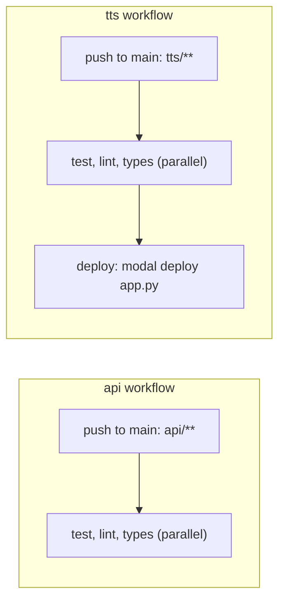

# Deployment and CI

The API and the TTS service are two separately deployed processes with two separate deploy paths, kept isolated by path filtering on both sides.

## How the API deploys

Railway holds one project with three resources: the API service, a managed Postgres database, and a managed S3-compatible bucket for audio. The API reaches Postgres over Railway's private network and the bucket over its S3 endpoint, with credentials supplied as service environment variables (see [[persistence-and-storage]]). The service is built with Railway's default builder from the uv-managed project manifest, no bespoke build recipe, and runs **serverless (scale-to-zero)**: it sleeps when idle and wakes on the next request. `api/railway.toml` carries the settings that make this so:

| Setting | Answers |
|---|---|
| `builder = "RAILPACK"` | how the image is built, from the uv-managed manifest, no custom recipe |
| `startCommand` | how the container boots: `uvicorn app.main:app --host 0.0.0.0 --port $PORT` |
| `preDeployCommand = "alembic upgrade head"` | the schema is migrated before the new release serves traffic, not on process start, so a wake is a container start rather than a migration |
| `healthcheckPath = "/health"` | what Railway polls to decide the container is up |
| `sleepApplication = true` | scale-to-zero is on |

Pushes to `main` auto-deploy via the service's connected GitHub source; `railway up --service nagara-api` from within `api/` stays available as a manual override.

> [!warning] Two Railway settings are dashboard-only and load-bearing
> The service's **Root Directory must be `api`** (the app and `railway.toml` live there, not the repo root), and its **Watch Paths must be `api/**`**: neither is expressible in `railway.toml` itself, so a docs-only or `web/`-only push does not silently redeploy production only because someone assumed the config file was the whole story.

The production URL, `nagara.asermax.com`, is a Cloudflare-managed CNAME to the Railway custom-domain target, with TLS issued by Railway.

> [!warning] The Cloudflare record must stay DNS-only, and the custom domain's target port must be 8080
> Proxying through Cloudflare blocks Railway's certificate validation, so the record has to stay DNS-only rather than proxied. The custom domain's target port must point at `$PORT` (8080), not 80, or the domain resolves to nothing useful.

> [!info] Rejected: another PaaS, an always-on VM, or self-hosted Postgres/object storage
> Railway was the pre-declared target and provides first-party managed Postgres, S3-compatible buckets, and CLI provisioning in one place. An always-on VM forgoes scale-to-zero and pays steady idle cost for a product whose demand is unproven ([[validate-demand]]); self-hosting either managed service is unwarranted operational burden for a single-service MVP.

## How the TTS service deploys

`tts/` is pushed independently with `modal deploy`, from within `tts/` or via CI below; see [[tts-service]] for what actually runs on Modal.

## CI: two independent, path-filtered pipelines

`.github/workflows/api.yml` and `.github/workflows/tts.yml` each run **test, lint, and types as three parallel jobs** on pushes to `main`, path-filtered to their own subdirectory (`api/**`, `tts/**`): the same isolation principle as Railway's watch paths, so a docs-only push, or a change to one subproject, triggers neither the other subproject's checks nor its deploy. Each job provisions the pinned toolchain (uv/ruff/ty/pytest, see the repository's `CLAUDE.md`) with `uv sync --frozen` against that subproject's lockfile.

The `tts` workflow adds a **`deploy` job that depends on all three checks** and runs `modal deploy`, so deployment is automatic and gated on green checks rather than being a step someone runs by hand. It authenticates with `MODAL_TOKEN_ID` / `MODAL_TOKEN_SECRET` supplied as GitHub Actions secrets. `api` has no deploy job: Railway's own connected-source deploy is not gated by these workflows at all.

> [!note] Two deploy models coexist by design
> The API deploys through Railway's own GitHub integration, entirely outside GitHub Actions; the TTS service deploys from inside a gated Actions job. Nothing unifies them into one pipeline, because they are genuinely two different platforms with two different native deploy mechanisms, and forcing one model onto both would fight at least one of them.

The `tts` check jobs install the full dev dependency group (torch-cpu, kokoro, numpy) because `ty` needs them to resolve `app.py`'s image-runtime imports locally; the deploy job installs only the Modal client (`--no-dev`). uv's lockfile-keyed cache absorbs most of the repeat install cost.

## Binary fixtures go through Git LFS

`.gitattributes` routes `*.ogg`, `*.wav`, `*.mp3` and `*.png` through Git LFS, so an audio or image fixture is stored as a pointer and the blob itself lives outside the packfile every clone downloads. Audio is the fixture kind this project actually produces, and a generated article runs to several megabytes.

> [!warning] A binary committed without this is permanent until someone rewrites history
> Deleting the file in a later commit removes it from the working tree and leaves the blob in every clone at full size. Two Opus fixtures reached pushed history this way before `.gitattributes` existed, and getting them back out took a `filter-repo` rewrite and a force push over a shared branch: see [[scrub-audio-blobs-from-history]] for what that cost and why the remote still serves an unreachable blob by hash.

## What is not built yet

`web/` and `api/` are served from separate hosts today; serving them from one origin once `web/` exists is [[single-origin-web-and-api]].

---

Related: [[tts-service]] · [[persistence-and-storage]] · [[authentication]] · [[invariants]] · [[single-origin-web-and-api]] · [[scrub-audio-blobs-from-history]]
