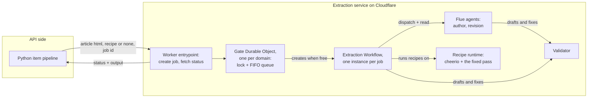

# Extraction service

## 🔭 Overview

Extraction runs as a service on Cloudflare, separate from the item pipeline. The Python API sends an article and a recipe, and receives the extraction result. When an agent authored or revised the recipe, it also receives the final recipe. The service is stateless over recipes and items; every call carries everything, and the item database stays the record. The TTS service stays on Modal, a separate deployable untouched by the move.

## 🏗️ Architecture

The Worker entrypoint owns the HTTP endpoints and nothing else: two calls, create-job and fetch-status, translating between the Python API and the internals. The gate Durable Object, one instance per domain key, owns per-domain serialization: a lock and a FIFO queue in its storage; it is the only creator of workflow instances for its domain, so a job id that does not resolve yet means the job is queued. The extraction Workflow, one instance per job, owns the extraction sequence: run-and-validate the provided recipe, author when none came, revise when validation fails, end on the not-article verdict, and return the output. The Flue agents, one per prompt, own the judgement: bounded loops with retries, the validator mounted as their tool, one conversation per Durable Object, with durable turn replay. The recipe runtime owns deterministic execution: cheerio, the fixed conversion pass, the validator's mechanical checks.

> [!WARNING] The recipe runtime is unproven on the Workers engine
> Turndown documented-fails on Workers without a DOM, with `document is not defined` as an open issue against the project, and cheerio has no first-party statement either way. Both probably run under a bundled DOM shim within the script-size budget. A spike proves the runtime on workerd before anything builds; the fixed pass depends on this fact.

## ♠️ The boundary

| Direction | What crosses |
|---|---|
| In | the article's HTML, the domain's current recipe script or none, a caller-chosen job id |
| Out | the status, and once finished the output: the title and units or the not-article verdict, plus the final recipe script when an agent authored or revised the recipe |

The calling pattern is spawn-and-resolve, the same shape the API already uses with the TTS service: create the job, keep the handle, resolve lazily on poll. Creating a job with an id that already exists within its retention window throws, so the spawn contract is create-then-resume: a retried create with the same job id resumes the existing instance instead of failing. The item row carries the job id as its extraction handle, and the poll reads status through the entrypoint. A job id that does not resolve yet means the article is queued behind its domain's running job; the gate creates the instance when the domain's job finishes, and the workflow's last step notifies the gate.

## ⚙️ Platform limits

A workflow instance has no wall-clock limit; the bound is CPU per invocation, tens of seconds by default and configurable upward. The agent loops never approach that bound, because model turns are input-output waits. Instance parameters, step results and the returned output are each capped near 1 MiB: an article whose fetched HTML exceeds the cap fails as too large before any step runs. Finished outputs persist for the retention window, days on the free tier and a month on the paid tier, which is far longer than the poll's resolve cadence. Instance state is kept for that window too, so a job id is not reusable until the window passes.

## ℹ️ Sources

- Cloudflare Workflows, Workers API and limits: https://developers.cloudflare.com/workflows/build/workers-api/ and https://developers.cloudflare.com/workflows/reference/limits/
- Triggering workflows, including from a Durable Object: https://developers.cloudflare.com/workflows/build/trigger-workflows/
- Flue on Cloudflare, agents as Durable Objects: https://flueframework.com/docs/ecosystem/deploy/cloudflare/
- Flue workflows, dispatch and read from a step: https://flueframework.com/docs/guide/workflows/
- The Cloudflare announcement of the Agents SDK and Flue: https://blog.cloudflare.com/agents-platform-flue-sdk/

---

Related: [recipes](recipes.md) · [item-lifecycle](item-lifecycle.md) · [tts-service](tts-service.md) · [article-extraction](article-extraction.md) · [deployment-and-ci](deployment-and-ci.md)
