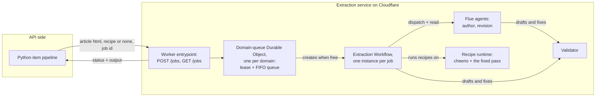
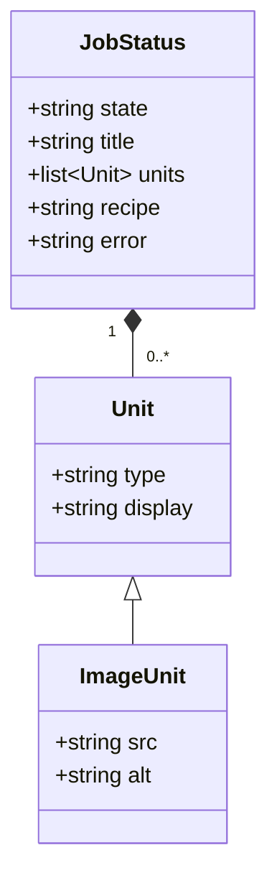
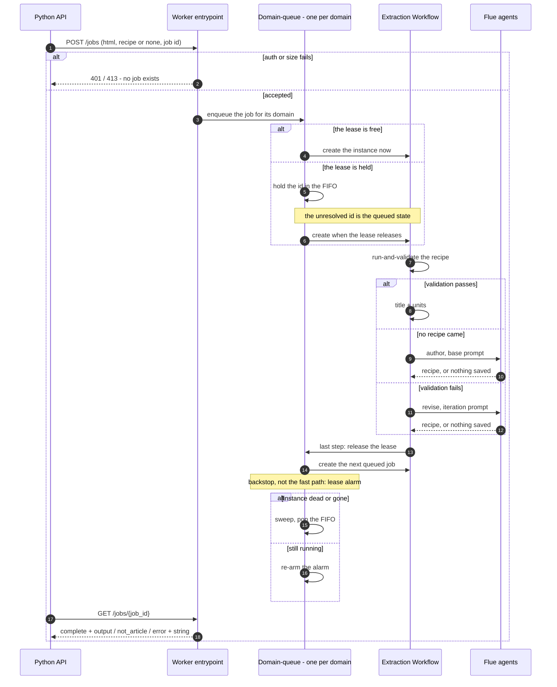

# Extraction service

## 🔭 Overview

Extraction runs as a service on Cloudflare, separate from the item pipeline. The Python API sends an article and a recipe, and receives the extraction result and, when an agent authored or revised the recipe, the final recipe. The service is stateless over recipes and items; every call carries everything, and the item database stays the record. The TTS service stays on Modal, a separate deployable untouched by the move. The payload shapes belong to the service: the API declares its own mirror of them and adjusts when the service's shapes change.

## 🏗️ Architecture

The Worker entrypoint owns the HTTP endpoints and nothing else: two routes, translating between the Python API and the internals. Access authenticates at the edge before the Worker runs; the service carries no authentication code. The domain-queue Durable Object, one instance per domain key, owns per-domain serialization: a lease and a FIFO queue in its storage; it is the only creator of workflow instances for its domain, so a job id that does not resolve yet means the job is queued. The extraction Workflow, one instance per job, owns the extraction sequence: run-and-validate the provided recipe, author when none came, revise when validation fails, end on the not-article verdict, and return the output. The Flue agents, one per prompt, own the judgement: bounded loops with retries, the validator mounted as their tool, one conversation per Durable Object, with durable turn replay. The recipe runtime owns deterministic execution: cheerio, the fixed conversion pass, the validator's mechanical checks.

> [!WARNING] Recipe source executes in a Dynamic Worker
> workerd blocks every direct path to running source: `eval` and `new Function` throw, `data:` URL imports do not resolve. A Dynamic Worker, in open beta for runtime-given code, runs the script instead; the beta is the standing risk and must be verified again at implementation time, before anything builds against it. The deterministic stack around it is proven on workerd: cheerio parses a real article in 8 to 18 ms, and the fixed pass converts in 2 to 19 ms with turndown over domino-parsed nodes.

## ♠️ What the service exposes

| Member | Answers | Who asks |
|---|---|---|
| `POST /jobs` | acceptance: `201`; `409` when the id already exists, the resume path; `413` when the HTML exceeds the ~1 MiB cap, rejected with no job created | the extraction client, at spawn |
| `GET /jobs/{job_id}` | the job's state and output, `200` always, the state in the body | the extraction client, on poll |

The create body carries `html`, the fetched article (required); `recipe`, the domain's current script (absent means author); and `job_id`, the caller-chosen instance id matching `^[a-zA-Z0-9_][a-zA-Z0-9-_]*$`, so the API's `itm_` ids are legal unchanged; and `domain`, the article's final host, which keys the domain-queue.

The state is one of `queued`, `running`, `complete`, `not_article`, `error`. `complete` carries `title`, `units`, and `recipe` when an agent authored or revised one; `error` carries the service's error string, the only diagnostic it emits. Absent members mean not applicable, never empty.

A unit is `type` plus `display`; an image unit adds `src`, resolved by the recipe's lazy-load handling, and `alt`, which the recipe never invents. No spoken form crosses the boundary. The API derives it.

## 📩 A job's path

The workflow's last step releases the lease and the domain-queue creates the FIFO's next job; the alarm is the backstop for a job that dies without running that step. Acquiring the lease sets an alarm five minutes out; when it fires on a busy domain, the domain-queue asks the platform for the running instance's status. When the status is ended or the instance is unaddressable, the domain-queue sweeps the lease and starts the next job; when the instance is running, the domain-queue re-arms the alarm. The domain-queue creates the instance before it persists the lease, both inside its single-threaded window, so a failed create leaves no lease behind.

## 🧩 The recipe runtime

| Member | Answers | Who asks |
|---|---|---|
| `run(recipe source, html)` | the title, the units, or the verdict, with the validation report | the workflow's run step |
| `validate(units, html)` | the mechanical checks' report alone | the validator tool, inside the agents' loops |

`run` executes the script inside a Dynamic Worker: the injection bundle carries cheerio, domino, and turndown with it, the article parses inside because the recipe's `$` must exist there, and what returns is JSON. The validator is not part of the bundle; the mechanical checks run in the main Worker, so one implementation serves the workflow path and the agent tool path. A recipe that throws against changed markup, or hangs until the CPU cap kills it, is a validation failure: the revision path's trigger, with its crash report as the validator report. Only platform failures outside the recipe are `error` terminals: a Dynamic Worker that is unreachable, a bundle that does not load.

## 🤖 The agents

Each dispatch opens a conversation keyed by the job id. The conversation is disposable, carries no history from other jobs, and its prompts are self-contained. A retry of the whole run is a fresh conversation under a suffixed id. The bounds are one hundred turns, authoring one retry, revision two, set in configuration with the model; the model is flash-class, to be chosen by evaluation before the agent round runs. The settled reply is a script validated in-loop by its own tool calls, a not-article verdict from the author, or the agent giving up. The reply never carries units. The workflow runs every settled script through the runtime, so a fresh recipe and a years-old one extract through the same deterministic path.

## 📞 The calling side

The API calls through a thin client: `spawn(html, recipe or none, job id, domain)` at the source step, and `resolve(job id)` on poll. The pipeline maps the states to outcomes and writes the `extraction:`-prefixed errors; the client translates nothing. The item's extraction handle is the job id, stable across retries. A retried item re-attaches to the same running job, and the API mints a new id only when the previous job ended `error`, because that is the one terminal whose instance would hand back the same failure.

Fetching stays API-side and always uses firecrawl. The queued ceiling measures 300 seconds from `queued_at` and fires during holds too; each accepted retry restarts the clock. A `not_article` verdict fails the item permanently, and the retry route accepts the item under its cap, the verdict included.

> [!NOTE] The ceiling can kill an item mid-authoring
> An authoring that outlasts about four windows exhausts the retry cap, the item dies, and its job completes unread. The recipe the job authored is lost, and the domain's next article authors fresh. Accepted knowingly. Authoring inside one window is the expected case, the turn bound is a ceiling rather than a forecast, and the ceiling's simplicity is worth more than a paused clock.

## ⚙️ Platform limits

A workflow instance has no wall-clock limit; the bound is CPU per invocation, tens of seconds by default and configurable upward. The agent loops never approach that bound, because model turns are input-output waits. Instance parameters, step results and the returned output are each capped near 1 MiB: an article whose fetched HTML exceeds the cap fails as too large before any step runs. Finished outputs persist for the retention window, days on the free tier and a month on the paid tier, which is far longer than the poll's resolve cadence. Instance state is kept for that window too, so a job id is not reusable until the window passes.

## ℹ️ Sources

- Cloudflare Workflows, Workers API and limits: https://developers.cloudflare.com/workflows/build/workers-api/ and https://developers.cloudflare.com/workflows/reference/limits/
- Triggering workflows, including from a Durable Object: https://developers.cloudflare.com/workflows/build/trigger-workflows/
- Flue on Cloudflare, agents as Durable Objects: https://flueframework.com/docs/ecosystem/deploy/cloudflare/
- Flue workflows, dispatch and read from a step: https://flueframework.com/docs/guide/workflows/
- The Cloudflare announcement of the Agents SDK and Flue: https://blog.cloudflare.com/agents-platform-flue-sdk/
- Dynamic Workers, the open-beta primitive for runtime-given code: https://developers.cloudflare.com/dynamic-workers/

---

Related: [recipes](recipes.md) · [item-lifecycle](item-lifecycle.md) · [tts-service](tts-service.md) · [article-extraction](article-extraction.md) · [deployment-and-ci](deployment-and-ci.md)
