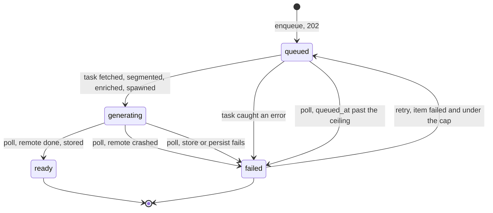
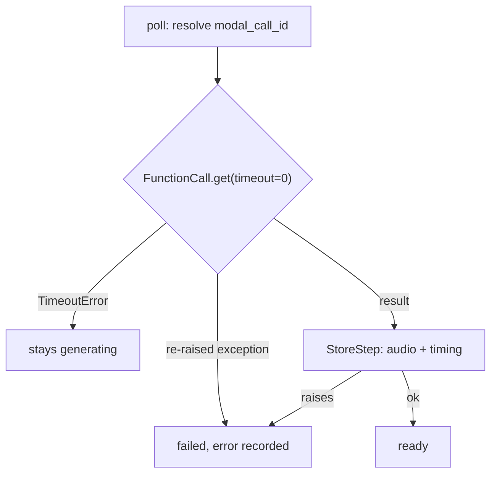
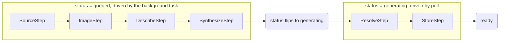

# Item lifecycle

## 🔭 Overview

An item is the single persisted entity nagara has: the record of one `enqueue(url, voice?)` call, from creation through to playable audio or a clear failure. A four-state machine, three routes and one background task drive it; [article-extraction](article-extraction.md) covers what the enrichment task does to a URL and [read-along-timing](read-along-timing.md) covers what the TTS service hands back.

## 💽 Modeling

The `Item` row, one per `enqueue` call, with `status` one of `queued` / `generating` / `ready` / `failed`:

| Field | Answers |
|---|---|
| `id` | the item's identity: `"itm_"` plus 8 hex characters |
| `url`, `title` | which article this item is for; `title` fills once extraction runs |
| `voice` | which Kokoro voice this item's audio uses, fixed at creation |
| `created_at` | when it was enqueued; never moves |
| `queued_at` | when the current attempt entered the queue: set in the enqueue write and rewritten on every retry. The ceiling measures work age from this, not from `created_at` |
| `enriched_at` | set once every unit has resolved: the flag that enrichment finished and a retry can re-spawn without re-enriching |
| `retry_count` | how many times this item has been re-driven; bounds re-spend against `retry_max` |
| `duration`, `audio_format` | populated once `ready` |
| `units` | the typed display/spoken/timing units, written as enrichment runs and timed at `ready`; see [article-extraction](article-extraction.md) and [item-contract](item-contract.md) |
| `degradations` | per-unit enrichment failures that did not fail the item; null when the enrichment was clean |
| `error` | populated only when `status` is `failed` |
| `modal_call_id` | the in-flight synthesis call's handle, resolved on poll |

Audio bytes are never a column on this row; they live in the store described in [persistence-and-storage](persistence-and-storage.md), keyed by item id.

## 🟢 States

**Enqueue** commits the item as `queued`, with `queued_at` set in the same write, then schedules `advance_queued_item` as a `BackgroundTasks` handler and returns `202` immediately. The task opens its own session, so the row must be committed before it is scheduled; the response is serialized from the queued row, so a client sees `queued` on the `POST` and `generating` on the following poll.

**The background task** does the work that cannot happen inside a request: it fetches and segments the URL ([article-extraction](article-extraction.md)), enriches the units, then spawns a remote synthesis call over the derived spoken paragraphs and persists its handle (`modal_call_id`) in the same write that moves the item to `generating`. Any error along the way fails the item with a prefixed reason (see "What a failure names" below).

**Poll** loads the item and advances it in place. It applies the queued ceiling first, then resolves an in-flight Modal call:

*Still running* and *crashed* are read directly from that resolution outcome: a timeout means running, a re-raised remote exception means the job crashed, and the two are never confused. *Done* stores the audio and the joined timing (see [article-extraction](article-extraction.md)'s index join) and transitions the item to `ready`; if that store or persistence step itself fails, the item transitions to `failed` with a readable error rather than being left stuck `generating`.

**Retry** (`POST /items/{id}/retry`) moves a `failed` item back to `queued` and re-schedules the same task; the section below covers it.

> [!NOTE] Why `queued` and `generating` are separate states
> The two phases have different physics, and the state names carry that distinction to the client. Enrichment runs in the API process as the `BackgroundTasks` handler, and it is mortal: a redeploy or a container recycle kills it mid-flight, and an item stranded at `queued` has no way to finish on its own. Synthesis runs on Modal and survives a redeploy of the API once spawned, which is why resolving it lazily on poll works across restarts. So a `queued` item is in a strandable phase and a `generating` item is not; a client that could not tell them apart could not tell a phase that needs the ceiling to rescue it from one that recovers itself, and the staleness rule would have to infer the phase from whether `modal_call_id` happens to be set instead of reading it off the status. Enqueue returns before synthesis starts because enrichment (fetch, segment, describe) takes longer than a request should hold open, and `queued` is the name of that in-process phase.

> [!TIP] Rejected: one combined in-flight state
> Collapsing `queued` and `generating` into a single "working" status removes a column value but costs the one distinction that matters: a client, and the staleness rule, could not tell a strandable phase from an unstrandable one. The two states are kept because the two phases fail and recover differently.

## 📩 Flow

The background task and poll call one entry, `pipeline.advance(item, db)`. Which steps run is a function of the item's status and row, so enqueue, retry, and poll are the same call entered at different points. The task drives the `queued` phase, poll drives the `generating` phase, and each step gates on the status it advances from.

Each step carries a `wants` precondition over the row and a `name` that is the `error:` prefix it owns. The runner runs the first step of the item's status whose `wants` holds, persists its effect, and stops once the status flips to a phase a different driver owns, a guarded write lands zero rows, or no step wants more. Resume is that same rule read backwards: an item with `enriched_at` set wants only `SynthesizeStep`, so a retry re-spawns from the row without re-fetching.

| Step | Runs when the item is | Owns the prefix |
|---|---|---|
| `SourceStep` | queued and not yet fetched | `fetch:`, `extraction:` |
| `ImageStep` | queued, fetched, not enriched | `enrichment:` |
| `DescribeStep` | queued and not enriched | `enrichment:` |
| `SynthesizeStep` | queued and enriched | `spawn:` |
| `ResolveStep` | generating | `tts:` |
| `StoreStep` | generating, with the remote result in hand | `store:` |

A step reaches its capability through an interface, so a second backend is another implementation the factory selects rather than a branch inside the step (invariant 6):

| Interface | Implementations | Documented in |
|---|---|---|
| `Fetcher` | `PlainFetcher`, `FirecrawlFetcher` | [article-extraction](article-extraction.md) |
| `Extractor` | `TrafilaturaExtractor` | [article-extraction](article-extraction.md) |
| `Describer` | `GeminiDescriber` | [the-describer](the-describer.md) |
| `Synthesizer` | `ModalSynthesizer` | [tts-service](tts-service.md) |

Each queued step persists its own effect through the guarded write, so progress survives the mortal phase in pieces: `SourceStep` and `ImageStep` write the units built so far, `DescribeStep` writes the described units and stamps `enriched_at`, and `SynthesizeStep` writes the call handle together with the flip to `generating`.

> [!NOTE] Why `enriched_at` is stamped one write before synthesis spawns
> Describing finishes, `enriched_at` lands, and only then is synthesis spawned. So a synthesis that crashes on the GPU, or a store that fails on finalize, leaves a row a retry re-spawns from at zero cost: the spoken text is already on it, and neither the fetch nor the describe repeats. A row stranded earlier in enrichment carries no `enriched_at`, so its retry re-fetches from the start.

> [!NOTE] Why the working context copies the row rather than reading through the item
> A step's working units run ahead of the persisted row until its write lands, and the queued write is a raw `UPDATE ... WHERE status = 'queued'`. Carrying that working state on the loaded row would dirty it, and the next guarded write would autoflush an unguarded `UPDATE` past the status clause, resurrecting a row a poll already failed. The context holds plain copies of the row's fields, so the row stays pristine and the guard holds.

## ⏳ Deferred work is mortal, and the ceiling recovers it

The task's mortality is the price of running deferred work inside the API process instead of a worker, and two mechanisms pay it.

**The queued ceiling.** Poll fails a `queued` item once its work age passes `NAGARA_QUEUED_CEILING_SECONDS` (default 300), with `enrichment: no result after 300s`. Work age is `now - queued_at`, never `now - created_at`: `created_at` never moves, so measuring from it would fail a just-retried item instantly and turn retry into a no-op that reports failure. `queued_at` is set in the enqueue write, so even a row stranded before its task ever ran carries a clock the ceiling can read.

**Every task write is conditional on the item still being `queued`.** The writes go through `_write_if_queued`, a single `UPDATE ... WHERE status = 'queued'` that checks rowcount. If a slow-but-alive task finishes a minute after poll already tripped the ceiling and marked the item `failed`, its `generating` write matches zero rows and the task abandons, committing nothing further. A late task can never resurrect a failure a client has already observed. Nothing is lost either: the units the task wrote before the failure stay on the row, so a retry resumes from them.

> [!WARNING] A late task must not overwrite a failed row
> The subtle case is a container that was slow rather than dead. Without the conditional write, its finishing `UPDATE` would stamp `generating` over the `failed` a poll already surfaced, and a client that surfaced the failure would see the item silently un-fail. The `WHERE status = 'queued'` guard is what forecloses that. SQLite reports changed rows rather than matched rows, which is reliable here because every task write moves at least one column off its previous value.

> [!NOTE] Why nothing sweeps in the background
> Both the Modal resolution and the ceiling are computed on poll, when a client asks. An item nobody polls stays where the last write left it, which is acceptable because the state is only needed at the moment it is read. Nothing runs on a timer scanning for work to advance.

> [!TIP] Rejected: a background sweeper polling all in-flight calls
> A sweeper that walked every `queued` and `generating` row would reintroduce a second process the zero-broker approach in [tts-service](tts-service.md) deliberately avoids, for no benefit at this scale. State computed on poll is enough, because poll is exactly when the new state is needed.

## 🔁 Retry resumes from the phase that failed

`POST /items/{id}/retry` re-drives a `failed` item in place, so a synthesis crash on someone else's GPU costs nothing to recover from. It returns `202` and hands the item to the same task enqueue uses; [item-contract](item-contract.md) carries the route and wire detail.

**Only a `failed` item under the cap is retryable.** `queued`, `generating` and `ready` all return `409`, and so does a `failed` item at or past `retry_max` (default 3). A stranded item needs no special case: the ceiling converts it to `failed` first, which is the whole reason the ceiling exists.

The task branches on `enriched_at`, which is why the enqueue and retry paths share one handler:

| Row at retry | What the task does | Cost |
|---|---|---|
| `enriched_at` set | re-spawn synthesis from the units on the row, straight to `generating` | no fetch, no describe |
| `enriched_at` null, some units present | back to `queued`, re-enrich the units still missing spoken text | one fetch, partial describe |
| `enriched_at` null, no units | back to `queued`, full enrichment | full cost |

The common case is the first row: enrichment already completed, so retry re-spawns and nothing else. `queued_at` is rewritten on every attempt, which is why the ceiling measures from it.

> [!NOTE] Retry does not re-fetch when enrichment completed
> Re-fetching would not reliably reproduce the first extraction: firecrawl's output is non-deterministic, measured at a 5x spread on the same URL minutes apart. So retry resumes from the stored units rather than re-deriving them, which means it cannot repair an item whose stored extraction was wrong on a 200-status error page. A force-restart that re-fetches such an item is a separate, deliberate design problem, not something half-built here.

> [!NOTE] The claim that stops two concurrent retries
> The `failed → queued` move is one conditional `UPDATE` gating on status still `failed` and `retry_count` under the cap, incrementing the count in SQL. Two concurrent retries cannot both win: only the first finds the preconditions met, the second lands zero rows and the route refuses it with `409`. A read-then-write would let both pass, spawning two Modal jobs for one item with the second orphaned and incrementing the count once, so the cap would read tighter than it is. The pre-read only picks which refusal message to send.

## 🏷️ What a failure names

Every `failed` item carries an `error` whose prefix names the phase that failed, so a reader can place a failure without a stack trace:

| Prefix | Phase |
|---|---|
| `fetch:` | fetching the URL, or firecrawl unreachable |
| `extraction:` | segmenting the fetched HTML into units |
| `enrichment:` | describing images and code in the API process, or the ceiling firing |
| `spawn:` | handing the spoken paragraphs to Modal |
| `store:` | writing the finished audio and timing on finalize |
| `tts:` | synthesis crashing on the GPU host, surfaced on poll |

The first five are set inside the task; `store:` and `tts:` are set on poll. A systemic failure at any of these phases fails the item.

> [!NOTE] A per-unit degradation is not a failure
> Enrichment distinguishes a systemic failure from a single unit that could not be described. A failed image fetch or a failed describe call for one unit is recorded in `degradations` and the item still reaches `ready`; only an exception that stops the whole enrichment phase fails the item with the `enrichment:` prefix. So `degradations` is populated on items that succeeded, and `error` only on items that did not.

Where each failure lands, and what its error names:

- **Non-HTML URL**: enqueuing a PDF or anything else non-HTML fails in the task with `fetch:` naming the unsupported content type; no synthesis is attempted.
- **Fetch failure**: a URL that cannot be fetched, or yields no article text, fails in the task with the `fetch:` or `extraction:` reason.
- **Stranded task**: the container dies mid-enrichment; the next poll past the ceiling fails the item with `enrichment: no result after 300s`, and a retry re-drives it.
- **Remote crash**: synthesis crashes on the GPU host; the next poll surfaces `failed` with the `tts:` error, and a still-running job is never mis-reported as failed.
- **Storage or persistence failure on finalize**: synthesis completes, but writing the audio or persisting the item fails; the poll surfaces `failed` with a `store:` error rather than leaving the item stuck `generating`.

> [!WARNING] Extraction can succeed on the wrong thing
> A URL serving a 200-status error page (a GitHub Pages 404, say) extracts cleanly, generates audio, and reaches `ready`: the worst failure mode, because it looks like a working item and the status is never `failed`. Separating a real article from a plausible 200-status error page is unsolved.

## 🧵 Async endpoints over bridged sync libraries

Every endpoint is `async def` over an `AsyncSession`, so an enrichment task can fan its image fetches and describe calls out concurrently. The three libraries that stay synchronous each block the single event loop if called directly, so each is bridged through `run_in_threadpool` at its call site:

| Library | Call | Why it blocks |
|---|---|---|
| trafilatura | fetch and extract | a network fetch plus a CPU-bound extract |
| boto3 | the audio store's `store` | a synchronous S3 client |
| Modal client | `spawn_synthesis`, `poll_synthesis` | a synchronous remote call |

The database URL stays the logical sync-dialect one and is mapped onto the matching async driver at runtime (`asyncpg` for Postgres, `aiosqlite` for SQLite), because Alembic drives the sync driver from the same setting; see [persistence-and-storage](persistence-and-storage.md).

> [!WARNING] A new sync library called from a route without the bridge blocks the loop, silently
> A blocked event loop still returns correct answers, just serialized, so nothing in the suite catches it. Any new synchronous, blocking call from an `async def` must go through the threadpool bridge.

## ⏩ What is not built yet

Quota enforcement and a `GET /items` list endpoint are deferred and not part of this lifecycle; see [item-contract](item-contract.md)'s "what is not built yet". The spawn-failure branch has no covering test at the endpoint level yet.

---

Related: [article-extraction](article-extraction.md) · [tts-service](tts-service.md) · [item-contract](item-contract.md) · [persistence-and-storage](persistence-and-storage.md) · [authentication](authentication.md) · [invariants](invariants.md)
