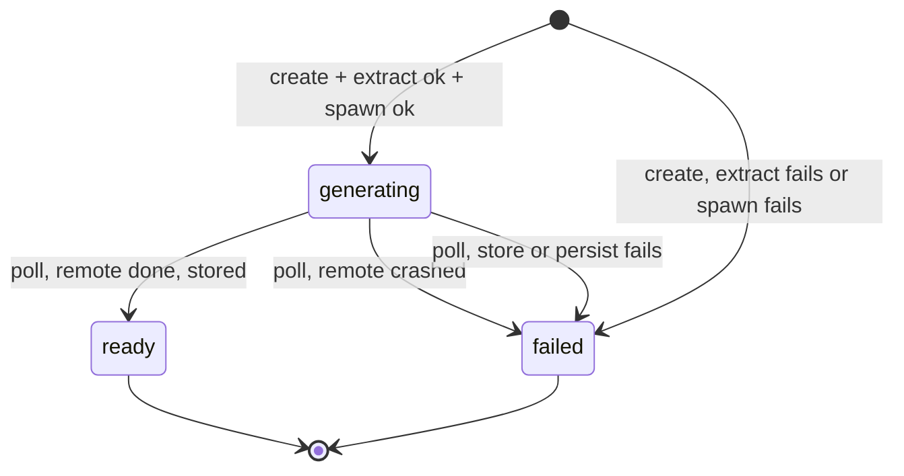
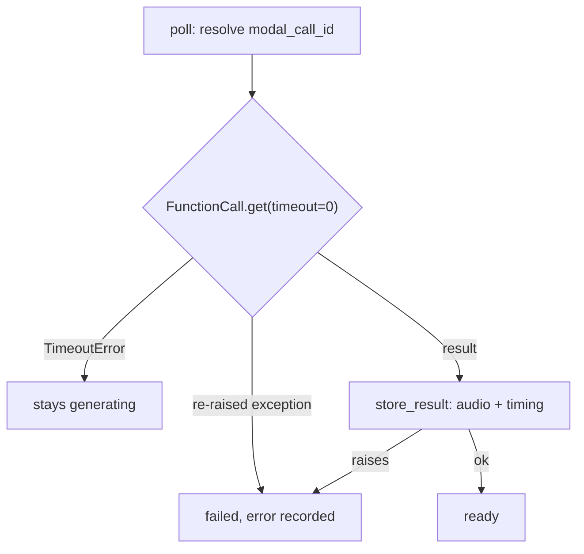

# Item lifecycle

An item is the single persisted entity nagara has: the record of one `enqueue(url, voice?)` call, from creation through to playable audio or a clear failure. This note covers the state machine and the two requests that drive it; [[article-extraction]] covers what happens inside the enqueue call and [[read-along-timing]] covers what the TTS service hands back.

## What it exposes

The `Item` row, one per `enqueue` call, with `status` one of `generating` / `ready` / `failed`:

| Field | Answers |
|---|---|
| `id` | the item's identity: `"itm_"` plus 8 hex characters |
| `url`, `title` | which article this item is for |
| `voice` | which Kokoro voice this item's audio uses, fixed at creation |
| `created_at` | when it was enqueued |
| `duration`, `audio_format` | populated once `ready` |
| `display` | the markdown display units, persisted at enqueue and awaiting timing; see [[article-extraction]] |
| `paragraphs` | the read-along windows once `ready`; see [[item-contract]] |
| `error` | populated only when `status` is `failed` |
| `modal_call_id` | the in-flight synthesis call's handle, resolved on poll |

Audio bytes are never a column on this row; they live in the store described in [[persistence-and-storage]], keyed by item id.

## How an item advances

There is no `queued` state: generation starts inside the enqueue request itself, so the item is `generating` from the client's first observation.

**Enqueue** creates the item as `generating`, then extracts the URL ([[article-extraction]]). If extraction fails, a fetch error or a non-HTML content-type, the item is marked `failed` with the reason and returned immediately; no synthesis is attempted. Otherwise the API spawns a remote synthesis call over the derived spoken paragraphs and persists its handle (`modal_call_id`). Enqueue then returns the item immediately, accepted and `generating`.

**Poll** loads the item. If it is `generating` and carries a call handle, the API resolves the remote call non-blockingly:

*Still running* and *crashed* are read directly from that resolution outcome: a timeout means running, a re-raised remote exception means the job crashed, and the two are never confused. *Done* stores the audio and the joined timing (see [[article-extraction]]'s index join) and transitions the item to `ready`; if that store or persistence step itself fails, the item transitions to `failed` with a readable error rather than being left stuck `generating` forever.

The resolve step is **lazy on poll**: there is no background sweeper. An item only advances when a client asks about it, which is exactly when the new state is needed.

> [!note] Why generation starts inside the enqueue request
> No separate "start" step and no `queued` pre-state: synthesis begins as soon as extraction succeeds, so the client sees progress immediately and the lifecycle stays a clean three-state machine. If a non-eager path (a scheduled batch, say) is ever added, the `queued` state returns then, not now.

> [!info] Rejected: a deferred queue with a queued pre-state
> An item sitting `queued` until a worker picks it up adds a state and a scheduler for no benefit, when the remote compute platform already runs the work asynchronously on spawn (see [[tts-service]]).

> [!note] Why nothing sweeps in the background
> An item advances from `generating` only when a client polls it. State is computed exactly when observed, so an item nobody polls simply stays `generating` in the record until someone asks: acceptable, since the state is only needed at the moment it is read.

> [!info] Rejected: a background sweeper polling all in-flight calls
> Unnecessary at this scale, and it reintroduces a worker process the zero-broker approach in [[tts-service]] deliberately avoids.

## Failure paths

- **Non-HTML URL**: enqueuing a PDF (or anything else non-HTML) fails at enqueue with an error naming the unsupported content type; no synthesis is attempted.
- **Fetch failure**: a URL that cannot be fetched, or yields no article text, fails at enqueue with the reason.
- **Remote crash**: synthesis crashes on the GPU host; the next poll surfaces `failed` with the remote error, and a still-running job is never mis-reported as failed.
- **Storage or persistence failure on finalize**: synthesis completes, but writing the audio to the store or persisting the item fails; the poll surfaces `failed` with a readable error rather than leaving the item stuck `generating`.

> [!warning] Extraction can succeed on the wrong thing
> A URL serving a 200-status error page (a GitHub Pages 404, say) extracts cleanly, generates audio, and reaches `ready`: the worst failure mode, because it looks like a working item and the status is never `failed`. See [[trustworthy-extraction]].

## What is not built yet

Quota enforcement and a `GET /items` list endpoint are deferred furniture, not part of this lifecycle; see [[item-contract]]'s "what is not built yet" and the [[api-hardening]] work item. The spawn-failure branch of enqueue has no covering test at the endpoint level; see [[test-spawn-failure-path-at-endpoint]].

---

Related: [[article-extraction]] · [[tts-service]] · [[item-contract]] · [[persistence-and-storage]] · [[authentication]] · [[invariants]] · [[audio-read-later-queue]]
