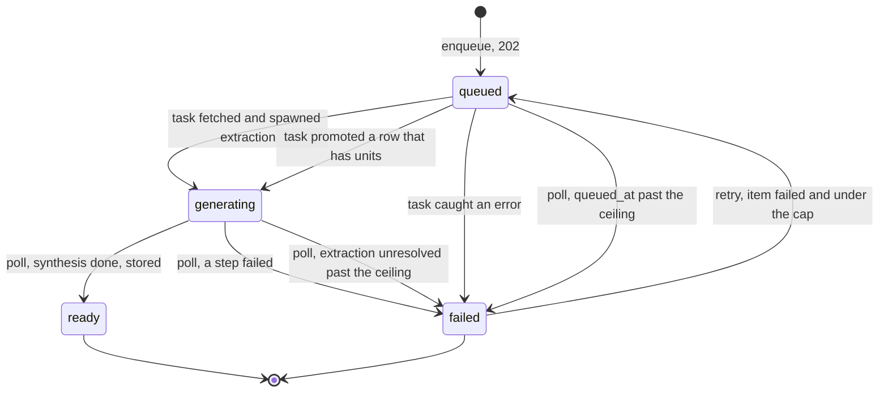
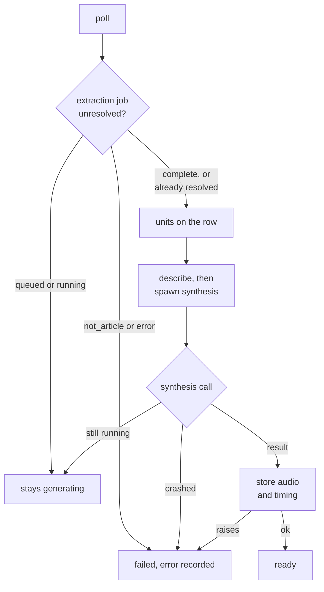
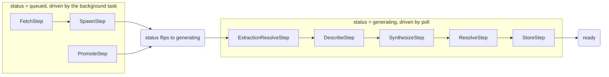

# Item lifecycle

## 🔭 Overview

An item is the single persisted entity nagara has: the record of one `enqueue(url, voice?)` call, from creation through to playable audio or a clear failure. A four-state machine, three routes and one background task drive it. The background task fetches the article and hands it to the [extraction-service](extraction-service.md); every later step runs on poll. [article-extraction](article-extraction.md) covers how a completed extraction job becomes the item's units and [read-along-timing](read-along-timing.md) covers what the TTS service hands back.

## 💽 Modeling

The `Item` row, one per `enqueue` call, with `status` one of `queued` / `generating` / `ready` / `failed`:

| Field | Answers |
|---|---|
| `id` | the item's identity: `"itm_"` plus 8 hex characters |
| `url`, `title` | which article this item is for; `title` fills once the extraction job resolves |
| `voice` | which Kokoro voice this item's audio uses, fixed at creation |
| `created_at` | when it was enqueued; never moves |
| `queued_at` | when the current attempt entered the queue: set in the enqueue write and rewritten on every retry. The ceiling measures work age from this, not from `created_at` |
| `extraction_handle` | the extraction job's id while the job is unresolved: minted at the fetch and cleared in the write that stores the units; an `error` terminal also clears it, so the retry mints a new one |
| `extraction_domain` | the final URL's domain after redirects, which picks the recipe |
| `recipe_version_id` | the recipe version the job was spawned with, or the one it authored or revised; see [recipes](recipes.md) |
| `enriched_at` | set once every unit has resolved its spoken form: the flag that enrichment finished and a retry can re-spawn synthesis without re-enriching |
| `retry_count` | how many times this item has been re-driven; bounds re-spend against `retry_max` |
| `duration`, `audio_format` | populated once `ready` |
| `units` | the typed display/spoken/timing units, written when the extraction job resolves, rewritten by enrichment, and timed at `ready`; see [article-extraction](article-extraction.md) and [item-contract](item-contract.md) |
| `degradations` | per-unit enrichment failures that did not fail the item; null when the enrichment was clean |
| `error` | populated only when `status` is `failed` |
| `modal_call_id` | the in-flight synthesis call's handle, resolved on poll |

Audio bytes are never a column on this row; they live in the store described in [persistence-and-storage](persistence-and-storage.md), keyed by item id.

## 🟢 States

```mermaid
stateDiagram-v2
    [*] --> queued: enqueue, 202
    queued --> generating: task fetched and spawned extraction
    queued --> generating: task promoted a row that has units
    queued --> failed: task caught an error
    queued --> failed: poll, queued_at past the ceiling
    generating --> ready: poll, synthesis done, stored
    generating --> failed: poll, a step failed
    generating --> failed: poll, extraction unresolved past the ceiling
    failed --> queued: retry, item failed and under the cap
    ready --> [*]
    failed --> [*]
```

**Enqueue** commits the item as `queued`, with `queued_at` set in the same write, then schedules `advance_queued_item` as a `BackgroundTasks` handler and returns `202` immediately. The task opens its own session, so the row must be committed before it is scheduled; the response is serialized from the queued row, so a client sees `queued` on the `POST` and `generating` on the following poll.

**The background task** does the work that cannot happen inside a request: it fetches the URL through firecrawl, reads the domain's current recipe, mints the extraction handle, and spawns the extraction job ([article-extraction](article-extraction.md), [extraction-service](extraction-service.md)). The spawn's write moves the item to `generating`. When a row already carries units, the task skips the fetch and the spawn and promotes the row to `generating` directly. Any error along the way fails the item with a prefixed reason (see "What a failure names" below).

**Poll** loads the item, applies the ceiling, and advances a `generating` item in place:

```mermaid
flowchart TD
    P["poll"] --> X{"extraction job<br/>unresolved?"}
    X -->|queued or running| H["stays generating"]
    X -->|not_article or error| F["failed, error recorded"]
    X -->|complete, or<br/>already resolved| U["units on the row"]
    U --> D["describe, then<br/>spawn synthesis"]
    D --> R{"synthesis call"}
    R -->|still running| H
    R -->|crashed| F
    R -->|result| S["store audio<br/>and timing"]
    S -->|ok| Y["ready"]
    S -->|raises| F
```

Poll resolves the extraction job first: a queued or running job holds the item at `generating`, a `not_article` verdict or an `error` terminal fails it, and a complete job becomes the item's units ([article-extraction](article-extraction.md)). Describing and spawning synthesis then run in the same poll. *Still running* and *crashed* are read directly from the synthesis call's resolution outcome: a timeout means running, a re-raised remote exception means the job crashed, and the two are never confused. *Done* stores the audio and the joined timing (see [article-extraction](article-extraction.md)'s index join) and transitions the item to `ready`; if that store or persistence step itself fails, the item transitions to `failed` with a readable error rather than being left stuck `generating`.

**Retry** (`POST /items/{id}/retry`) moves a `failed` item back to `queued` and re-schedules the same task; the section below covers it.

> [!NOTE] Why `queued` and `generating` are separate states
> The two phases have different physics, and the state names carry that distinction to the client. The fetch and the spawn run in the API process as the `BackgroundTasks` handler, and that handler is mortal: a redeploy or a container recycle kills it mid-flight, and an item stranded at `queued` has no way to finish on its own. Once spawned, the extraction job runs on Cloudflare and the synthesis call runs on Modal, and both survive a redeploy of the API. Every `generating` step runs inside a poll request, so when a request dies mid-step, the next poll repeats that step. So a `queued` item is in a strandable phase and a `generating` item is not; a client that could not tell them apart could not tell a phase that needs the ceiling to rescue it from one that recovers itself. Enqueue returns before the fetch starts because a firecrawl scrape takes longer than a request should hold open, and `queued` is the name of that in-process phase.

> [!TIP] Rejected: one combined in-flight state
> Collapsing `queued` and `generating` into a single "working" status removes a column value but costs the one distinction that matters: a client, and the staleness rule, could not tell a strandable phase from an unstrandable one. The two states are kept because the two phases fail and recover differently.

## 📩 Flow

The background task and poll call one entry, `pipeline.advance(item, db)`. Which steps run is a function of the item's status and row, so enqueue, retry, and poll are the same call entered at different points. The task drives the `queued` phase, poll drives the `generating` phase, and each step gates on the status it advances from.

```mermaid
flowchart LR
    subgraph Q["status = queued, driven by the background task"]
        direction LR
        F["FetchStep"] --> S["SpawnStep"]
        P["PromoteStep"]
    end
    S --> G("status flips to generating")
    P --> G
    subgraph GEN["status = generating, driven by poll"]
        direction LR
        E["ExtractionResolveStep"] --> D["DescribeStep"] --> Y["SynthesizeStep"] --> R["ResolveStep"] --> T["StoreStep"]
    end
    G --> E
    T --> RDY("ready")
```

Each step carries a `wants` precondition over the row and a `name` that is the `error:` prefix it owns. The runner runs, in order, each step of the item's status whose `wants` holds, persists that step's effect, and stops once the status flips to a phase a different driver owns, a guarded write lands zero rows, or no step wants more. Resume is that same rule read backwards: a row that already carries units wants only `PromoteStep` in the queued phase, so a retry never re-fetches it.

| Step | Runs when the item is | Owns the prefix |
|---|---|---|
| `FetchStep` | queued, with no units and no fetched page yet | `fetch:` |
| `SpawnStep` | queued, with the page fetched | `extraction:` |
| `PromoteStep` | queued, with units on the row | none: it only flips the status |
| `ExtractionResolveStep` | generating, holding an extraction handle | `extraction:` |
| `DescribeStep` | generating, extraction resolved, not enriched | `enrichment:` |
| `SynthesizeStep` | generating, enriched, with no synthesis call yet | `spawn:` |
| `ResolveStep` | generating, with a synthesis call in flight | `tts:` |
| `StoreStep` | generating, with the remote result in hand | `store:` |

A step reaches its capability through an interface, so a second backend is another implementation the factory selects rather than a branch inside the step (invariant 6):

| Interface | Implementations | Documented in |
|---|---|---|
| `Fetcher` | `FirecrawlFetcher` | [article-extraction](article-extraction.md) |
| `Describer` | `GeminiDescriber` | [the-describer](the-describer.md) |
| `Synthesizer` | `ModalSynthesizer` | [tts-service](tts-service.md) |

Each step persists its own effect, so progress survives in pieces. `FetchStep` writes the extraction handle and domain, and `SpawnStep` writes the recipe version together with the flip to `generating`. On poll, `ExtractionResolveStep` writes the title and the units and clears the handle, `DescribeStep` writes the described units and stamps `enriched_at`, and `SynthesizeStep` writes the synthesis call handle.

> [!NOTE] Why `enriched_at` is stamped one write before synthesis spawns
> Describing finishes, `enriched_at` lands, and only then does synthesis spawn. So a store that fails on finalize leaves a row a retry re-spawns from at zero cost: the spoken text is already on it, and neither the fetch nor the describe repeats. A row that failed before its extraction job resolved carries no units, so its retry fetches again: the fetched HTML lives only in the task's working context, never on the row, so there is nothing earlier to resume from.

> [!NOTE] Why the working context copies the row rather than reading through the item
> A step's working units run ahead of the persisted row until its write lands, and the queued write is a raw `UPDATE ... WHERE status = 'queued'`. Carrying that working state on the loaded row would dirty it, and the next guarded write would autoflush an unguarded `UPDATE` past the status clause, resurrecting a row a poll already failed. The context holds plain copies of the row's fields, so the row stays pristine and the guard holds.

## ⏳ Deferred work is mortal, and the ceiling recovers it

The task's mortality is the price of running deferred work inside the API process instead of a worker, and two mechanisms pay it.

**The ceiling.** Poll fails an item once its work age passes `NAGARA_QUEUED_CEILING_SECONDS` (default 300), with `enrichment: no result after 300s`, when the item is `queued` or is `generating` while still holding an unresolved extraction job. The ceiling never fails a `generating` item whose extraction handle is cleared and whose synthesis call is in flight. That phase survives an API redeploy, and poll resolves it. An extraction job that outlives the ceiling, such as one whose recipe is still being authored, finishes after the item has already failed, so no poll reads its result; the retry route recovers the item. Work age is `now - queued_at`, never `now - created_at`: `created_at` never moves, so measuring from it would fail a just-retried item instantly and turn retry into a no-op that reports failure. `queued_at` is set in the enqueue write, so even a row stranded before its task ever ran carries a clock the ceiling can read.

**Every task write is conditional on the item still being `queued`.** The writes go through `_write_if_queued`, a single `UPDATE ... WHERE status = 'queued'` that checks rowcount. If a slow-but-alive task finishes a minute after poll already tripped the ceiling and marked the item `failed`, its `generating` write matches zero rows and the task abandons, committing nothing further. A late task can never resurrect a failure a client has already observed. A `generating` step runs inside the poll request, which is the item's only writer in that phase, so the step mutates the row directly and the request's own commit persists the change.

> [!WARNING] A late task must not overwrite a failed row
> The subtle case is a container that was slow rather than dead. Without the conditional write, its finishing `UPDATE` would stamp `generating` over the `failed` a poll already surfaced, and a client that surfaced the failure would see the item silently un-fail. The `WHERE status = 'queued'` guard is what forecloses that. SQLite reports changed rows rather than matched rows, which is reliable here because every task write moves at least one column off its previous value.

> [!NOTE] Why nothing sweeps in the background
> The extraction job, the Modal resolution and the ceiling are all computed on poll, when a client asks. An item nobody polls stays where the last write left it, which is acceptable because the state is only needed at the moment it is read. Nothing runs on a timer scanning for work to advance.

> [!TIP] Rejected: a background sweeper polling all in-flight calls
> A sweeper that walked every `queued` and `generating` row would reintroduce a second process the zero-broker approach in [tts-service](tts-service.md) deliberately avoids, for no benefit at this scale. State computed on poll is enough, because poll is exactly when the new state is needed.

## 🔁 Retry resumes from the phase that failed

`POST /items/{id}/retry` re-drives a `failed` item in place. It returns `202` and hands the item to the same task enqueue uses; [item-contract](item-contract.md) carries the route and wire detail.

**Only a `failed` item under the cap is retryable.** `queued`, `generating` and `ready` all return `409`, and so does a `failed` item at or past `retry_max` (default 3). A stranded item needs no special case: the ceiling converts it to `failed` first, which is the whole reason the ceiling exists.

What the retry does depends on how far the row got:

| Row at retry | What happens | Cost |
|---|---|---|
| units and `enriched_at` set | promoted to `generating`; poll spawns synthesis from the units on the row | no fetch, no describe |
| units, no `enriched_at` | promoted to `generating`; poll describes again, then spawns | no fetch |
| no units | back through the fetch and the spawn, re-attaching to the job when a handle survives | one fetch |

The extraction handle is stable across retries, so a retried item re-attaches to the job the first attempt spawned. Only an `error` terminal clears the handle, because that job would hand back the same failure; the retry then mints a new id suffixed with the retry count. A `not_article` verdict keeps its handle, so a retry re-attaches to the job and the item fails again with the same verdict. `queued_at` is rewritten on every attempt, which is why the ceiling measures from it.

> [!WARNING] A retry after a synthesis crash resolves the same crashed call
> A `tts:` failure leaves `modal_call_id` on the row, and the retry does not clear it. The promoted item's next poll resolves that same call, which re-raises the same exception, so the item fails again with the same `tts:` error and never re-spawns synthesis. The retry still returns `202`, and the failure shows only on the following poll.

> [!NOTE] Retry does not re-fetch once extraction resolved
> Re-fetching would not reliably reproduce the first extraction: firecrawl's output is non-deterministic, measured at a 5x spread on the same URL minutes apart. So retry resumes from the stored units rather than re-deriving them, which means it cannot repair an item whose stored extraction was wrong. A force-restart that re-fetches such an item is a separate, deliberate design problem, not something half-built here.

> [!NOTE] The claim that stops two concurrent retries
> The `failed → queued` move is one conditional `UPDATE` gating on status still `failed` and `retry_count` under the cap, incrementing the count in SQL. Two concurrent retries cannot both win: only the first finds the preconditions met, the second lands zero rows and the route refuses it with `409`. A read-then-write would let both pass, spawning two Modal jobs for one item with the second orphaned and incrementing the count once, so the cap would read tighter than it is. The pre-read only picks which refusal message to send.

## 🏷️ What a failure names

Every `failed` item carries an `error` whose prefix names the phase that failed, so a reader can place a failure without a stack trace:

| Prefix | Phase |
|---|---|
| `fetch:` | fetching the URL: firecrawl unreachable, or no HTML returned |
| `extraction:` | spawning or resolving the extraction job: the service unreachable or the page too large, a `not_article` verdict, an `error` terminal, or a completed job whose units leave nothing to keep |
| `enrichment:` | describing images and code, or the ceiling firing |
| `spawn:` | handing the spoken paragraphs to Modal |
| `store:` | writing the finished audio and timing on finalize |
| `tts:` | synthesis crashing on the GPU host, surfaced on poll |

The task sets `fetch:` and the spawn's `extraction:`; poll sets every other prefix. A systemic failure at any of these phases fails the item.

> [!NOTE] A per-unit degradation is not a failure
> Enrichment distinguishes a systemic failure from a single unit that could not be acquired or described. A failed image fetch or a failed describe call for one unit is recorded in `degradations` and the item still reaches `ready`; only an exception that stops the whole enrichment phase fails the item with the `enrichment:` prefix. So `degradations` is populated on items that succeeded, and `error` only on items that did not.

Where each failure lands, and what its error names:

- **Fetch failure**: firecrawl cannot be reached or returns no HTML; the task fails the item with a `fetch:` reason and no job is spawned.
- **Not an article**: the extraction job's agent judges the page is not an article; the poll that resolves the job fails the item with `extraction: not an article`.
- **Stranded work**: the container dies mid-task, or the extraction job is still unresolved; the next poll past the ceiling fails the item with `enrichment: no result after 300s`, and a retry re-drives it.
- **Remote crash**: synthesis crashes on the GPU host; the next poll surfaces `failed` with the `tts:` error, and a still-running job is never mis-reported as failed.
- **Storage or persistence failure on finalize**: synthesis completes, but writing the audio or persisting the item fails; the poll surfaces `failed` with a `store:` error rather than leaving the item stuck `generating`.

> [!WARNING] Extraction can succeed on the wrong thing
> A URL serving a 200-status error page (a GitHub Pages 404, say) extracts cleanly, generates audio, and reaches `ready`: the worst failure mode, because it looks like a working item and the status is never `failed`. Separating a real article from a plausible 200-status error page is unsolved.

## 🧵 Async endpoints over bridged sync libraries

Every endpoint is `async def` over an `AsyncSession`, so an enrichment step can fan its image fetches and describe calls out concurrently. The three libraries that stay synchronous each block the single event loop if called directly, so each is bridged through `run_in_threadpool` at its call site:

| Library | Call | Why it blocks |
|---|---|---|
| firecrawl SDK | the fetch's scrape | a synchronous network call |
| boto3 | the audio store's `store` | a synchronous S3 client |
| Modal client | `spawn_synthesis`, `poll_synthesis` | a synchronous remote call |

The database URL stays the logical sync-dialect one and is mapped onto the matching async driver at runtime (`asyncpg` for Postgres, `aiosqlite` for SQLite), because Alembic drives the sync driver from the same setting; see [persistence-and-storage](persistence-and-storage.md).

> [!WARNING] A new sync library called from a route without the bridge blocks the loop, silently
> A blocked event loop still returns correct answers, just serialized, so nothing in the suite catches it. Any new synchronous, blocking call from an `async def` must go through the threadpool bridge.

## ⏩ What is not built yet

Quota enforcement and a `GET /items` list endpoint are deferred and not part of this lifecycle; see [item-contract](item-contract.md)'s "what is not built yet". The spawn-failure branch has no covering test at the endpoint level yet.

---

Related: [article-extraction](article-extraction.md) · [extraction-service](extraction-service.md) · [recipes](recipes.md) · [tts-service](tts-service.md) · [item-contract](item-contract.md) · [persistence-and-storage](persistence-and-storage.md) · [authentication](authentication.md) · [invariants](invariants.md)
