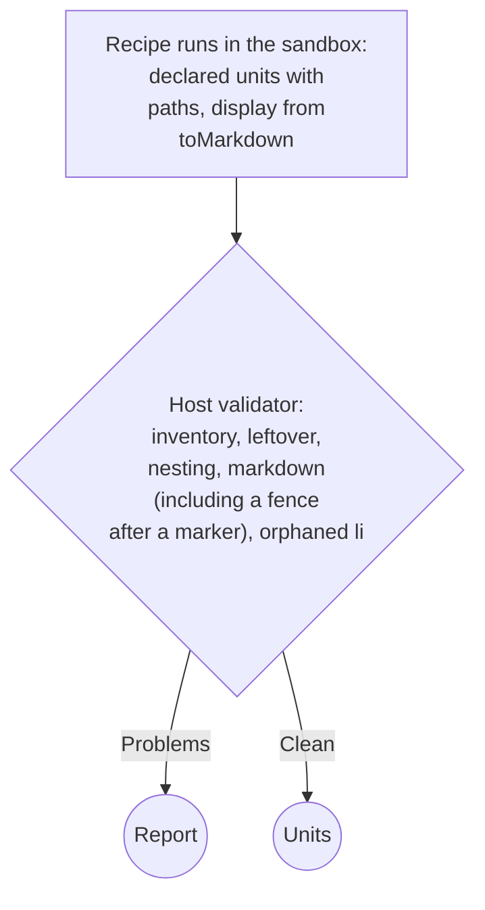

# Markdown units

## 🔭 Overview

A unit's `display` is markdown. Every recipe hands its selected elements to one shared converter rather than converting by hand ([recipes](recipes.md)), so the mapping from source to markdown is the same across every domain. Inside the sandbox, the recipe returns its declared units. The host validates them before anything crosses to the API or appears in the authoring agent's extract tool.

## 📄 What a unit's display carries

| Source | Unit | Display markdown |
|---|---|---|
| A heading (`h1` to `h6`) | paragraph unit | ATX, `#` through `######` |
| A blockquote | paragraph unit | `>`-prefixed; a list or table nested inside the quote stays inside the quote's own unit |
| A list, ordered or unordered | one paragraph unit | `-` bullets, or ordinals that keep the source's own numbers, including a non-1 `start`; a code block or an image nested inside the list stays inside the list's own markdown, wherever `toMarkdown` places it |
| A task-list item | inside its list's unit | `[x]` / `[ ]` |
| A table | paragraph unit | a GFM pipe table |
| Struck-through text | inside its unit | `~~text~~` |
| A formula | inside its unit | its alttext as plain text, no delimiter |
| Inline content with no GFM form | inside its unit | whatever Turndown outputs for it |
| A `<pre>` or `<pre><code>` | its own code unit | a fenced code block |
| An image | its own image unit | `src` and `alt` as the page presents them, no markdown |
| A blockquote's `<footer>`/`<cite>` | left out | none |
| A `<dl>` | left out | none |
| Footnote references and the footnote list | left out | none |
| A heading's self-link | left out, the heading's own text stays | none |
| The article's title | travels as the extraction's `title`; a heading that repeats it is left out | none |

## 🔄 How an element becomes markdown

`toMarkdown` passes the element itself, its own tag included, to Turndown with the fixed configuration (ATX headings, fenced code, `-` bullets, `---` rules) and the GFM plugin. Each Turndown rule fires only when its tag is present, so the tag selects the markdown construct: `h2` for a heading, `blockquote` for a quote, `ol` or `ul` for a list. `toMarkdown` wraps the content of a `<pre>` with no `<code>` child in `<code>` before conversion, so every `<pre>` becomes a fenced block.

The recipe returns its declared units, each tied to its real element path. The host validator checks them for inventory, leftover text, nesting, an orphaned `<li>`, and each unit's own markdown. Its fence check accepts an opening fence right after a list, quote or task marker, because a list item holding only a code block puts the fence on the marker's own line. The same validator runs at authoring, revision and extraction ([recipes](recipes.md)). When it is clean, the host returns the units. These units are what crosses to the API and what an authoring or revising agent's extract tool shows ([extraction-service](extraction-service.md)). When it reports problems, the host returns the report instead.

> [!WARNING] The validator does not check that a unit kept its markdown
> Inventory and leftover-text checks confirm that every element in the container is accounted for and that no readable text was dropped. Neither confirms that a unit's markdown syntax, such as a heading's `#`, a quote's `>` or a list's numbering, survived the conversion. A recipe whose converter drops the element's own tag therefore still validates clean. In production, 53 headings reached the listener's page as plain paragraphs, 16 quotes lost their `>` and every ordered list came out with bullets, and every recipe behind them had validated. Nothing downstream catches it either; the reader sees undifferentiated paragraphs, the table of contents finds no heading, and the audio sounds right.

> [!TIP] Rejected: splitting a list around an embedded code block or image
> A split needs a synthetic resume point at every enclosing list level, re-entering each one at its own next number without repeating what came before. Keeping the list as one unit needs no resume points. The fence or the `` sits wherever `toMarkdown` places it inside the list's own markdown, and the spoken-form derivation only has to skip it (see [article-extraction](article-extraction.md)).

> [!TIP] Rejected: wrapping a formula's alttext in `$…$` or `$$…$$`
> `sanitize_spoken` has a rule for each markdown marker Turndown can emit and no rule for a dollar sign, so a delimiter would reach the audio as a literal character. The alttext carries no delimiter at all instead, and reads as plain words in both the display and the spoken form.

## ⏩ What is not built yet

- **Telling code apart from a non-code `<pre>`.** `toMarkdown` treats every `<pre>` as code and wraps it in `<code>` before conversion; nothing distinguishes a `<pre>` used for plain preformatted layout.
- **An empty declared element.** The runtime has no special handling for a recipe-declared unit that converts to no markdown.
- **The display of a table with no header row.** The GFM table stays whatever Turndown produces for it; the header-aware linearization a table's spoken form gets ([article-extraction](article-extraction.md)) has no counterpart in the display markdown.
- **An image inside a table cell, or a table cell holding a list or code.** Neither has a settled shape.

---

Related: [recipes](recipes.md) · [extraction-service](extraction-service.md) · [article-extraction](article-extraction.md)
