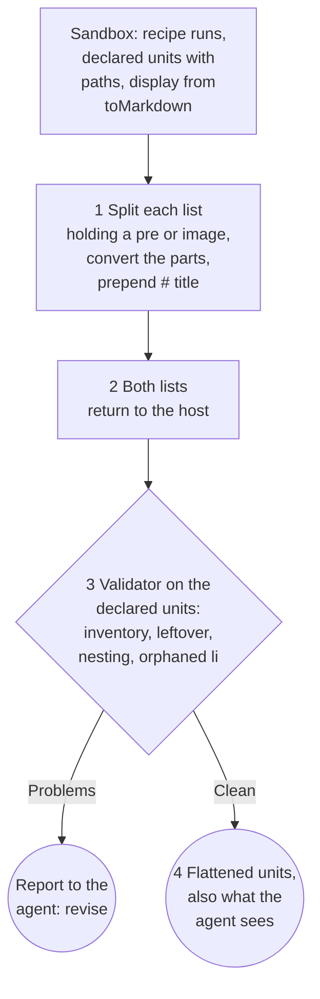

# Markdown units

## 🔭 Overview

A unit's `display` is markdown. Every recipe hands its selected elements to one shared converter rather than converting by hand ([recipes](recipes.md)), so the mapping from source to markdown is the same across every domain. Inside the sandbox, the runtime splits list units and prepends the title after the recipe returns; the host then validates the declared units and returns the flattened units only when validation is clean, before anything crosses to the API or appears in the authoring agent's extract tool.

## 📄 What a unit's display carries

| Source | Unit | Display markdown |
|---|---|---|
| A heading (`h1` to `h6`) | paragraph unit | ATX, `#` through `######` |
| A blockquote | paragraph unit | `>`-prefixed; a list or table nested inside the quote stays inside the quote's own unit |
| A list, ordered or unordered | one paragraph unit | `-` bullets, or ordinals that keep the source's own numbers, including a non-1 `start` |
| A task-list item | inside its list's unit | `[x]` / `[ ]` |
| A table | paragraph unit | a GFM pipe table |
| Struck-through text | inside its unit | `~~text~~` |
| A formula | inside its unit | its alttext as plain text, no delimiter |
| Inline content with no GFM form | inside its unit | whatever Turndown outputs for it |
| A `<pre>` or `<pre><code>` | its own code unit | a fenced code block |
| An image | its own image unit | `src` and `alt` as the page presents them, no markdown |
| A blockquote's `<footer>`/`<cite>` | left out | none |
| A `<dl>` | left out | none |
| Footnote references and the footnote list | left out | none |
| A heading's self-link | left out, the heading's own text stays | none |
| The article's title | the first unit, ahead of every recipe-declared unit; no title unit when `extraction.title` is empty | `# <title>`, from `extraction.title`; no other unit carries the title |

> [!NOTE] Why the title is synthesized, never authored
> The runtime builds the title unit from `extraction.title` once it has every recipe-declared unit; the recipe does not select it. Building it this way is deterministic from the title the recipe already extracted, so it needs no judgement from the agent. The authoring prompts tell the agent to leave out any heading that repeats the title, so a recipe yields one title unit and the listener hears the title once (see [recipes](recipes.md) and [what-gets-read-aloud](../product-design/what-gets-read-aloud.md)).

### ✂️ A list split around a nested code block

```html
<ol>
  <li>Item A</li>
  <li>Item B
    <ol>
      <li>Item B.1</li>
      <li>Item B.2 with a code block:
        <pre><code>x = 1</code></pre>
      </li>
      <li>Item B.3</li>
    </ol>
  </li>
</ol>
```

comes back as three units, in document order:

1. a paragraph unit, the list up to the code block:
   ```
   1. Item A
   2. Item B
      1. Item B.1
      2. Item B.2 with a code block:
   ```
2. a code unit: `x = 1`
3. a paragraph unit, the list resumed:
   ```
   2.  3. Item B.3
   ```

The resumed part opens with an empty item at each enclosing level it needs to re-enter: the outer `2.` re-enters item B without repeating its text, and the inner `3.` picks the nested list back up at its own next number. The resumed part is valid CommonMark, and the spoken-form derivation walks the same tree the listener's page renders (see [article-extraction](article-extraction.md)).

## 🔄 How an element becomes markdown



`toMarkdown` passes the element itself, its own tag included, to Turndown with the fixed configuration (ATX headings, fenced code, `-` bullets, `---` rules) and the GFM plugin. Each Turndown rule fires only when its tag is present, so the tag selects the markdown construct: `h2` for a heading, `blockquote` for a quote, `ol` or `ul` for a list. `toMarkdown` wraps the content of a `<pre>` with no `<code>` child in `<code>` before conversion, so every `<pre>` becomes a fenced block.

Inside the same sandbox run, once the recipe has returned its declared units, the runtime splits every list unit that holds a code block or an image, at any nesting depth (1). The split yields a list part, then the code or image unit, then the rest of the list, in document order. `toMarkdown` converts each list part with its own list tag intact. The runtime then prepends the title unit, only when the extracted title is not empty. Both lists return to the host (2): the declared units, each tied to its real element path, and the flattened units. The same validator runs at authoring, revision and extraction against the declared units only ([recipes](recipes.md)) (3). When it is clean, the flattened units are what the workflow returns and what an authoring or revising agent's extract tool shows (4) ([extraction-service](extraction-service.md)); when it reports problems, the host discards the flattened units.

> [!NOTE] Why the validator reads the declared units and not the split ones
> The validator's nesting check flags any two units whose paths sit inside one another. A list-part clone from the split has no path, because the clone was never part of the parsed article tree. Validating the declared units, which are still elements at real positions, means every path the validator checks is real, and a split part never needs one. The split runs in the sandbox because the converter lives there, so it happens before validation.

> [!WARNING] The validator does not check that a unit kept its markdown
> Inventory and leftover-text checks confirm that every element in the container is accounted for and that no readable text was dropped. Neither confirms that a unit's markdown syntax, such as a heading's `#`, a quote's `>` or a list's numbering, survived the conversion. A recipe whose converter drops the element's own tag therefore still validates clean. In production, 53 headings reached the listener's page as plain paragraphs, 16 quotes lost their `>` and every ordered list came out with bullets, and every recipe behind them had validated. Nothing downstream catches it either; the reader sees undifferentiated paragraphs, the table of contents finds no heading, and the audio sounds right.

> [!TIP] Rejected: splitting a list by handing each item to the converter on its own
> Turndown's list rule reads the parent `<ol>` or `<ul>` to number or bullet an item, so an item converted alone comes out with no ordinal and no bullet. The runtime instead keeps every surviving list part inside a clone of the original list's own tag, so Turndown still numbers or bullets the items in each part.

> [!TIP] Rejected: wrapping a formula's alttext in `$…$` or `$$…$$`
> `sanitize_spoken` has a rule for each markdown marker Turndown can emit and no rule for a dollar sign, so a delimiter would reach the audio as a literal character. The alttext carries no delimiter at all instead, and reads as plain words in both the display and the spoken form.

## ⏩ What is not built yet

- **Telling code apart from a non-code `<pre>`.** `toMarkdown` treats every `<pre>` as code and wraps it in `<code>` before conversion; nothing distinguishes a `<pre>` used for plain preformatted layout.
- **An empty declared element.** The runtime has no special handling for a recipe-declared unit that converts to no markdown.
- **The display of a table with no header row.** The GFM table stays whatever Turndown produces for it; the header-aware linearization a table's spoken form gets ([article-extraction](article-extraction.md)) has no counterpart in the display markdown.
- **An image inside a table cell, or a table cell holding a list or code.** Neither has a settled shape.

---

Related: [recipes](recipes.md) · [extraction-service](extraction-service.md) · [article-extraction](article-extraction.md)
