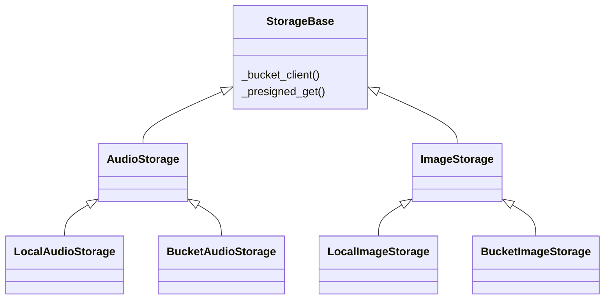
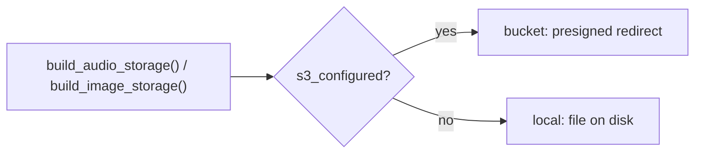
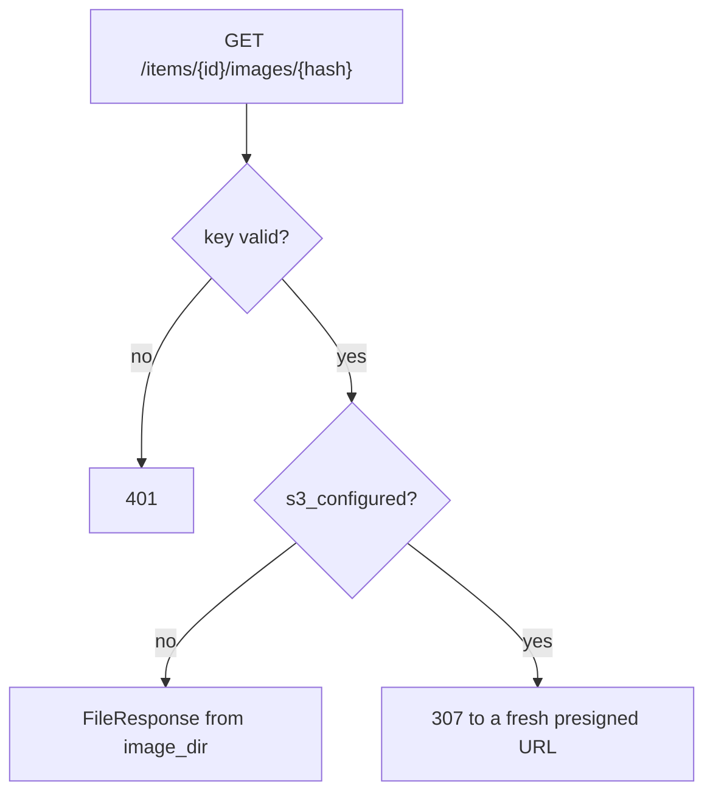

# Persistence and storage

What the item row persists, where its audio and images live, and the ledger that records what each item cost. The two backends that differ between local development and production, the database and the object store, are resolved the same way: pick the implementation once, at startup, from configuration.

## The item row and its JSON columns

The item is a single SQLAlchemy ORM row (see [[item-lifecycle]] for its fields). Two of its columns are JSON, supported by both SQLite and Postgres without a dialect-specific schema: `units` and `degradations`. Audio bytes are never a column; they live in the audio store below, keyed by item id, so a multi-megabyte file never bloats the row store.

`units` is the one list the whole pipeline rides on. Each element is a typed unit carrying its display markdown, its spoken form, and its timing window, and that single list serves display, synthesis, and read-along alike (see [[item-contract]] for the unit shape and the wire projection that drops `spoken`). Because there is one list rather than the two parallel lists an earlier schema kept, a dropped unit takes its timing window with it instead of leaving one list longer than the other; [[invariants]] carries why that is load-bearing.

`degradations` is a JSON list of typed objects the client never sees, accumulated in memory during enrichment and flushed with the same write that stores the units. Each object carries a `type` and a short `reason`, and an acquisition failure also carries the origin `url`, the locator worth re-fetching once the unit is gone. `type` is the unit discriminator, so in practice only `image` and `code` appear: a paragraph cannot enrich, so it cannot degrade. The `reason` says both what happened and what nagara did about it:

| `reason` | What happened |
|---|---|
| `404`, `timeout`, `undecodable`, `svg rasterise failed` | acquisition failed, so the unit was dropped from the list |
| `describe failed`, `describe cap reached` | the unit stays, but its spoken form fell back to alt text or the honest floor |

> [!note] Why a separate column and not `error`
> `error` is failed-only by design, and that rule is worth keeping. So it cannot describe an item that reached `ready` after dropping six of twelve images: technically `ready`, quietly worse. `degradations` gives the operator a full record of what was lost while the client, reading only the wire fields, sees an item that looks whole.

> [!info] Rejected: audio as a database blob, or proxied through the API
> Storing audio bytes in the database bloats the row store with multi-megabyte blobs; proxying them through the API in production routes large downloads through a service meant to sleep, and a headerless `<audio>` element cannot follow a credential-guarded byte stream anyway. A separate store reached through a signed link avoids both.

The schema is versioned with **Alembic migrations** for the databases that must persist and evolve (local dev and production), applied before the app serves (Railway's pre-deploy step, see [[deployment-and-ci]]). The test database is disposable and built directly from the models on every run (`Base.metadata.create_all`).

> [!warning] The test schema is built from the models, so the migration path itself is never exercised by the suite
> An autogenerate check (comparing a fresh migration against the current models) is the only thing guarding that the committed migrations still match: the tests passing says nothing about whether `alembic upgrade head` would succeed against real, already-persisted data.

```python
_engine_kwargs = (
    {"connect_args": {"check_same_thread": False}} if _is_sqlite else {"poolclass": NullPool}
)
engine = create_engine(settings.database_url, **_engine_kwargs)
```

SQLite needs the cross-thread connection setting because the API serves blocking database work from a threadpool; Postgres uses `NullPool` instead, opening and closing a connection per request rather than pooling one; see [[deployment-and-ci]] for why an idle service holding no warm connection matters.

> [!note] Why an ORM and not the embedded store's SQL directly
> The store swaps by connection string alone (Postgres in production, SQLite locally and in tests), with the models and query code unaffected by which backend is in use.

> [!info] Rejected: Postgres everywhere, including local and tests
> An embedded store keeps the local loop and the test suite zero-setup and fast; the ORM seam is what makes the production swap to Postgres cheap when it matters.

## The storage backends: one base, two interfaces

Audio and images each get their own storage interface, and each interface has a local implementation for dev and tests and a bucket implementation for production. A shared base, `StorageBase`, holds the bucket-client machinery both bucket implementations reuse: the boto3 client with a pinned addressing style, so `boto3` does not guess path-style against a custom endpoint, and the presigned-URL minting. The local file writing lives in each `Local*` class, not the base.



| Member | Answers |
|---|---|
| `StorageBase` | the boto3 client and the presigned-URL minting shared by both bucket implementations |
| `AudioStorage` | one file per item, keyed by item id |
| `ImageStorage` | many files per item, keyed by the content hash of the re-encoded WebP bytes, deduped across items |
| `s3_configured` | are all four S3 settings present together: a half-supplied set counts as not configured, see the warning below |
| `build_audio_storage()`, `build_image_storage()` | the two factories: bucket if `s3_configured`, local otherwise |

The routes in [[item-contract]] call the interfaces and never know which backend is behind them.



> [!note] Why images earn their own interface rather than sharing audio's
> Images differ from audio on every axis: many per item rather than one, fetched from an origin rather than handed in as bytes, keyed by a content hash for cross-article dedup rather than by item id, and served by a URL embedded in persisted markdown. Sharing the bucket client through the base avoids copy-pasting the boto3 setup; folding the two into one media interface would force a single shape onto two different semantics.

> [!note] Why a content hash keys an image, not the item id or the origin URL
> Hashing the re-encoded WebP bytes dedupes for free: across items, across re-enqueues of the same article, and across a repeat of the same image within one article, which happens whenever `og:image` is echoed in the body. The format is verified by decoding with Pillow rather than trusting `Content-Type` (wrong or missing on most image CDNs), and the re-encode collapses source-format variants of one image to a single stored object.

> [!note] Why configuration and not an environment name
> "Which backend" is expressed as configuration a deployment supplies (a connection string, a set of credentials), never as an `if production` or `if testing` branch in runtime code. The same code path runs everywhere; only the supplied configuration differs, so there is no production-only path the test suite never exercises because a flag hid it. Moving a capability from its local stand-in to its managed production home is then a new implementation behind the existing interface plus configuration, not a rewrite of every caller.

> [!warning] A half-supplied credential set must count as not configured
> `s3_configured` requires all four fields together; three out of four is treated as absent rather than as a misconfiguration to crash on, so an incomplete production setup falls back to the local implementation visibly (media simply isn't where it's expected) rather than failing obscurely deep in a request. Audio and images read the same switch, so both fall back together.

## Serving audio and an image

Both media routes mint the response at request time and persist nothing. Locally each returns a `FileResponse` from disk; against the bucket each returns a `RedirectResponse` (307) to a freshly minted presigned URL. `GET /items/{id}/audio` serves the one audio file; `GET /items/{id}/images/{hash}` serves one image by its content hash. The store serves that image by its hash alone, since the hash is deduped across items; the route confirms the item exists and leaves the hash-to-item association to [[item-contract]]. Both routes require the key, so the auth invariant holds on every route that touches an item.



> [!warning] A presigned URL is never written into the row
> The unit list is persisted indefinitely, and a presigned URL is dead inside `s3_url_ttl` (3600 seconds). So a unit stores the content hash and its display markdown embeds the route path; the signed URL is minted only when the route is called. Writing it into the row would persist a link that expires an hour later.

## The cost ledger

Every metered call writes one row to `cost_entries`, scoped to its `item_id`. The ledger records spend and enforces nothing: a budget or a rate cap is a separate concern.

| Column | Holds |
|---|---|
| `type` | the event kind: `firecrawl` / `describer` / `tts` |
| `quantity` + `unit` | the raw measure: `credits`, `calls`, or `seconds` |
| `dollars` | the cost, snapshotted from configured prices at write time |
| `detail` | nullable JSON: firecrawl destination and proxy, describer kind (`code`/`image`), tts duration |

`type` is a constant map, not an enum: `CostType` is a `Literal` and `COST_TYPES` derives the runtime tuple from it with `get_args`, so the two cannot drift (per the project's no-enum rule). Prices (`firecrawl_dollars_per_credit`, `gemini_dollars_per_call`, `tts_dollars_per_second`) live on `Settings` per invariant 6, each a plan- or vendor-dependent estimate.

> [!note] Why both the raw measure and the dollars
> The raw measure never goes stale and re-prices against future rates; the dollar snapshot gives an instant total without joining a price table. Keeping only one loses one of those, so each row carries both.

The three write points differ in when they commit:

| Event | Measured from | Commit |
|---|---|---|
| `firecrawl` | `creditsUsed` off the scrape response | its own |
| `describer` | one row per successful call, tagged by kind | its own |
| `tts` | the synthesized audio duration | rides the finalize-to-`ready` write |

> [!note] Why firecrawl and describer commit on their own
> A firecrawl scrape and a describer call are billed the moment they return, whether or not the item goes on to reach `generating`. So each metered fact commits immediately rather than riding the item's own conditional write, which a concurrent poll can cause to land zero rows. firecrawl is recorded on the extraction-failed path for the same reason. TTS is different: it is measured only once the item is finalized, so it rides that write and audio, timing, and cost land together.

## What is not built yet

Audio caching by `(url, voice)`: regenerating identical audio today rather than reusing it; see [[audio-caching-by-url-and-voice]].

---

Related: [[item-lifecycle]] · [[item-contract]] · [[deployment-and-ci]] · [[invariants]]
