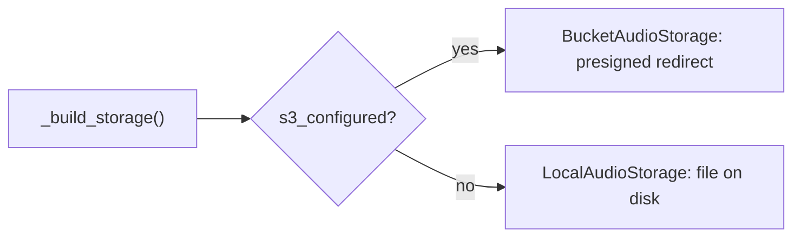

# Persistence and storage

Two seams that differ between local development and production, both resolved the same way: pick the implementation once, at startup, from configuration.

## The item row and its JSON timing column

The item is a single SQLAlchemy ORM row (see [[item-lifecycle]] for its fields). `display` and `paragraphs` are JSON-typed columns, supported by both SQLite and Postgres without a dialect-specific schema. Audio bytes are never a column; they live in the audio store below, keyed by item id, so a multi-megabyte file never bloats the row store.

> [!info] Rejected: audio as a database blob, or proxied through the API
> Storing audio bytes in the database bloats the row store with multi-megabyte blobs; proxying them through the API in production routes large downloads through a service meant to sleep, and a headerless `<audio>` element cannot follow a credential-guarded byte stream anyway. A separate store reached through a signed link avoids both.

The schema is versioned with **Alembic migrations** for the databases that must persist and evolve (local dev and production), applied before the app serves (Railway's pre-deploy step, see [[deployment-and-ci]]). The test database is disposable and built directly from the models on every run (`Base.metadata.create_all`).

> [!warning] The test schema is built from the models, so the migration path itself is never exercised by the suite
> An autogenerate check (comparing a fresh migration against the current models) is the only thing guarding that the committed migrations still match: the tests passing says nothing about whether `alembic upgrade head` would succeed against real, already-persisted data.

```python
_engine_kwargs = (
    {"connect_args": {"check_same_thread": False}} if _is_sqlite else {"poolclass": NullPool}
)
engine = create_engine(settings.database_url, **_engine_kwargs)
```

SQLite needs the cross-thread connection setting because the API serves blocking database work from a threadpool; Postgres uses `NullPool` instead, opening and closing a connection per request rather than pooling one; see [[deployment-and-ci]] for why an idle service holding no warm connection matters.

> [!note] Why an ORM and not the embedded store's SQL directly
> The store swaps by connection string alone (Postgres in production, SQLite locally and in tests), with the models and query code unaffected by which backend is in use.

> [!info] Rejected: Postgres everywhere, including local and tests
> An embedded store keeps the local loop and the test suite zero-setup and fast; the ORM seam is what makes the production swap to Postgres cheap when it matters.

## Choosing a backend from configuration

`AudioStorage` is a small interface with two implementations:

| Member | Answers |
|---|---|
| `s3_configured` | are all four S3 settings present together: a half-supplied set counts as not configured, see the warning below |
| `LocalAudioStorage` | writes a file under the configured data directory and serves it directly |
| `BucketAudioStorage` | puts the object in the bucket and serves it by minting a presigned URL, pinning the addressing style so `boto3` does not guess path-style against a custom endpoint |
| `_build_storage()` | the factory: bucket if `s3_configured`, local otherwise |

The audio route in [[item-contract]] calls the interface and never knows which backend is behind it.



> [!note] Why configuration and not an environment name
> "Which backend" is expressed as configuration a deployment supplies (a connection string, a set of credentials), never as an `if production` or `if testing` branch in runtime code. The same code path runs everywhere; only the supplied configuration differs, so there is no production-only path the test suite never exercises because a flag hid it. Moving a capability from its local stand-in to its managed production home is then a new implementation behind the existing interface plus configuration, not a rewrite of every caller.

> [!warning] A half-supplied credential set must count as not configured
> `s3_configured` requires all four fields together; three out of four is treated as absent rather than as a misconfiguration to crash on, so an incomplete production setup falls back to the local implementation visibly (audio simply isn't where it's expected) rather than failing obscurely deep in a request.

## What is not built yet

Audio caching by `(url, voice)`: regenerating identical audio today rather than reusing it; see [[audio-caching-by-url-and-voice]].

---

Related: [[item-lifecycle]] · [[item-contract]] · [[deployment-and-ci]] · [[invariants]]
