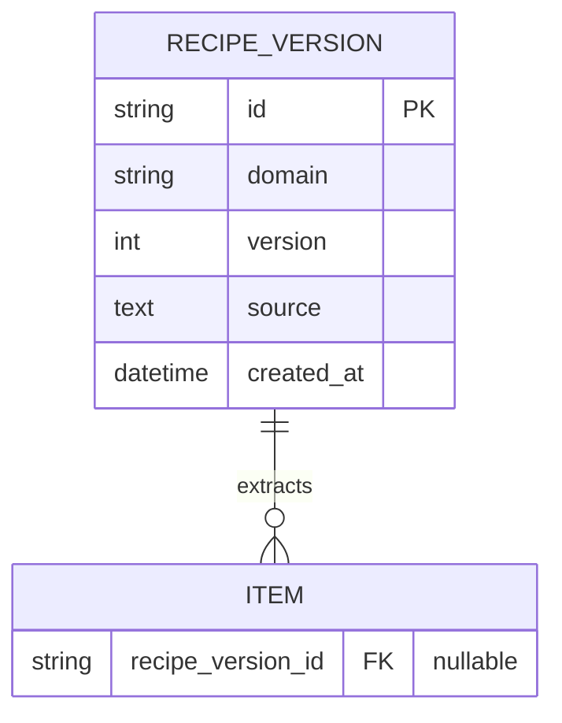
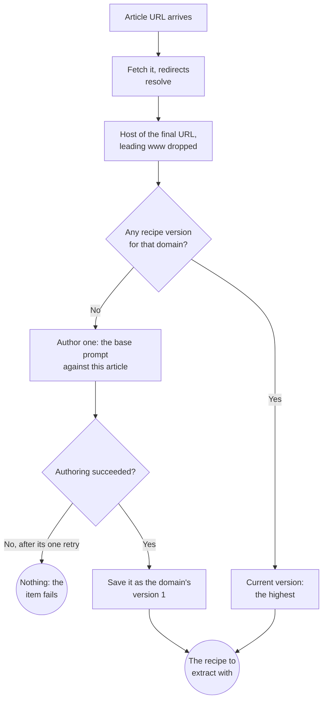
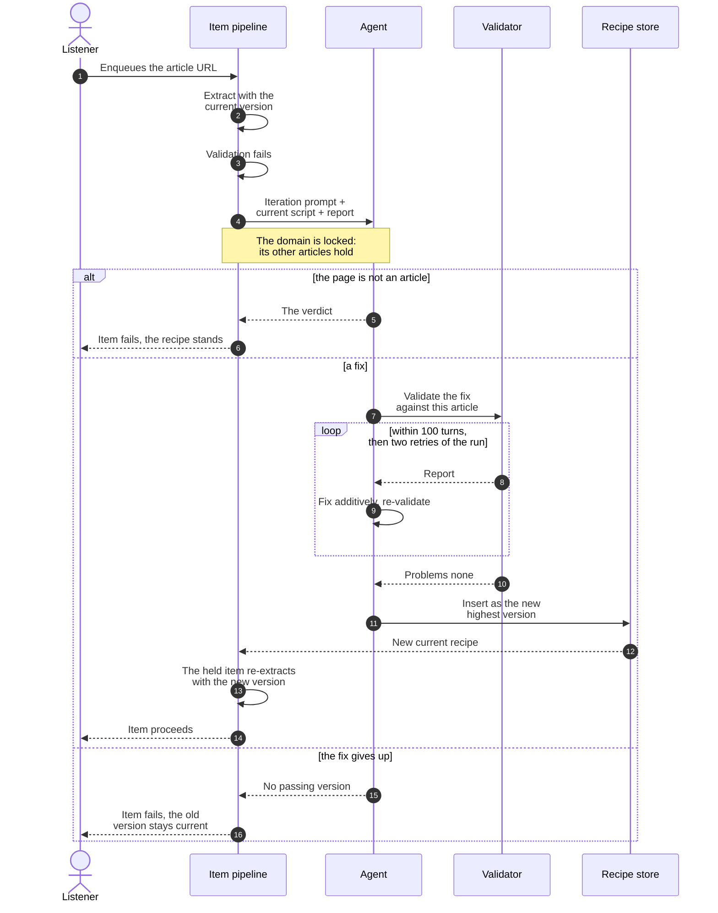

# Recipes

## 🔭 Overview

A recipe is one domain's extraction knowledge: a script that receives an article's HTML as a Cheerio document and returns the article as a title and a list of markdown units, deterministically, so the same page always yields the same units. Agents write recipes. The first article from a domain authors the domain's recipe, and every later article extracts with it. When a recipe fails an article, that article triggers a revision. The model runs at authoring time only.

## 🧾 The script and its declarations

A recipe is a script plus the declarations around it. The container selector names the element that contains the article, and everything outside the container is site chrome. The inventory names every element kind the domain's pages carry inside the container and the role each plays: a unit, inline content, a wrapper, or the title. The ignores are the selectors deliberately excluded, each with the judgement that justified it; typical ignores are ads, date stamps and share rows. Every recipe excludes footnote markers and footnote bodies; the authoring prompts instruct this.

The inventory is the union across the domain's pages, and an element kind absent from one page is normal variation across a domain's posts.

The script receives the Cheerio document and `toMarkdown`, the fixed HTML-to-markdown converter, from the runtime, and imports nothing. The script reads the document without changing it. Domain knowledge enters as structural preparation of a cloned element. The script builds a `<thead>` for a table that lacks one, swaps MathML for the LaTeX in its `alttext`, removes footnote subtrees, and wraps a span-built listing in a `<pre>`. The fixed pass converts the prepared clone.

> [!TIP] Rejected: the agent writes its own conversion
> A trial where the agent hand-converted html to markdown matched the fixed pass on quality and gained nothing by it: conversion stopped being identical across domains, and a recipe could get conversion wrong. The per-domain tricks survived as clone preparation, which is reviewable DOM structure, never a rewritten converter.

## 📦 Units and the fixed pass

Units come back in document order, one element per unit, never overlapping: once an element is a unit, everything inside it is that unit's content. The kinds are `paragraph`, `code` and `image`. A paragraph is any flow that renders as markdown: prose, headings, quotes, lists, tables; a list is a single unit. A paragraph or code unit carries its final display markdown, produced by the fixed conversion pass. An image unit carries `src` and `alt` exactly as the page presents them: the recipe never invents `alt`, and the src is how the recipe resolves the domain's lazy-load conventions. An image the article carries is always emitted, even when its src cannot be resolved. Acquiring, validating, describing or dropping images is downstream's business.

> [!NOTE] Why three kinds and not one per markdown shape
> Downstream distinguishes exactly three things: text rendered as markdown and read as prose, code that gets described instead of read, and images that get acquired and follow the caption/alt precedence. Headings, quotes, lists and tables all derive their display from their markdown, so one paragraph kind covers them; even the read-along table of contents derives from a `#`-prefixed unit's display text, not from a kind.

The same validator runs at authoring, revision and extraction. It checks that every unit's element is inside the container, in document order, none nested inside another; that every element kind in the container is declared or reported as unexpected; and that no readable text is left after the units and ignores are removed, with the leftover report naming the element kinds that carry it. It also checks that every unit's markdown is valid: non-empty, no residual HTML outside code, balanced fences. Invalid markdown fails a recipe like any other problem.

## 💽 The recipe record

Each version of a domain's recipe is one row, in the item database alongside the items. A revision is a pure insert that updates no row, and the current recipe for a domain is the highest version, so the per-article read is one indexed descent. The `source` column carries the entire script with its declarations embedded, stored exactly as the authoring loop validated it and kept whole so a failing recipe reaches a prompt as one piece. `id` is a generated string following the house pattern. Extraction sets `recipe_version_id` on the item to the version whose script extracted it. That link traces a revision that made things worse to the items it touched. The column is null for items that never reached extraction. Recipes are global: one recipe per domain, shared by every listener.

> [!TIP] Rejected: a current flag or a separate history table
> A flag mutates the previous row and is denormalized state that can disagree with the version number; a current-plus-history pair overwrites the payload in place and duplicates the schema.

## ⚖️ Matching a URL to a recipe

The key is the host of the fetch's final URL with only a leading `www` dropped: subdomains are distinct domains, so `blog.exe.dev` and `exe.dev` hold separate recipes, and a canonical link declared inside the page does not change it. Consolidation comes from redirects: a hundred domains redirecting to one place all land on that domain's recipe. No recipe serves a set of domains, and platform-hosted hostnames with identical markup each author their own.

> [!NOTE] Why no recipe serves several domains
> Platform-hosted blogs put many hostnames on identical markup, and one recipe describing that markup would save every later hostname its authoring run. Sharing was rejected to keep one recipe per domain strict: a recipe's identity is its domain's key, and a set-valued key complicates matching, storage and revision for a cost, repeated authoring, that only platforms pay.

## 📩 The lifecycle: authoring and revision

First authoring happens when a domain's first article arrives: the base prompt runs against that article's HTML, best-effort within one hundred turns, with one retry of the whole run, and if that fails the item fails with nothing saved for the domain. A domain's homepage enqueued by mistake fails and saves nothing, and the next real article authors fresh.

Revision triggers when an article fails validation under the current version. The iteration prompt receives the current script, stored whole, and the validator's report. The standing instruction is additive: keep the recipe's previous assumptions and add what this article needs. The exception is a wholesale markup change, where the agent judges the domain was redesigned and may rewrite the recipe outright. Validation is against the triggering article only. The item that triggered the revision holds while the revision runs, then retries with the new version; the listener sees a slow item and nothing else. A revision that gives up writes no version, so the older one stays current and the next article from the domain triggers revision again. Each attempt is independently bounded.

> [!WARNING] A failed revision leaves the domain exposed
> Every new article from a permanently broken domain triggers one bounded revision attempt before failing, and nothing counts these consecutive attempts: the failures are visible, but the agent spend is unbounded.

> [!NOTE] The not-an-article verdict is what catches the 200-status error page
> A URL serving an HTTP 200 error page extracts cleanly under a generic extractor and reaches `ready` as audio of the error page. An agent looking at the page to author or revise reports the page for what it is. The verdict fails the item, from either prompt. From revision, the verdict also means no version is written and the recipe stands.

## ♠️ What extraction hands the pipeline

| Input | What it is | Where it comes from |
|---|---|---|
| The article's HTML | Firecrawl's rawHtml for the URL | The fetch, which resolves redirects and so decides the domain |
| The recipe | The domain's current version, the script stored whole | The recipe store, by the matched domain |

| Output | What it carries |
|---|---|
| The title | The article's own title; the agent prefers the element that contains it, its judgement when there is none |
| The units | `{ kind, markdown or src+alt }`, document order |
| The verdict | Empty when extraction succeeded; not-an-article or not-accessible fails the item |

The recipe's markdown is the single source of truth: display shows it as-is; the spoken form derives from it generically and never reaches a client. The image handler receives the recipe-declared images, acquires and validates them, and prefers the caption, then the alt, then a generated description. When acquisition fails, it drops the image with a degradation. The `og:image` lede has no generic rule; when a page's `og:image` belongs in the article, declaring it is the recipe's judgement.

---

Related: [article-extraction](article-extraction.md) · [extraction-service](extraction-service.md) · [item-lifecycle](item-lifecycle.md) · [item-contract](item-contract.md) · [persistence-and-storage](persistence-and-storage.md)
