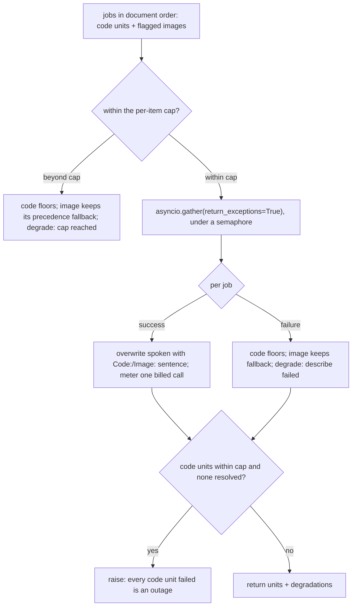

# The describer

## 🔭 Overview

Gives a listener one spoken sentence for a block they cannot see: a code block, or an image with no author-written text. It is a reusable core with two callers: the code path and the image path both reach the same Gemini call, layered under a fan-out that floors, caps, and fails per unit. It never speaks what a block *means*, only what it *is* or *shows*: meaning comes from the author, and the describer only makes the block visible. Implemented in `api/app/service/describe.py`, called during enrichment (see [item-lifecycle](item-lifecycle.md)).

## ♠️ What it exposes

| Member | Answers |
|---|---|
| `describe(client, contents)` | the reusable core: one structured-output call plus the sanitize tail, returning the spoken sentence. The caller owns `contents`: a prompt string, or a prompt plus an inline image part |
| `build_code_prompt(title, intro, code)` | the code prompt: kind and what-for, no opener, the introducing unit as authority |
| `build_image_prompt(title, alt)` | the image prompt: one specific sentence of what is shown, alt passed as unreliable context |
| `ImageDescribeRequest` | one image the precedence flagged for a describe (case 3): its `index` in the unit list, its raw `alt`, and the WebP `image` bytes |
| `enrich_with_descriptions(...)` | the fan-out: describe every code unit and every flagged image against one shared budget, in document order, returning the updated units and a degradation list |

## 📞 The core call: structured output, then sanitize

`describe` makes one call to `gemini-3.5-flash-lite` on Google's paid API (never through a gateway), parses the JSON, and runs the value through the shared sanitize tail. The response schema is a JSON object with one required string field, `spoken`.

The response is requested as `application/json` against that schema, so the model returns `{"spoken": "..."}` and there is nothing to parse out of prose. The parsed `spoken` then passes through `sanitize_spoken`, the same tail article prose runs through (see [article-extraction](article-extraction.md)).

> [!NOTE] Both guards, because a leaked marker is stochastic and only ever caught by ear
> Structured output makes one whole failure class impossible: the model cannot open with a heading or a preamble when the value is a bare string field. But a JSON schema cannot forbid a backtick or a `**` *inside* that string, and a marker reached narration exactly once in the bake-off and did not reproduce across 48 re-runs. "It did not happen this time" is the judgement a pipeline cannot rely on, so sanitize catches the marker the schema cannot.

> [!NOTE] The schema is not repeated in the prompt
> Gemini's own docs warn that duplicating the schema, or JSON examples, in the prompt lowers output quality. The config carries the shape; the prompt describes only the task.

## ✍️ The prompts: no opener, an invention guard, minimal asymmetric context

Both prompts share three rules and differ only in subject.

**No self-opener.** The sentence must begin with the thing itself, the kind-noun for code or the visible subject for an image, and the word "This" is forbidden anywhere in it. `Code: ` and `Image: ` are nagara's announcement, so the model owns only the content. An image noun-opens naturally; code needs the ban spelled out, because forbidding "This block" and "This example" alone leaves a residual "This is a…".

**The invention guard** is a sharpened positive instruction with no few-shot. Code: name the kind and the purpose, never the mechanics, return values, or framework, unless the introducing text states them. Image: describe only what is visibly there, and **name no person, organization, brand, place, or region unless that exact name appears as written text inside the image**. The one confirmed invention in the bake-off was geography read onto an artwork, and no run under this guard reproduced it.

**Context is minimal and asymmetric.** The code prompt gets the article title, the introducing paragraph (the unit just before, which the listener heard seconds ago as authority), and the block. The paragraph *after* is dropped. The image prompt gets the title and the alt, labelled as often wrong or SEO filler, to use only where it matches the pixels.

> [!NOTE] Why the paragraph after the block is dropped
> It is the elaboration the listener is about to hear anyway, and including it nudges the model toward describing behaviour rather than naming what the block is.

> [!NOTE] Why one sentence per code block, even when the prose already named it
> Every code block gets its own spoken sentence because it needs its own audio window in the read-along, and dropping it would remove the code from a reader's view. The redundancy with the introducing prose is the price of that window. What the sentence adds above restatement is the *kind*: "the syntax for creating a variable" names the concept; the specific field names and query values that would add most are exactly what the guard forbids as invention.

## 🗣️ What each unit says

A **code** unit's spoken form becomes `Code: <sentence>`, overwriting the interim `"Code sample."` placeholder from segmentation.

An **image** follows a five-step precedence, top to bottom. Cases 1, 2, 4, and 5 are the fallback already sitting on the unit from acquisition (see [article-extraction](article-extraction.md)); the describer owns case 3 and the filter that routes between 2 and 3.

| # | Condition | Spoken form |
|---|---|---|
| 1 | caption present | the caption, verbatim |
| 2 | no caption, good alt | the alt, verbatim |
| 3 | no caption, no good alt | **one generated sentence of what the image shows** |
| 4 | generation failed, alt non-empty | any alt, verbatim |
| 5 | generation failed, alt empty | `Image with no description.` |

The **good-alt filter** (`_is_good_alt`) decides case 2 against case 3. Alt is trusted verbatim only when it reads as a grammatical sentence, is not the article title (the same title-echo check the extractor's cruft trim uses), and clears a small CMS denylist (`subscribe`, `appears in`, `courtesy`, `photograph by`, `click`) and filename patterns. Everything else goes to the describer: empty, keyword soup, title-as-alt, a subscribe prompt.

> [!NOTE] The denylist separates good alt from boilerplate where no clean heuristic exists
> "Image of tank rolling over a world map" and "This article appears in the October 2023 issue. Subscribe to WIRED." are *both* grammatical sentences, so grammaticality alone cannot separate good alt from boilerplate. The denylist keeps the first and sends the second to the describer, at the cost of a maintained list a novel boilerplate phrase can slip past.

> [!NOTE] A describe failure never goes silent
> On failure or over-budget, an image keeps its precedence fallback (any non-empty alt, else the floor), so invariant 2's drop-from-both never fires for a *description* failure. It fires one layer earlier, for an *acquisition* failure, which belongs to [article-extraction](article-extraction.md). The floor is honest: it tells the listener an image is there that could not be described.

## 🔀 The fan-out, and its bounds

`enrich_with_descriptions` walks the interleaved unit list once into one document-ordered job list of every code unit and every flagged image. That single ordered list is what makes the cap a shared budget across both kinds.



**One shared budget, counted in document order.** `NAGARA_DESCRIBE_MAX_PER_ITEM` (default 25) caps the combined code-and-image total, so the two kinds can never each spend a full budget. Past the cap a code unit floors and an image keeps its precedence fallback; each records a `describe cap reached` degradation. The cap never fails an item and never goes silent.

**Independent resolution.** `asyncio.gather(..., return_exceptions=True)` under an `asyncio.Semaphore` (`NAGARA_DESCRIBE_CONCURRENCY`, default 10) lets every job resolve on its own, so a fifty-unit article where one call fails keeps the other forty-nine.

> [!NOTE] Why every job resolves independently
> The lifecycle writes each step's result incrementally and resumes per unit, so one failed call must not discard the others; independent resolution is the only shape that keeps those writes and that resume valid.

**Retry policy.** google-genai does not retry on its own, so `stamina` owns it: roughly three attempts with exponential backoff and jitter, classified by which errors are worth retrying.

```python
_RETRY_STATUS = frozenset({408, 429})  # + any 5xx, + connection/timeout
```

408, 429, and 5xx mean unlucky or briefly down and retry in place; 400, 401, 403, and 404 mean the call itself is wrong and fail the unit at once, because retrying only burns the budget.

**Per-unit failure degrades, systemic failure fails the item.** A single unit failing writes a `describe failed` degradation and floors (code) or keeps the fallback (image). The item fails only when there are code units within the cap and **every one** of them failed: a code-bearing item with zero code descriptions is a silent total failure, an outage rather than an article state. An image-only failure never raises, because an image always has a spoken fallback.

> [!WARNING] The client is never built from an empty key
> A missing `NAGARA_GEMINI_API_KEY` raises rather than letting google-genai fall back to the ambient `GOOGLE_API_KEY`/`GEMINI_API_KEY` it reads on its own: a trap that succeeds silently on a developer's machine and fails in production. The key has to be set in the Railway dashboard, because `railway.toml` carries no environment variables.

Each successful call fires an `on_describe(kind)` callback, which the lifecycle meters as one `describer` cost entry per call; a failed or capped unit made no billable call, so only the success branch counts.

## ⏩ What is not built yet

- **No describer cache.** Per-row resume already covers the common retry case. What is lost is cross-article dedup of the same snippet, second-order on cost; defending against abuse with a cache is the wrong tool, and the retry count cap and quota enforcement, which is not built yet, own that instead.
- **The fallback model misidentifies kind.** `gemini-3.1-flash-lite` exists to be available when 3.5 is not, not to match it: under structured output it once wrote "A TypeScript interface…" for a one-line JSON block. That is kind-level rather than behaviour-level, and it is recorded rather than fixed.

---

Related: [article-extraction](article-extraction.md) · [item-lifecycle](item-lifecycle.md) · [item-contract](item-contract.md) · [what-gets-read-aloud](../product-design/what-gets-read-aloud.md) · [invariants](invariants.md)
