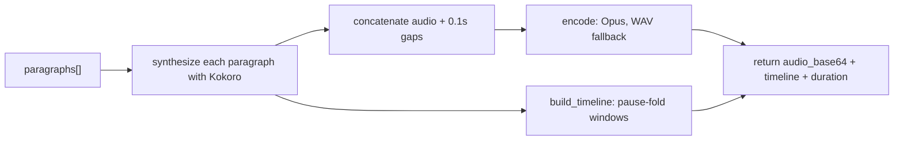

# TTS service

Renders an item's spoken paragraphs to audio on a GPU host and produces their read-along timing. Lives at `tts/app.py`, deployed as its own Modal app (`nagara-tts`), and is invoked by the API remotely rather than imported.

> [!note] The TTS code is an image definition, not a callable library
> The synthesis code *is* the specification of the container image that runs on the GPU host: it declares its own base image, system packages, and model bake step, and is uploaded as a unit. It cannot execute inside the API process; the API can only invoke it as a separately deployed service.

## What it exposes

One remote method, `synthesize(paragraphs, voice)`, called through Modal rather than imported:

| Member | Answers |
|---|---|
| `paragraphs: list[str]` | what to render: already the derived spoken form, one string per read-along unit |
| `voice: str` | which Kokoro voice to render with, defaulting to `af_heart` |
| → `audio_base64` | the rendered audio, base64-encoded so it survives the JSON round trip |
| → `format` | which codec the caller must treat it as: `audio/ogg`, or `audio/wav` on the ffmpeg fallback |
| → `duration` | the total audio length in seconds, what a progress bar divides by |
| → `paragraphs` | the position-keyed timeline, `{index, start, end}` per unit; see [[read-along-timing]] |

The API's [[item-contract]] models the return shape as `SynthesisResult`.

## How it works



Each paragraph is synthesized independently through Kokoro-82M and its duration recorded, then the audios are concatenated with a fixed 0.1-second silence gap between them: none after the last paragraph, since there is nothing left to separate it from. [[read-along-timing]]'s `build_timeline` turns those per-paragraph durations into contiguous windows over the same concatenated audio. The whole result is base64-encoded and returned as one payload, with the timeline's `text` set to the paragraph actually synthesized; the API replaces it with the display markdown at the join described in [[article-extraction]], never this value.

Audio is encoded to Opus through a `soundfile`-then-`ffmpeg` pipeline; if that codec path snags, it falls back to plain WAV. "Playable audio" is the only property either path is judged on, and WAV runs roughly 18 times larger than the equivalent Opus for a full article.

GPU and memory snapshotting are both enabled on the deployed class, bringing cold start down from roughly 27 seconds to roughly 6; a container then stays warm for 300 seconds after its last call, to absorb a session's burst of pushes.

## How the API invokes it with no broker

The API **spawns** a remote call through Modal's class handle (`modal.Cls.from_name(app, cls)().synthesize.spawn(paragraphs, voice)`) and persists the returned call's `object_id` on the item as the handle to resolve later (see [[item-lifecycle]]); the enqueue request then returns immediately.

The result is resolved **lazily**, on each poll, with a non-blocking read whose exception type (not its message) is what tells a running job from a crashed one:

```python
try:
    result = fc.get(timeout=0)
except TimeoutError:
    ...                   # still running
except Exception as e:
    ...                   # crashed: e becomes the item's error
```

A still-running call raises `TimeoutError`; a crashed one re-raises the remote exception across the process boundary, which is what makes a running job and a failed one impossible to confuse.

> [!note] Why the compute platform is the async layer, and there is no broker
> The platform's own invocation primitives (spawn plus a non-blocking result read) are sufficient async infrastructure at this scale, verified in [[player-ready-item]]. The running-versus-crashed distinction comes for free from the result read, not from anything the API tracks separately. The two deployables also graduate independently: the TTS service ships on its own deploy cadence (see [[deployment-and-ci]]), decoupled from the API.

> [!info] Rejected: a broker and a worker process
> A conventional task-queue stack, a message broker plus a separate worker, would add infrastructure to run, scale, and monitor for no benefit the platform's own spawn/poll primitives do not already provide, and it would still need the same crash/running bookkeeping the result read gives for free.

> [!warning] Clients must poll, the API cannot push completion
> A client observes `generating` until a poll transitions the item to `ready` or `failed`. There is no notification path; see [[item-lifecycle]] for the state machine this participates in.

The execution substrate is coupled to Modal as a result: moving off it means replacing the compute host and the async layer together, not just the GPU.

## What is not built yet

Streaming paragraph audio from one warm container, so time-to-first-audio is roughly one to two seconds instead of waiting for the whole article; see [[streaming-paragraph-audio]]. Word-level timestamps exist inside Kokoro but are not returned or used; see [[caption-export]].

---

Related: [[item-lifecycle]] · [[read-along-timing]] · [[item-contract]] · [[deployment-and-ci]] · [[invariants]] · [[audio-read-later-queue]]
